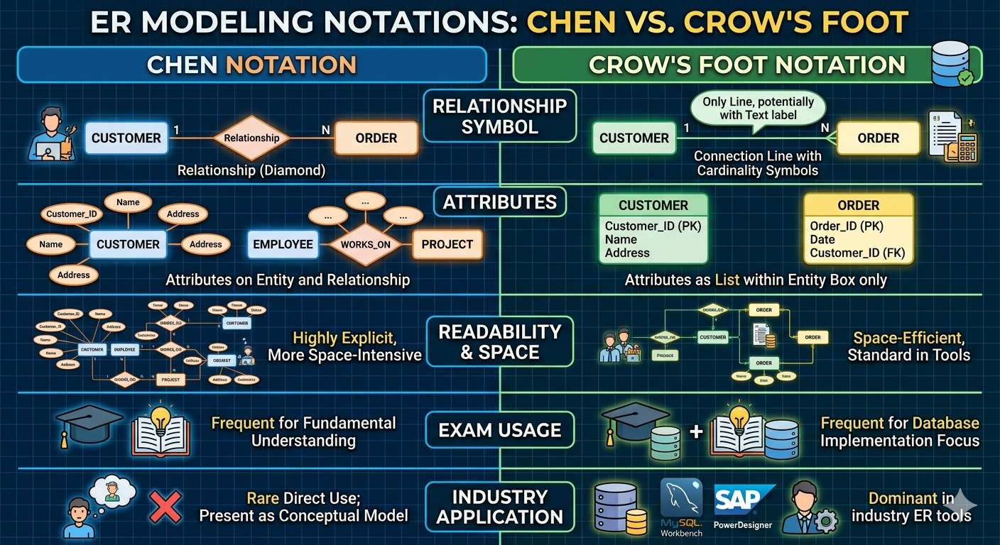

Gerne – hier der gewünschte Zusatz zur **Chen-Notation**, passgenau als Ergänzung zum ERM-Kapitel.

---

## 🧩 Chen-Notation – die Urform des ERM im Detail

Die **Chen-Notation** (benannt nach Peter Chen, 1976) ist die ursprüngliche und für das Verständnis fundamentalste Darstellungsform des Entity-Relationship-Modells.  
Du findest sie in vielen Lehrbüchern, IHK-Prüfungen und grundlegenden Konzeptpapieren – obwohl in der Industrie heute vor allem die **Krähenfuß-Notation** verbreitet ist.

**Denke so:** Chen ist das detaillierte Konstruktionsprinzip. Krähenfuß ist der vereinfachte, alltagstaugliche Werkstattplan. Wenn du Chen verstehst, kannst du jedes andere Datenmodell lesen.

---

### 🔎 Die drei unverwechselbaren Chen-Symbole

Was Chen so besonders macht: **Jedes Konzept bekommt eine eigene geometrische Form.** Es gibt keine Vermischung.

| Element           | Symbol in Chen | Bedeutung und Analogie                                                                 |
|-------------------|----------------|----------------------------------------------------------------------------------------|
| **Entität**       | Rechteck       | Das Ding selbst, z. B. „Kunde“, „Auftrag“. Dein Aktenordner.                          |
| **Beziehung**     | Raute          | Die Verbindung zwischen den Dingen, z. B. „erteilt“. Die Tätigkeit, die Ordner verknüpft. |
| **Attribut**      | Ellipse        | Eine Eigenschaft, z. B. „Name“, „Datum“. Die Einzelfelder auf der Karteikarte.         |
| **Primärschlüssel** | Unterstrichenes Attribut | Der eindeutige Identifier, z. B. „Kundennummer“. Deine Aktenzeichen-Nr.            |

Die Kardinalität (1, n, m) steht in Chen direkt an den Linien zwischen Entität und Raute.

**Beispielbild in Worten:**
```
[Kunde] —(1)———(erteilt)———(n)—[Auftrag]
```
- Ein Kunde erteilt mehrere Aufträge.
- Ein Auftrag wird von genau einem Kunden erteilt.

---

### 🌍 Warum Chen? Die Lern- und Denkhilfe

- **Trennung von Struktur und Datenfluss:** Chen zwingt dich, genau zu überlegen, *was* du speicherst (Entitäten, Attribute) und *wie* sie verbunden sind (Beziehungen). Du vermischst nicht automatisch Fremdschlüssel mit Entitäten – das passiert erst später beim Umsetzen in Tabellen.
- **Attribute einer Beziehung:** In Chen kannst du einer Raute eigene Attribute geben (z. B. das „Ausleihdatum“ gehört zur Beziehung „leiht aus“). Dieses Konzept geht in anderen Notationen oft unter.
- **Bestechende Klarheit für Kommunikation:** Weil jedes Element eine eigene Form hat, erkennen auch fachfremde Kollegen sofort den Unterschied zwischen „Ding“ und „Verknüpfung“. Perfekt für den ersten Whiteboard-Entwurf.

> 💡 **Agile Side-Info:** Wenn du mit Fachabteilungen sprichst, frag nach: „Welche Dinge (Rechtecke) kommen vor? Was tun sie miteinander (Rauten)? Und welche Merkmale (Ellipsen) sind für uns wichtig?“ Das ist Chen-Denken ohne Notation.

---

### 🔀 Chen vs. Krähenfuß – die zwei Welten im Schnellvergleich

Die **Krähenfuß-Notation** (Crow’s Foot) kommt ohne Rauten aus und schreibt die Kardinalität mit Strichen und „Krähenfüßen“ direkt an die Linie. Sie ist kompakter, aber weniger explizit.

| Merkmal                 | Chen-Notation                                                   | Krähenfuß-Notation                                              |
|-------------------------|-----------------------------------------------------------------|-----------------------------------------------------------------|
| Beziehungssymbol        | Raute (eigenes Symbol)                                          | Nur eine Linie, ggf. mit Text                                   |
| Attribute               | Ellipsen an Entitäten und auch an Rauten möglich                | Nur im Entitätskasten, oft als Liste                            |
| Lesbarkeit              | sehr explizit, dafür mehr Platzbedarf                           | platzsparend, in Tools standard                                 |
| Verwendung in Prüfungen | häufig (Grundverständnis)                                       | ebenfalls häufig, besonders bei Umsetzung in Datenbanken        |
| Industrie-Einsatz       | selten direkt; als Denkmodell präsent                           | dominierend in ER-Tools (MySQL Workbench, SAP PowerDesigner)    |



**Was du als Umschüler:in mitnehmen solltest:**  
Du musst beide Darstellungen souverän lesen und erklären können. In IHK-Prüfungen kommt oft die Chen-Notation dran, damit die Prüfer sehen, dass du die Logik verstanden hast. Im Beruf zeichnest du dann meistens Krähenfuß – aber dein Denken bleibt im Chen-Modus: klare Trennung der Konzepte.

---

### 👣 Dein nächster Schritt plus

1. Nimm das Bibliotheks-ERM von vorhin und zeichne es einmal **vollständig in Chen** (Rechteck, Raute, Ellipsen). Gib der Raute „leiht aus“ ein Attribut „Ausleihdatum“.  
2. Übersetze es anschließend in die Krähenfuß-Notation (nur Rechtecke, Linien mit Kardinalitäten, Attribute im Kasten).  
3. Vergleiche beide Darstellungen und finde heraus, welche dir intuitiver erscheint. Das stärkt deine Fähigkeit, in beiden Sprachen zu denken.

---

Damit hast du die Chen-Notation als Fundament sicher im Griff. Sie ist das begriffliche Rückgrat für jede Art von Datenmodellierung, auch wenn die Diagramme später anders aussehen.