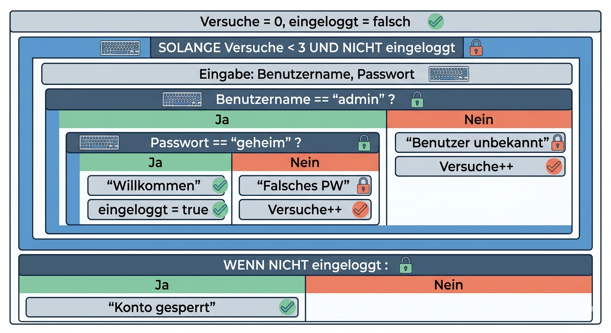

## 📋 Nassi-Shneiderman-Struktogramm (DIN 66261) – Der agile Bauplan für sauberen Code

### Worum geht’s eigentlich?

Ein Struktogramm ist eine grafische Darstellung eines Programmablaufs. Es zeigt **lückenlos und springfrei**, was dein Code tut – ähnlich wie eine **Montageanleitung ohne „weiter bei Schritt 5“**.  
Damit verhinderst du Spaghetti-Code und schaffst von Anfang an Klarheit in der Logik.

**DIN 66261** legt die Symbole einheitlich fest, damit alle dasselbe verstehen – auf dem Whiteboard, in der Doku oder in der IHK-Prüfung.

---

### 🔧 Die drei wichtigsten Bausteine

Stell dir das wie eine Werkzeugkiste vor, aus der du dir immer wieder bedienst:

| Symbol                      | Bedeutung                                                                 | Analogie aus anderen Berufen                           |
|-----------------------------|---------------------------------------------------------------------------|--------------------------------------------------------|
| **Rechteck**                | Eine Anweisung / ein Prozessschritt                                       | Ein einzelner Handgriff im Montageplan                 |
| **Verzweigung (Selektion)** | Ein Bedingungsblock: oben die Frage, links der „Ja“-Pfad, rechts „Nein“  | Wenn die Schraube locker → nachziehen, sonst weiter.   |
| **Schleife (Iteration)**    | Ein wiederholter Block; Bedingung steht oben (while) oder unten (repeat) | Solange die Maschine rattert, Werkstück nachlegen.     |

Ein vierter Baustein für Fortgeschrittene: die **Fallunterscheidung (Case)** – ähnlich wie eine Verzweigung mit mehreren festen Optionen.

> 💡 **Agile Side-Info:** Im Team reichen meist Rechteck, Verzweigung und Schleife. Zeichne nur das Nötigste – „Minimal Viable Documentation“.

---

### 🧩 Einfaches Beispiel: Login mit drei Versuchen

Das folgende Struktogramm (Textversion) liest du strikt von oben nach unten. Jeder eingerückte Block sitzt *in* der übergeordneten Struktur – genau das ist die **Verschachtelung**.

```
+----------------------------------------------+
| Versuche = 0, eingeloggt = falsch            |   ← Anweisungen (Sequenz)
+----------------------------------------------+
| SOLANGE Versuche < 3 UND NICHT eingeloggt    |   ← Schleife (Iteration)
|   +----------------------------------------+ |
|   | Eingabe: Benutzername, Passwort        | |
|   +----------------------------------------+ |
|   | Benutzername == "admin" ?              |   ← Verzweigung (Selektion)
|   +----+-----------------------------+     | |
|   | Ja |                             | Nein| |
|   |    | Passwort == "geheim" ?      |     | |
|   |    +----+-------------------+    |     | |
|   |    | Ja |                   |    | "Benutzer unbekannt"|
|   |    |    | "Willkommen"      |    | Versuche++ |
|   |    |    | eingeloggt=true   |    |     | |
|   |    +----+-------------------+    |     | |
|   |    | Nein: "Falsches PW"   |     |     | |
|   |    | Versuche++            |     |     | |
|   |    +-----------------------+     |     | |
|   +--------------------------------+       | |
+-------------------------------------------+
| WENN NICHT eingeloggt: "Konto gesperrt"    |   ← weitere Verzweigung
+-------------------------------------------+
```



Du siehst: In der Schleife steckt eine Verzweigung, und in deren „Ja“-Strang eine weitere Verzweigung. Diese **Schachtelung** ist völlig logisch und direkt auf Code übertragbar.

---

### 🧠 Das Warum – mit Analogien aus deinem alten Beruf

**Handwerk / Fertigung:**  
Früher hattest du vielleicht eine Arbeitsanweisung mit Sprungmarken („bei Fehler weiter bei Schritt 8“). Das Struktogramm verbietet solche Sprünge. Jeder Schritt hat seinen festen Platz, Fehler lassen sich so viel leichter finden. Es ist der Unterschied zwischen einem losen Zettel und einem genormten Prüfplan.

**Kaufmännischer Bereich / Vertrieb:**  
Denk an eine Rabattstaffel: „Wenn Kunde Premium und Bestellwert > 100, dann 10 %, sonst 5 %.“ Im Struktogramm siehst du sofort, ob du einen Fall übersehen hast – wie bei einer Entscheidungsmatrix im Rechnungswesen.

**Gastronomie / Küche:**  
Ein Rezept mit „Solange der Teig nicht glatt ist, rühren“ ist eine Schleife. Im Struktogramm steht die Bedingung oben und die Aktion darunter – kein Hin- und Herspringen.

**Das bringt's technisch:**  
- Keine undurchschaubaren GOTO-Sprünge.  
- Alle Pfade sind sichtbar, keine toten Zweige oder Endlosschleifen.  
- Du kannst das Struktogramm **im Kopf testen**, bevor du eine Zeile Code schreibst.

---

### 🏗️ Verschachtelung – absolut logisch

Verschachtelung bedeutet einfach: Ein Block enthält einen weiteren Block.

- Eine **Schleife** kann mehrere Anweisungen und wiederum eine Verzweigung enthalten.  
- Eine **Verzweigung** kann im Ja- und Nein-Zweig jeweils viele Anweisungen oder sogar neue Schleifen haben.

Alles bleibt in einer **Hierarchie wie Ordner im Dateisystem**. Kein Block ragt seitlich heraus, alle sind sauber eingerückt. So wie du einen komplexen Projektplan in Teilprojekte gliederst – das Struktogramm ist die Ordnungsstruktur für deinen Code.

---

### 🚀 Im Stil des agilen Arbeitens

- **Nur so viel wie nötig:** Male ein Struktogramm auf das Whiteboard, um einen kniffligen Algorithmus im Team zu klären – danach wird es wegeradiert oder abfotografiert. Du brauchst kein perfektes Tool.  
- **Iterativ verfeinern:** Starte mit dem Hauptfluss (Happy Path). Fehlerbehandlungen fügst du Schritt für Schritt hinzu – genau wie du User Stories in Tasks zerlegst.  
- **Gemeinsames Verständnis:** Auch Product-Owner oder Tester verstehen das Bild sofort, weil es keine Programmiersprache voraussetzt.

🎯 **Side-Info:** Tools wie *Structorizer*, *yEd* oder einfache ASCII-Zeichnungen im Code-Kommentar erleichtern das digitale Zeichnen. Für die Prüfung reicht meist ein sauberes, händisches Diagramm.

---

### 👣 Dein nächster Schritt

1. Nimm eine einfache Alltagslogik (z. B. „Kaffeeautomat gibt Kaffee aus, wenn genug Wasser und genug Bohnen da sind“) und zeichne ein Struktogramm mit maximal 5 Blöcken.  
2. Tausche es mit einem Lernpartner aus und lasst euch gegenseitig den Ablauf erklären.  
3. Später überträgst du das Struktogramm direkt in Python, Java oder eine andere Sprache – du wirst sehen, die Struktur ist identisch.

---

**Zusammengefasst:** Das Nassi-Shneiderman-Struktogramm ist dein **leichtgewichtiges Werkzeug, um Algorithmen logisch, fehlerfrei und im Team verständlich zu machen**. Aus jedem Beruf hast du bereits eine Vorstellung von geordneten Abläufen – hier bekommst du die IT-Übersetzung dazu.