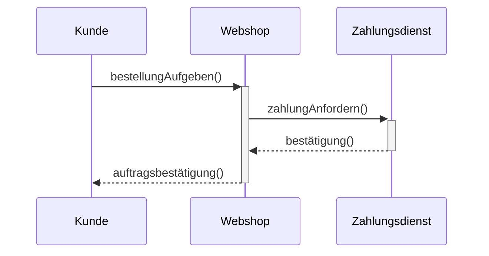
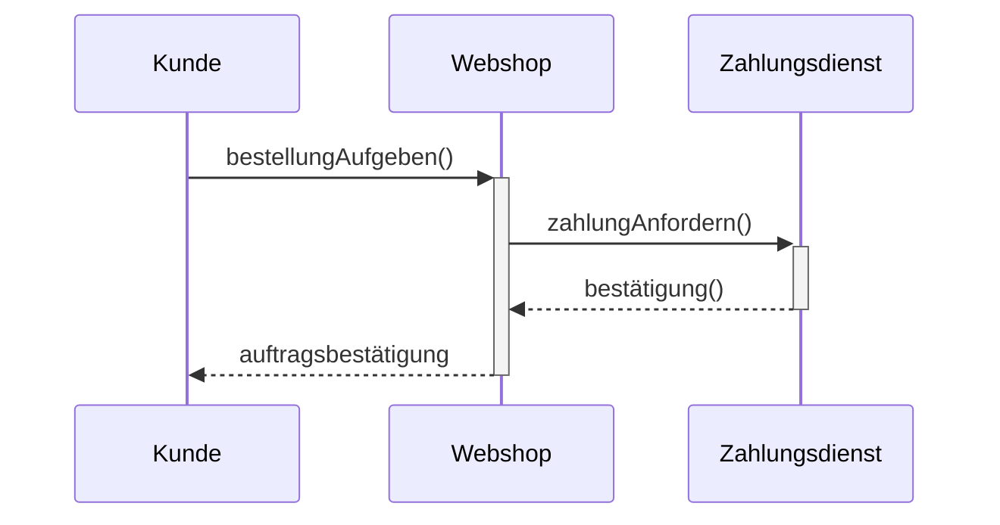

UML-Sequenzdiagramm (2): Aktivitätsbalken und synchrone Kommunikation

Nachdem die Grundlagen sitzen, kommt der nächste Schritt: Wann ist ein Systemteil wirklich beschäftigt? Das zeigt der Aktivitätsbalken – und genau diese Frage liebt die IHK.
1. Die Analogie: Der Koch und seine Arbeitszeit

Stellen Sie sich ein Küchenprotokoll vor: Ein Koch bekommt eine Bestellung (Nachricht), arbeitet dann eine Zeit lang (knetet, brät, würzt), und ruft vielleicht währenddessen einen Sous-Chef. Der senkrechte dicke Strich auf seiner Lebenslinie zeigt: Jetzt tut er aktiv etwas, und niemand darf ihn unterbrechen.

    Lebenslinie ohne Balken: Bereit, aber nicht aktiv.

    Aktivitätsbalken: Dünner oder dicker, senkrechter Block auf der Lebenslinie – Zeitraum, in dem die Komponente arbeitet oder blockiert wartet.

2. Wie Aktivitätsbalken den Zeitfluss präzisieren

Im ersten Diagramm haben wir nur Pfeile gesehen – wir wussten, wann eine Nachricht ankommt, nicht aber, wie lange verarbeitet wird. Der Aktivitätsbalken macht aus dem statischen Zeitpunkt einen Zeitraum.

    Beginnt der Balken genau am Empfang einer Nachricht.

    Endet er direkt nach dem Senden der Antwort.

    Bei synchronen Aufrufen bleibt der Balken des Aufrufers bis zur Antwort bestehen – er wartet.

Darstellung: Statt bloßer gestrichelter Linie setzt man einen dicken vertikalen Strich (in reinem Text: ┃) in den Zeitabschnitten, in denen die Komponente aktiv ist.
3. Beispiel: Webshop mit Aktivitätsbalken
text

Interpretation: Der Webshop hat einen Aktivitätsbalken ab Empfang der Bestellung. Er umspannt die Wartezeit auf die Antwort des Zahlungsdienstes. Erst nachdem die Bestätigung zurück ist, sendet der Webshop die auftragsbestätigung an den Kunden und sein Balken endet.
4. Profi-Tipps für die Prüfung

    Blockierende Wartezeit erkennen: Ein Aktivitätsbalken, der während eines synchronen Aufrufs weiterläuft, signalisiert „beschäftigt und wartend“ – keine Parallelarbeit.

    Lebenslinie nicht vergessen: Auch wenn der Balken endet, läuft die gestrichelte Linie weiter, denn die Komponente existiert noch.

    Prüfungsfokus: Oft muss man entscheiden, ob eine Komponente zu einem bestimmten Zeitpunkt aktiv ist oder nicht. Einfach senkrecht schauen: Ist an dieser Stelle ein Balken auf ihrer Linie?

    Abgrenzung: Aktivitätsbalken sind keine „Ladenbalken“, sie zeigen Dauer, nicht Fortschritt.

Beispiel-Struktur (Code-Nah mit Aktivitätsbalken)
text

(Der Aktivitätsbalken wird durch das Zeichen ┃ innerhalb der Lebenslinie angedeutet – in professionellen Tools ein breites Rechteck.)