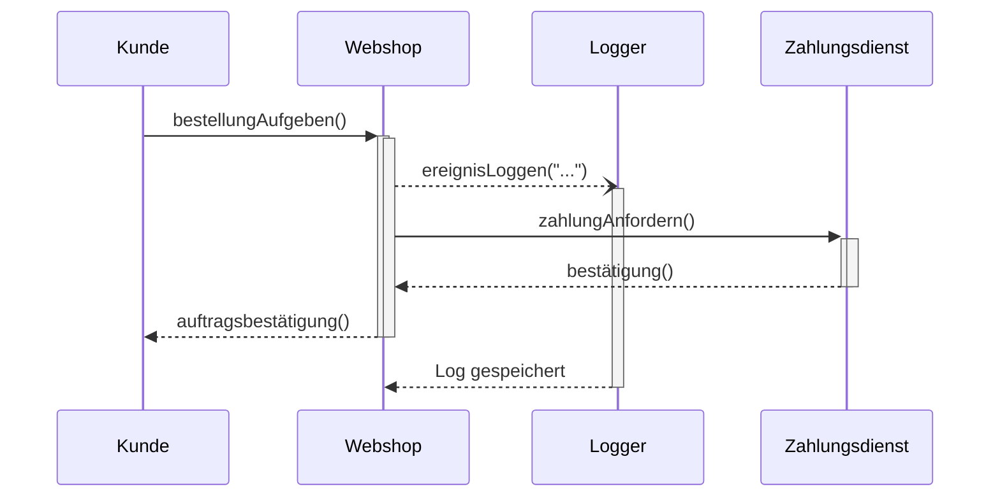

UML-Sequenzdiagramm (3): Asynchrone Nachrichten und Parallelität

Jetzt wird es dynamisch: Nicht jede Nachricht zwingt den Sender zum Stillstand. Asynchrone Kommunikation ist der Schlüssel zu modernen, entkoppelten Systemen – und ein beliebtes Thema für das Verständnis von „Feuer-und-vergiss“-Prinzipien.
1. Die Analogie: E-Mail vs. Telefonat

    Synchron (Telefonat): Sie rufen an, der andere geht ran, Sie sprechen, warten auf Antwort, legen auf. Sie können nichts anderes tun, während Sie warten.

    Asynchron (E-Mail): Sie schicken eine Nachricht raus und arbeiten sofort weiter. Ob der Empfänger sie jetzt oder in fünf Minuten liest, ist Ihnen momentan egal.

Genau das zeigt das Sequenzdiagramm mit offenen Pfeilen und (oft) gestrichelten Linien.
2. Notation und Auswirkungen auf den Zeitfluss
Art	Pfeil	Wirkung beim Sender
Synchron	Gefüllter Pfeil	Aktivitätsbalken läuft weiter, blockiert bis zur Antwort
Asynchron	Offener Pfeil (oft gestrichelt)	Sender macht nahtlos mit der nächsten Aktion weiter – kein Warten

In UML ist eine asynchrone Nachricht ein Pfeil mit offener Spitze. Häufig wird zusätzlich eine gestrichelte Linie verwendet, die Unterscheidung ist aber nicht streng normiert; entscheidend ist die Semantik des Nicht-Blockierens.
3. Beispiel: Logger als unabhängiger Dienst
text

Interpretation: Der Webshop sendet zuerst eine asynchrone Log-Nachricht, bleibt aber aktiv (Balken läuft durch). Er muss nicht warten, bis der Logger fertig ist; stattdessen schickt er sofort die Zahlungsaufforderung an den Zahlungsdienst. Logger und Zahlungsdienst können jetzt parallel arbeiten – erkennbar an den überlappenden Aktivitätsbalken an unterschiedlichen Lebenslinien.
4. Profi-Tipps für die Prüfung

    Pfeile genau zeichnen: In Prüfungen wird oft explizit nach der Notation für „asynchron“ gefragt (offener Pfeil, manchmal gestrichelt). Machen Sie sich mit beiden Varianten vertraut.

    Antworten bei asynchronen Nachrichten: Eine asynchrone Nachricht kann später eine Antwort auslösen (z. B. Log gespeichert); diese ist ebenfalls asynchron und blockiert den ursprünglichen Sender nicht.

    Parallele Aktivitäten erkennen: Sobald zwei Aktivitätsbalken auf unterschiedlichen Linien gleichzeitig existieren, arbeiten die Komponenten parallel – wichtiges Indiz für nebenläufige Verarbeitung.

    Prüfungsfokus: IHK-Aufgaben geben gern einen Ablauf mit einer E-Mail-Benachrichtigung vor und fragen: „Warum ist diese Nachricht asynchron?“ Antwort: Weil der Hauptprozess nicht auf das Ergebnis wartet und sofort weitere Schritte durchführt.

