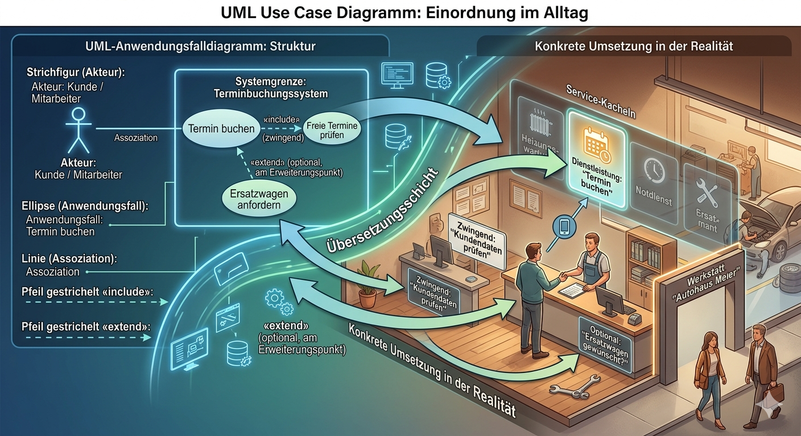

Hier kommt die gewünschte, vollständige Übersicht zum Use-Case-Diagramm – im exakt gleichen Stil wie zu Struktogramm, PAP und ERM, damit du alle vier Werkzeuge nahtlos vergleichen kannst.

---

## 📋 Anwendungsfalldiagramm (Use-Case-Diagramm) – Der Vertragsplan zwischen Mensch und System

### Worum geht’s eigentlich?

Ein Anwendungsfalldiagramm (Use Case Diagram) ist eine grafische Übersicht, die zeigt, **wer** (Akteure) mit einem System **welche Ziele** erreichen kann (Anwendungsfälle). Es geht **nicht** um das *Wie* oder die zeitliche Abfolge – sondern ausschließlich um das fachliche **Was**.

Stell dir das wie einen **Service-Katalog** vor: Du siehst alle angebotenen Dienstleistungen auf einen Blick, noch bevor du eine konkrete Schritt-für-Schritt-Anleitung aufschlägst. Es ist die Brücke zwischen Fachbereich und Entwicklung – und oft das erste Diagramm, das im agilen Projekt entsteht.

Die **UML 2.x** standardisiert die Symbole. In Prüfungen und in der Praxis brauchst du nur eine Handvoll davon.

---

### 🔧 Die wichtigsten Bausteine

| Symbol                     | Bedeutung                                                                                   | Analogie aus anderen Berufen                                          |
|----------------------------|---------------------------------------------------------------------------------------------|-----------------------------------------------------------------------|
| **Strichfigur (Akteur)**   | Eine Rolle, die mit dem System interagiert. Das kann ein Mensch, eine Organisation oder ein externes System sein. | Der Kunde, der den Schalter betritt – unabhängig davon, welche Person gerade dahintersteckt. |
| **Ellipse (Anwendungsfall)** | Ein konkreter, fachlicher Dienst, den das System anbietet (z. B. „Medium ausleihen“).        | Eine Dienstleistungskachel auf der Website eines Handwerksbetriebs: „Heizungswartung“, „Notdienst“. |
| **Kasten (Systemgrenze)**  | Zeigt, was Teil des betrachteten Systems ist und was außerhalb liegt.                       | Die Wände deines Betriebs – drinnen passiert die Wertschöpfung, draußen sind die Kunden. |
| **Linie (Assoziation)**    | Verbindet Akteur und Anwendungsfall. Bedeutet: „Dieser Akteur stößt diesen Anwendungsfall an“. | Der Kunde greift zum Telefonhörer und beauftragt die Dienstleistung.  |
| **Pfeil mit gestrichelter Linie und «include»** | Ein Anwendungsfall schließt einen anderen zwingend mit ein.                                 | Zum „Angebot erstellen“ gehört zwingend „Kundendaten prüfen“ – du kommst an diesem Schritt nicht vorbei. |
| **Pfeil mit gestrichelter Linie und «extend»** | Ein Anwendungsfall erweitert einen anderen optional, oft an einer Erweiterungspunkt.       | Zum Basis-Service „Rechnung zahlen“ gibt es die optionale Erweiterung „in Raten zahlen“ – nur wenn gewünscht. |



> 💡 **Agile Side-Info:** In Sprint-Planning-Workshops reichen dir Akteur, Ellipse und Rahmen. Include und Extend folgen später, wenn du die Abhängigkeiten im Backlog feiner schneidest.

---

### 🧩 Einfaches Beispiel: Online-Bibliothek

Das folgende Diagramm erfasst, welche Rollen mit dem System arbeiten und welche Ziele sie verfolgen – völlig ohne zeitliche Reihenfolge.

```
+------------------------------------------------+
|  Online-Bibliothek                             |  ← Systemgrenze
|                                                |
|   o "Medium suchen"                            |  ← Anwendungsfälle (Ellipsen)
|   o "Medium ausleihen"                         |
|   o "Mahngebühr bezahlen"                      |
|                                                |
|   o "Inventur durchführen"                     |
|                                                |
+------------------------+-----------------------+
                         |
            +------------+------------+
            |                         |
      +-----+-----+             +-----+-----+
      | Leserin   |             | Bibliothekar|   ← Akteure (Rollen)
      +-----------+             +-----------+
```

Gelesen wird das so:
- Eine **Leserin** kann Medien suchen, Medien ausleihen und Mahngebühren bezahlen.
- Ein **Bibliothekar** kann zusätzlich eine Inventur durchführen.
- Beide Rollen stehen außerhalb des Systems – sie nutzen die Funktionen, die ihnen das System anbietet.

---

### 🏗️ Verfeinerung und "Verschachtelung" im Use-Case-Diagramm

Das Diagramm selbst hat keine echten Verschachtelungen wie eine Schleife im Code. Stattdessen zeigt es **Abhängigkeiten zwischen Anwendungsfällen** – und das ist entscheidend für das Verständnis:

#### 1. Include-Beziehung («include»)
Damit packst du immer wieder benötigte Teilfunktionen in einen eigenen Anwendungsfall und bindest ihn zwingend ein.
**Beispiel:** Der Use Case „Medium ausleihen“ hat ein «include» zu „Nutzerkonto prüfen“. Du zeichnest das so:
```
(Medium ausleihen) ---«include»---> (Nutzerkonto prüfen)
```
**Analogie:** Der Pförtnerdienst gehört zwingend zur Auslieferung – ohne Freigabe durch den Pförtner fährt kein Lkw aufs Gelände.

#### 2. Extend-Beziehung («extend»)
Damit modellierst du optionale Erweiterungen, die den Basisfall nicht verändern.
**Beispiel:** Der Use Case „Mahngebühr bezahlen“ kann erweitert werden durch «extend» zu „Ratenzahlung vereinbaren“ – aber nur, wenn die Leserin das wünscht.
```
(Mahngebühr bezahlen) <---«extend»--- (Ratenzahlung vereinbaren)
```
**Analogie:** Zur Standard-Wartung (Basisfall) gibt es den optionalen „Premium-Check“ – nur für Kund:innen, die ihn explizit buchen.

#### 3. Generalisierung von Akteuren
Ein Akteur erbt die Rechte eines anderen und erhält zusätzliche eigene.
**Beispiel:** Ein **Bibliothekar** ist eine spezialisierte Leserin. Er kann alles, was die Leserin kann, plus die Inventur.
```
  (Leserin)
      ^
      |
  (Bibliothekar)
```
**Analogie:** Ein Auszubildender kann alle Grundtätigkeiten ausführen, der Meister zusätzlich die Abnahme.

> 🎯 **Wichtiger Hinweis:** Das Anwendungsfalldiagramm selbst enthält noch keine Beschreibung des Ablaufs. Jeder Anwendungsfall wird durch eine **textuelle Beschreibung** oder ein beigefügtes Struktogramm/PAP konkretisiert.

---

### 🧠 Das Warum – mit Analogien aus deinem alten Beruf

**Handwerk / Fertigung:**
Bevor du die erste Maschine einrichtest, klärst du mit dem Kunden: „Welche Arbeiten sollen wir ausführen?“ Die Liste der Leistungen (z. B. Montage, Inspektion, Nacharbeit) ist dein Set an Anwendungsfällen. Der Auftraggeber (Akteur) stößt sie an. Das Diagramm ist dein **schriftlicher Leistungskatalog**, der den Umfang (Scope) festlegt – damit du nichts vergisst und nichts gratis einbaust.

**Kaufmännischer Bereich / Vertrieb:**
Der Vertrieb kennt das: Wer darf was im CRM tun? Der Außendienst (Akteur) erfasst Besuchsberichte, der Innendienst erstellt Angebote. Das Use-Case-Diagramm zeigt diese Berechtigungen funktional – lange bevor du an Zugriffsrechte in der Software denkst.

**Gastronomie / Küche:**
Die Schankgenehmigung (Akteur: Gast) löst den Use Case „Getränk bestellen“ aus. Ein Stammgast hat zusätzlich die Option „Tab starten“ (Extend). Die Systemgrenze ist die Theke – dahinter läuft die Zubereitung, die du später im Detail modellierst.

**Das bringt's technisch:**
- Du klärst den **genauen Systemumfang** (Scope), bevor du eine einzige Zeile Code schreibst.
- Missverständnisse mit Stakeholdern werden direkt sichtbar, weil jede Rolle ihre Anwendungsfälle sieht.
- Du hast eine perfekte Vorlage für dein Backlog: Jeder Anwendungsfall kann in eine oder mehrere User Stories zerlegt werden.

---

### 🚀 Im Stil des agilen Arbeitens

- **Benenne Anwendungsfälle aus Anwendersicht:** Nicht „Datenbankeintrag erzeugen“, sondern „Rechnung stornieren“. Das ist die gleiche Haltung wie die User Story: „Als Sachbearbeiter möchte ich eine Rechnung stornieren können, um...“
- **Beginne mit dem Happy Day:** Zeichne mit dem Product Owner nur die normalen Abläufe. Edge Cases und Fehlerfälle (z. B. „Zahlung abgelehnt“) können als optionale Extend-Use-Cases nachgeliefert werden.
- **Nutze es als Scope-Wächter:** Wenn ein Akteur einen Use Case haben soll, der nicht in der Systemgrenze liegt, ist das sofort eine Diskussion: Gehört das wirklich noch in unser System? Das schützt vor Scope Creep.
- **Text vor Diagramm-Schnörkeln:** Das Diagramm allein ist nur die halbe Miete. Schreibe zu jedem Use Case eine kurze, agile **Use-Case-Beschreibung** (Name, Auslöser, Akteur, erwartetes Ergebnis, wichtigste Schritte). Das ist deine leichtgewichtige Spezifikation.

🎯 **Side-Info:** Tools wie draw.io, PlantUML (Text-zu-Diagramm) oder Miro bieten spezielle UML-Use-Case-Schablonen. Spare dir das Händische und lass dir die Grundformen generieren. Für die Prüfung reicht ein sauber gezeichnetes Diagramm mit den drei Symbolen.

---

### 👣 Dein nächster Schritt

1. Nimm dasselbe Mini-Szenario wie bei den anderen Modellen (z. B. die Bibliothek oder den Kaffeeautomaten) und zeichne ein Use-Case-Diagramm mit **maximal 5 Anwendungsfällen und 2 Akteuren**. Stelle die Systemgrenze deutlich dar.
2. Notiere dir zu einem einzigen Anwendungsfall die fachliche Schrittfolge (nicht technisch, sondern: „1. Leserin identifiziert sich, 2. Leserin wählt Medium aus, ...“) und vergleiche erst danach mit einem PAP oder Struktogramm dazu.
3. Stelle das Diagramm einer Person aus deinem alten Beruf vor. Sie sollte die Ellipsen sofort als „Was kann ich tun?“ verstehen, ohne IT-Kenntnisse. Das beweist dir, dass die fachliche Modellierung sitzt.

---

**Zusammengefasst:** Das Anwendungsfalldiagramm ist der fachliche Einstiegspunkt, der die Bedürfnisse der Nutzer:innen in den Mittelpunkt stellt. Es ergänzt deine Werkzeuge Struktogramm, PAP und ERM perfekt um die **Wer-macht-was-Sicht** und übersetzt Anforderungen direkt in ein für alle verständliches Bild – bevor du in die technische Tiefe gehst.