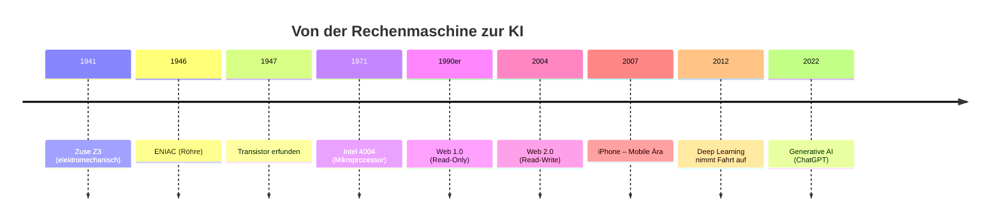

# LF1.1 – Die Wurzeln der IT & Der Wandel

> **Zielgruppe:** Umschüler FIAE/FISI, 2. Lehrjahr
> **Prüfungsrelevanz:** AP1 (schriftlich) + Fachgespräch
> **Lernzeit:** Kerninhalt: 50–65 Min., mit Vertiefung (Nice-to-know, Fachgesprächs-Beispiele): 75–90 Min.
> **Status:** Final
> **Stand:** 2026

---

## IHK-Kernfragen

| # | Frage | Abschnitt |
|---|---|---|
| 1 | Was unterscheidet "digital" von "elektronisch"? | [1.1](#11-die-vier-ären) |
| 2 | Warum war der Transistor der entscheidende Wendepunkt? | [1.2](#12-die-transistor-revolution) |
| 3 | Warum war IPv6 zwingend für den IoT-Durchbruch nötig? | [2.2](#22-die-stationen) |
| 4 | Wie hat sich das Berufsbild vom EDV-Techniker zum Solution Architect gewandelt? | [3](#3-der-beruf-im-wandel) |
| 5 | Welche Disziplin der Informatik deckt welche Aufgabe ab – und wo ordnet sich KI/Data Science ein? | [4](#4-disziplinen--grundlagen) |

---

## 1. Hardware-Evolution: Von der Rechenmaschine zum Mikrochip

> **Grundprinzip:** Jede Hardware-Generation löste ihr Vorgänger-Problem (Größe, Wärme, Geschwindigkeit) – und schuf damit ein neues.

### 1.1 Die vier Ären

| Ära | Zeitraum | Kerntechnik | Beispiel | Größe/Platzbedarf | IHK-Relevanz |
|---|---|---|---|---|---|
| Mechanisch | 17.–19. Jh. | Zahnräder, Hebel | Pascaline, Babbages Analytical Engine (Konzept), Ada Lovelace (erste Programmiererin) | Tischgerät bis raumfüllend (Konzept) | 🟢 |
| Elektromechanisch | 1940er | Relais, binär | **Zuse Z3** (1941, Berlin) – erster funktionsfähiger, programmgesteuerter Rechner | Füllte einen Raum | 🔴 |
| Elektronisch (Röhre) | ab 1946 | Röhren, dezimal | ENIAC (USA) – riesig, hitzeanfällig | ca. 170 m², ca. 27–30 t | 🔴 |
| Transistor/IC | ab 1947 / 1971 | Halbleiter, Mikrochip | Intel 4004 (1971) – erster Mikroprozessor | Vom Taschenrechner bis Smartphone | 🔴 |

### 1.2 Die Transistor-Revolution

> **Merksatz:** Der Transistor löste die Röhre ab, weil er kleiner, kühler und schneller war – die Basis für jede weitere Miniaturisierung.

Ohne die Erfindung von Shockley, Bardeen und Brattain (1947) wäre keine Integration tausender Schaltkreise auf einem Chip möglich gewesen. Der nächste Schritt – der **integrierte Schaltkreis (IC)** – bündelte diese Transistoren und machte 1971 den ersten Mikroprozessor möglich.

> **IHK-Typfrage:** *Warum gilt die Z3 als digital, aber nicht als elektronisch?*
> **Musterantwort:** Die Z3 rechnete binär mit den Zuständen 0 und 1 – das macht sie digital. Sie nutzte dafür aber mechanische Relais (klappernde Schalter), keine Elektronenröhren oder Halbleiter – deshalb ist sie elektromechanisch, nicht elektronisch. Digital beschreibt die *Darstellung* der Information, elektronisch/elektromechanisch die *technische Umsetzung*.

🟢 **Nice to know:** Das Mooresche Gesetz (Gordon Moore, 1965) besagt, dass sich die Anzahl der Transistoren auf einem Chip etwa alle 18–24 Monate verdoppelt – es gilt als der Haupttreiber der Miniaturisierung seit den 1970ern.

🔴 **Stolperstein:** "Digital bedeutet automatisch elektronisch." Ein Rechenschieber ist analog (stufenlos), die Z3 ist digital und elektromechanisch zugleich – die beiden Begriffspaare sind unabhängig voneinander.

---

## 2. Vernetzung & KI (2000er bis heute)

> **Grundprinzip:** Jede Netz-Generation macht mehr Endpunkte gleichzeitig aktiv – vom Lesen über das Mitmachen bis zum autonomen "Ding".

### 2.1 Begriffsklärung

| Begriff | Definition | IHK-Relevanz |
|---|---|---|
| Web 1.0 | Read-Only – statische HTML-Seiten lesen | 🟡 |
| Web 2.0 | Read-Write – Social Media, User Generated Content, Cloud | 🔴 |
| IoT | "Dinge" (Lampen, Autos, Maschinen) kommunizieren eigenständig | 🔴 |
| Generative AI | KI erzeugt selbstständig neue Inhalte (Text, Bild, Code) | 🔴 |

### 2.2 Die Stationen

1. **Web 1.0** (90er) – Read-Only
2. **Web 2.0** (ab ca. 2004) – Read-Write
3. **Mobile Ära** (ab 2007) – iPhone-Release, Internet wird "Always On"
4. **IoT** – IPv6 notwendig, da IPv4-Adressraum erschöpft ist
5. **KI-Ära** – Deep Learning, Generative AI; Daten werden zum "neuen Gold"
   - 2012: AlexNet gewinnt den ImageNet-Wettbewerb – Durchbruch des Deep Learning
   - 2017: Transformer-Architektur ("Attention is All You Need") legt die Basis für moderne Sprachmodelle
   - 2022: ChatGPT macht Generative AI massentauglich

> **IHK-Typfrage:** *Warum war IPv6 zwingend notwendig für den Durchbruch des IoT?*
> **Musterantwort:** IPv4 stellt nur ca. 4,3 Milliarden Adressen bereit – das reicht bei Weitem nicht, wenn nicht nur Menschen, sondern Milliarden einzelner Geräte (Sensoren, Maschinen, Haushaltsgeräte) eine eigene, eindeutige Adresse benötigen. IPv6 bietet mit 128 Bit einen praktisch unerschöpflichen Adressraum und macht damit jedes einzelne IoT-Gerät direkt adressierbar.

🔴 **Stolperstein:** "IoT ist nur Smart Home." Der größte wirtschaftliche Nutzen liegt im **Industrial IoT (IIoT)**, z. B. vorausschauende Wartung (Predictive Maintenance) von Maschinen in industriellen Szenarien.

---

## 3. Der Beruf im Wandel

> **Grundprinzip:** Mit jeder Technik-Generation verschiebt sich der Fokus von reiner Fachtiefe hin zu Team- und Systemdenken.

| Jahrzehnt | Rolle | Fokus |
|---|---|---|
| 1970er–80er | EDV-Techniker | Hardware am Laufen halten, Elite-Wissen, Rechenzentrum |
| 1990er–2000er | Nerd/Admin | PC-Boom, Windows, Netzwerke, Webseiten – oft Einzelkämpfer |
| 2010er | DevOps/Agile Developer | Teamwork (Scrum), Cloud, Automatisierung – Code als Handwerk |
| 2020er+ | Solution Architect / AI-Pilot | Probleme verstehen, KI steuern, Security, Ethik |

> **Merksatz:** Früher musste man technisch tiefer einsteigen (Assembler, Speicheradressen sparen) – heute muss man breiter denken (Systeme, Schnittstellen, Menschen).

> **IHK-Typfrage:** *Warum ist Empathie für einen Informatiker heute wichtiger als 1990?*
> **Musterantwort:** 1990 stand die reine technische Funktionalität im Vordergrund – Hauptsache, das System lief. Heute entwickeln wir für Endnutzer in agilen Teams; ohne Verständnis für deren Bedürfnisse (User Experience) und ohne Kommunikationsfähigkeit im Team (Scrum, Pair Programming) lässt sich moderne Software weder richtig planen noch erfolgreich einführen.
>
> **Beispiel fürs Fachgespräch:** "Wenn ich 1990 ein Buchhaltungsprogramm geschrieben hätte, hätte ich nur die Formeln korrekt umsetzen müssen. Heute sitze ich im Sprint Review vor dem Kunden, muss verstehen, warum die Buchhalterin mit der Bedienoberfläche nicht zurechtkommt, und gemeinsam mit dem Team eine bessere Lösung finden. Ohne Empathie erkenne ich nicht, wo das eigentliche Problem liegt."

🟡 **Kontextwissen:** Low-Code/No-Code-Plattformen verschieben den Fokus zusätzlich – reine Syntax-Kenntnisse verlieren an Wert, Architektur- und Problemlösungskompetenz gewinnt.

---

## 4. Disziplinen & Grundlagen

> **Grundprinzip:** Informatik ruht auf vier klassischen Säulen – wer nur die praktische kennt, versteht nicht, warum sein Code so läuft, wie er läuft. KI/Data Science ist eine Querschnittsdisziplin, die vor allem Theoretische und Angewandte Informatik verbindet.

| Disziplin | Inhalt | Beispiel | IHK-Relevanz |
|---|---|---|---|
| Theoretische Informatik | Mathematisches Herz: Algorithmen, Komplexität, Logik | Berechenbarkeit eines Problems | 🔴 |
| Technische Informatik | Hardware-Basis: Schaltnetze, Prozessoren | Bau eines Mikrochips | 🟡 |
| Praktische Informatik | Handwerk: Softwareentwicklung, Betriebssysteme | Programmierung einer App | 🔴 |
| Angewandte Informatik | Nutzen in Fachdomänen | IT im Auto, in der Medizin, im Handel | 🟡 |
| KI / Data Science *(Querschnitt aus Theoretischer + Angewandter Informatik)* | Maschinelles Lernen, Datenanalyse, neuronale Netze | Training eines Sprachmodells | 🟡 |

> **IHK-Typfrage:** *Ordne zu: "Entwicklung einer App für Diabetiker" – welche Disziplin(en)?*
> **Musterantwort:** In erster Linie **Angewandte Informatik**, da die App auf eine konkrete Fachdomäne (Medizin) zugeschnitten ist. Die App-Entwicklung selbst (Programmierung, Betriebssystem-Anbindung) ist zugleich **Praktische Informatik** – die beiden Disziplinen überschneiden sich hier.

🟢 **Nice to know:** KI wurde hier als Querschnittsdisziplin ergänzt (siehe Tabelle) – in klassischen Curricula zählt sie meist noch nicht als eigenständige fünfte Säule.

---

## Zeitstrahl: Hardware & Vernetzung im Überblick



---

## Selbsttest

| # | Frage | Kurzantwort |
|---|---|---|
| 1 | Was unterscheidet die Z3 vom ENIAC technisch? | Z3: elektromechanisch (Relais), binär – ENIAC: elektronisch (Röhren), dezimal |
| 2 | Welches Bauteil löste die Röhre ab? | Der Transistor (1947) |
| 3 | Warum ist IPv6 für IoT notwendig? | IPv4-Adressraum reicht nicht für Milliarden Geräte |
| 4 | Nenne die Rolle, die in den 2010ern den Fokus auf Scrum/Cloud/Automatisierung legte. | DevOps/Agile Developer |
| 5 | Welche Disziplin deckt Algorithmen und Komplexität ab? | Theoretische Informatik |
| 6 | Was besagt das Mooresche Gesetz? | Transistoren auf einem Chip verdoppeln sich ca. alle 18–24 Monate |
| 7 | Welche Disziplinen verbindet KI/Data Science hauptsächlich? | Theoretische Informatik (Algorithmik) + Angewandte Informatik (Einsatzgebiet) |

---

## IHK-Cheatsheet

| Begriff | Kurzdefinition |
|---|---|
| Zuse Z3 | Erster funktionsfähiger, programmgesteuerter Rechner (1941, elektromechanisch, binär) |
| ENIAC | Erster elektronischer Röhrenrechner (USA, 1946, dezimal) |
| Transistor | Halbleiterbauteil, löst 1947 die Röhre ab (kleiner, kühler, schneller) |
| Integrierter Schaltkreis (IC) | Tausende Transistoren auf einem Chip |
| Mooresches Gesetz | Transistoren auf Chips verdoppeln sich ca. alle 18–24 Monate (Moore, 1965) |
| KI-Durchbruch 2012 | AlexNet gewinnt ImageNet – Deep Learning wird praxistauglich |
| Web 2.0 | Read-Write-Internet: Social Media, User Generated Content |
| IoT | Vernetzte "Dinge" kommunizieren eigenständig, benötigt IPv6 |
| IPv6 | 128-Bit-Adressraum, löst die Adressknappheit von IPv4 |
| 4 Disziplinen der Informatik | Theoretisch, Technisch, Praktisch, Angewandt |
| Scrum/Agile | Teamorientierte Methode, prägte den Wandel zum "Teamplayer"-Berufsbild |
| Solution Architect | Aktuelles Berufsbild: Probleme verstehen, KI steuern statt nur coden |

---

## Prüfungstaktik

| Aufgabentyp | Typische Formulierung | Beispiel aus AP1 | Was die IHK hören will |
|---|---|---|---|
| Begriffsabgrenzung | "Unterschied zwischen X und Y erklären" | "Erläutern Sie den Unterschied zwischen Web 1.0 und Web 2.0 anhand eines Beispiels." | Klare, kurze Definition beider Begriffe + der entscheidende Unterschied in einem Satz |
| Ursache-Wirkung | "Warum war X notwendig für Y?" | "Begründen Sie, warum die Einführung von IPv6 für das Internet der Dinge notwendig war." | Kausalkette: Problem → Grenze der alten Lösung → wie die neue Technik das Problem löst |
| Zuordnung | "Ordne X der passenden Disziplin/Ära zu" | "Ordnen Sie die Entwicklung eines Embedded Systems für ein Fahrzeug einer Disziplin der Informatik zu und begründen Sie Ihre Zuordnung." | Zuordnung + eine Zeile Begründung, nicht nur das Label nennen |
| Bewertung/Diskussion | "Nimm Stellung zu These X" | "Nehmen Sie Stellung zur These: Low-Code/No-Code-Plattformen machen klassische Programmierkenntnisse überflüssig." | Pro- und Contra-Argument nennen, dann eigene begründete Position |

---

## Merk-Sätze fürs Fachgespräch

> Digital beschreibt die Darstellung (0/1), elektronisch/elektromechanisch die technische Umsetzung – beides ist unabhängig voneinander.

> Der Transistor war die Blaupause für jede weitere Miniaturisierung – ohne ihn kein Mikrochip, ohne Mikrochip kein modernes Computing.

> IoT braucht IPv6, weil jedes Gerät eine eigene Adresse braucht – IPv4 hat davon schlicht nicht genug.

> Der Beruf hat sich von reiner Fachtiefe zu Systemdenken und Teamarbeit verschoben – Empathie und Kommunikation sind heute Kernkompetenzen, nicht Kür.

> Die vier klassischen Disziplinen der Informatik überschneiden sich in der Praxis oft – KI/Data Science ist dafür das beste Beispiel, da es Algorithmik (theoretisch) mit konkreten Anwendungsgebieten (angewandt) verbindet.

---

```yaml
lernfeld: LF1.1
titel: Die Wurzeln der IT & Der Wandel
status: final
stand: 2026
quellen:
  - LF1.1- Die Wurzeln der IT
  - LF1.1.1- Die Maschinen (Hardware-Evolution)
  - LF1.1.2- Die Vernetzung & KI (2000er bis heute)
  - LF1.1.3- Der Beruf im Wandel
  - LF1.1.4- Disziplinen & Grundlagen
```