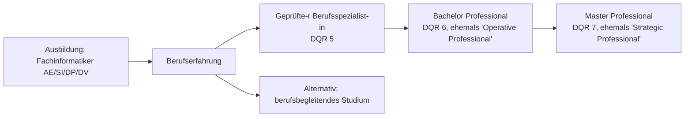

# LF1.2 – Berufsbild, Studium & Karriere

> **Zielgruppe:** Umschüler FIAE/FISI, 2. Lehrjahr
> **Prüfungsrelevanz:** AP1 (schriftlich) + Fachgespräch
> **Lernzeit:** Kerninhalt: 55–70 Min., mit Vertiefung (Nice-to-know, Fachgesprächs-Beispiele): 80–95 Min.
> **Status:** Final
> **Stand:** 2026

**Legende:** 🔴 Prüfungsstoff (hohe Relevanz) · 🟡 Kontextwissen (mittlere Relevanz) · 🟢 Nice to know

---

## IHK-Kernfragen

| # | Frage | Abschnitt |
|---|---|---|
| 1 | Was unterscheidet die 4 Fachrichtungen der Fachinformatik konkret voneinander? | [1](#1-die-4-fachrichtungen-praxis) |
| 2 | Wo liegt der Fokus-Unterschied zwischen Ausbildung und Studium? | [2](#2-akademie-vs-praxis-disziplinen--studiengänge) |
| 3 | Welche Rolle spielt die IHK im Dualen System – und warum nicht die Schule? | [3](#3-das-duale-system-organisation) |
| 4 | Was unterscheidet Fortbildung von Weiterbildung? | [4](#4-lebenslanges-lernen-karriere) |
| 5 | Welche Stufen der IT-Aufstiegsfortbildung gibt es und wie sind sie einzuordnen? | [4.2](#42-die-stufen-der-it-aufstiegsfortbildung) |

---

## 1. Die 4 Fachrichtungen (Praxis)

> **Grundprinzip:** Seit der Neuordnung 2020 deckt keine einzelne Fachrichtung mehr "die ganze IT" ab – Spezialisierung ist Antwort auf die gestiegene Komplexität von Daten, Vernetzung und Software.

### 1.1 Die vier Richtungen im Überblick

| Fachrichtung | Rolle | Kernaufgaben | IHK-Relevanz |
|---|---|---|---|
| Anwendungsentwicklung (AE) | Der "Software-Architekt" | Konzipiert und programmiert Anwendungen (Java, C#, Python), Datenbanken, Oberflächen | 🔴 |
| Systemintegration (SI) | Der "Infrastruktur-Manager" | Vernetzt Hard- und Software, administriert Server/Clouds, löst Störungen | 🔴 |
| Daten- und Prozessanalyse (DP) | Der "Optimierer" | Analysiert Datenströme (Big Data), optimiert Geschäftsprozesse digital. Typische Tools: Python (pandas, scikit-learn), SQL, Power BI/Tableau | 🟡 |
| Digitale Vernetzung (DV) | Der "Connector" | Verbindet IT mit Produktion (Industrie 4.0). Typische Arbeitsfelder: IoT-Sensoren konfigurieren, Maschinen an MES/ERP anbinden, Cyber-Physische Systeme (CPS) absichern | 🟡 |

> **IHK-Typfrage:** *Ein Kunde fragt einen Systemintegrator: "Warum können Sie mir nicht schnell die App programmieren?" Formuliere eine professionelle Antwort.*
> **Musterantwort:** Systemintegration und Anwendungsentwicklung sind bewusst getrennte Fachrichtungen mit unterschiedlichen Kernkompetenzen. Als Systemintegrator liegt mein Spezialgebiet in Netzwerken, Servern und Infrastruktur – nicht in der Softwareentwicklung. Für die App würde ich Sie an einen Kollegen aus der Anwendungsentwicklung weiterleiten, damit Sie fachlich fundierte Unterstützung statt einer improvisierten Lösung bekommen.

🔴 **Stolperstein:** "DP und DV sind Nischenberufe." In datengetriebenen und industriellen Kontexten (z. B. Predictive Maintenance, Smart Factory) sind DP und DV oft die zukunftsentscheidenden Fachrichtungen, keine Randerscheinung. Aktuell werden DP/DV-Plätze von Betrieben aber noch seltener angeboten als AE/SI, da viele Unternehmen ihre Ausbildungsstrukturen erst schrittweise auf die 2020 neu eingeführten Fachrichtungen umstellen.

---

## 2. Akademie vs. Praxis (Disziplinen & Studiengänge)

> **Grundprinzip:** Ausbildung und Studium beantworten unterschiedliche Fragen – "Wie mache ich es?" (Ausbildung) versus "Warum funktioniert es?" (Studium).

### 2.1 Disziplinen und passende Studiengänge

| Disziplin | Fokus | Passender Studiengang | IHK-Relevanz |
|---|---|---|---|
| Theoretische Informatik | Berechenbarkeit, Komplexitätstheorie, formale Sprachen, Logik | Informatik (Uni), Mathematik | 🟡 |
| Technische Informatik | Rechnerarchitektur, Schaltnetze, eingebettete Systeme | Technische Informatik, Elektrotechnik | 🟡 |
| Praktische Informatik | Konzeption, Entwicklung und Betrieb von Softwaresystemen (Betriebssysteme, Compilerbau, Datenbanken, Softwaretechnik) | Software Engineering, Computer Science | 🔴 |
| Angewandte Informatik | Anwendung informatischer Methoden in konkreten Fachdomänen (Wirtschaft, Medien, Medizin, Bioinformatik) | Wirtschaftsinformatik, Medieninformatik, Bioinformatik, Medizininformatik | 🔴 |

### 2.2 Ausbildung vs. Studium im Vergleich

| Aspekt | Ausbildung | Studium |
|---|---|---|
| Ausrichtung | Handlungsorientiert ("Wie mache ich es?") | Wissenschaftsorientiert ("Warum funktioniert es?") |
| Praxisbezug | Praxis ab Tag 1 im Betrieb | Meist erst in Praktika/Abschlussarbeit |
| Vergütung | Ausbildungsvergütung | Kein Gehalt (außer duales Studium) |
| Einstieg | Schneller Berufseinstieg | Höhere Einstiegschancen im Management – je nach Branche und Unternehmensgröße unterschiedlich stark ausgeprägt |

> **IHK-Typfrage:** *Vergleiche "Fachinformatiker AE" mit "Studium Software Engineering". Wo liegt der Fokus-Unterschied?*
> **Musterantwort:** Der Fachinformatiker AE lernt praxisnah, wie man mit gängigen Sprachen und Tools funktionierende Anwendungen baut – Handlungskompetenz steht im Vordergrund, und das von Anfang an im Betrieb. Das Studium Software Engineering vermittelt zusätzlich die wissenschaftliche Tiefe dahinter: Warum skaliert ein Algorithmus so, wie er skaliert? Welche formalen Methoden sichern Softwarequalität? Der Fachinformatiker ist damit schneller einsatzbereit, der Studierende hat ein breiteres theoretisches Fundament.

🔴 **Stolperstein:** "Studierte programmieren besser." Studierende lernen primär Konzepte; Azubis vertiefen das Handwerk (Clean Code, Tools, Debugging) oft intensiver, weil sie es täglich im Betrieb anwenden.

---

## 3. Das Duale System (Organisation)

> **Grundprinzip:** Das Duale System verzahnt zwei Lernorte – Theorie (Schule) und Praxis (Betrieb) – unter der neutralen Aufsicht der IHK.

### 3.1 Die drei Akteure

| Akteur | Aufgabe | IHK-Relevanz |
|---|---|---|
| Betrieb | Zahlt Vergütung, stellt Ausbilder, vermittelt Praxis nach Ausbildungsrahmenplan | 🔴 |
| Berufsschule | Vermittelt Fachtheorie (nach Rahmenlehrplan, RLP) und Allgemeinbildung | 🔴 |
| IHK | Neutrale Instanz: überwacht die Ausbildung, nimmt Prüfungen ab, schlichtet bei Konflikten | 🔴 |

> **IHK-Typfrage:** *Erkläre die Rolle der IHK. Warum nimmt nicht die Schule die Prüfung ab?*
> **Musterantwort:** Die IHK ist eine neutrale, überbetriebliche Instanz und nicht direkt am Ausbildungsverhältnis zwischen Betrieb und Azubi beteiligt. Würde die Berufsschule prüfen, hinge das Ergebnis vom Unterrichtsniveau und -stil der jeweiligen Schule ab. Die IHK stellt durch bundesweit einheitliche Prüfungsinhalte und -maßstäbe sicher, dass ein Abschluss vergleichbar und für alle Betriebe verlässlich ist – unabhängig davon, wo jemand ausgebildet wurde. Bei Streit zwischen Azubi und Ausbilder, etwa über die Einhaltung des Ausbildungsrahmenplans, vermittelt zudem der bei der IHK angesiedelte Schlichtungsausschuss als neutrale Instanz.

🟡 **Kontextwissen:** Der Ausbildungsrahmenplan (im Kursmaterial "AORP" genannt) regelt die betriebliche Praxis analog zum Rahmenlehrplan (RLP) der Schule – beide bilden zusammen die "Lernortkooperation". Geht ein Betrieb während der Ausbildung insolvent, unterstützt die IHK bei der Suche nach einem neuen Ausbildungsbetrieb.

---

## 4. Lebenslanges Lernen (Karriere)

> **Grundprinzip:** IT-Wissen veraltet schnell (Halbwertszeit ca. 2–3 Jahre) – der Berufsabschluss ist der Start, nicht das Ziel der Qualifizierung.

### 4.1 Fortbildung vs. Weiterbildung

| Begriff | Bedeutung | Beispiel |
|---|---|---|
| Fortbildung (Aufstieg) | Baut auf der Ausbildung auf, Ziel: höhere Position | Aufstieg vom Fachinformatiker zum IT-Systemmanager |
| Weiterbildung (Umschulung) | Erlernen eines komplett neuen Berufs | Quereinstieg in einen anderen Beruf |
| Anpassungsfortbildung | Aktualisierung vorhandenen Wissens | Schulung zu einer neuen Firewall-Generation |

### 4.2 Die Stufen der IT-Aufstiegsfortbildung

| Stufe | Frühere Bezeichnung | Aktuelle Bezeichnung (seit BBiG-Novelle 2020) | Niveau |
|---|---|---|---|
| 1 | IT-Spezialist (Zertifikat) | Geprüfte(r) Berufsspezialist(in) | DQR 5 |
| 2 | Operative Professional (z. B. IT-Systemmanager, IT-Business-Manager) | Bachelor Professional | DQR 6 – dem Bachelor gleichgestellt |
| 3 | Strategic Professional (z. B. IT-Technical Engineer) | Master Professional | DQR 7 – dem Master gleichgestellt |

> **IHK-Typfrage:** *Was ist ein "Operative Professional"? Ist dieser Abschluss dem Bachelor gleichgestellt?*
> **Musterantwort:** Der Operative Professional war die zweite Stufe der IT-Aufstiegsfortbildung (z. B. IT-Systemmanager) und ist heute als "Bachelor Professional" bekannt. Er ist im Deutschen Qualifikationsrahmen (DQR) auf Niveau 6 eingeordnet – damit formal gleichgestellt mit einem akademischen Bachelor-Abschluss, auch wenn der Weg dorthin komplett berufsbegleitend und praxisbasiert verläuft.

🟡 **Praxis-Tipp:** Die formale DQR-Gleichstellung erkennen nicht automatisch alle Arbeitgeber als akademischen Bachelor an. In Tarifverträgen und bei Behörden kann sie für Eingruppierungen relevant sein; im freien Markt zählen oft Berufserfahrung und Fortbildung mehr als der exakte Titel. Die älteren Bezeichnungen "Operative Professional" und "Strategic Professional" sind offiziell abgelöst, tauchen aber in Stellenanzeigen und älteren Quellen weiterhin auf – deshalb bleiben beide Begriffspaare für die Prüfung relevant.

🔴 **Stolperstein:** "Zertifikate ersetzen Erfahrung." Ein rein auswendig gelerntes Herstellerzertifikat ("Paper-Zertifikat") ohne praktische Anwendung fällt im Arbeitsalltag schnell auf – Zertifikate ergänzen Erfahrung, sie ersetzen sie nicht.

---

🟢 **LF-übergreifend:** Das Verständnis der Fachrichtungen ist auch für die Auswahl von Projektmethoden (LF5) und die Einordnung von Kundenanforderungen (LF6) relevant – ein DP-Spezialist entwirft andere Datenbankschemata als ein AE-Spezialist.

## Karriereweg im Überblick



---

## Selbsttest

| # | Frage | Kurzantwort |
|---|---|---|
| 1 | Welche Fachrichtung vernetzt Maschinen in der Produktion? | Digitale Vernetzung (DV) |
| 2 | Welcher Studiengang passt zur Technischen Informatik? | Technische Informatik oder Elektrotechnik |
| 3 | Warum prüft die IHK statt der Berufsschule? | Neutrale, bundesweit einheitliche und vergleichbare Prüfungsmaßstäbe |
| 4 | Was ist der Unterschied zwischen Fortbildung und Weiterbildung? | Fortbildung = Aufstieg auf der Ausbildung aufbauend, Weiterbildung = neuer Beruf |
| 5 | Welchem DQR-Niveau entspricht der Bachelor Professional? | DQR 6 (Bachelor-gleichgestellt) |

---

## IHK-Cheatsheet

| Begriff | Kurzdefinition |
|---|---|
| AE / SI / DP / DV | Die 4 Fachrichtungen der Fachinformatik seit der Neuordnung 2020 |
| Rahmenlehrplan (RLP) | Regelt die schulische Theorie-Vermittlung |
| Ausbildungsrahmenplan | Regelt die betriebliche Praxis-Vermittlung |
| IHK | Neutrale Prüfungs- und Aufsichtsinstanz im Dualen System |
| Fortbildung | Aufstieg auf Basis der Ausbildung |
| Weiterbildung | Umschulung in einen neuen Beruf |
| Geprüfte(r) Berufsspezialist(in) | 1. Stufe der IT-Aufstiegsfortbildung, DQR 5 |
| Bachelor Professional | 2. Stufe (ex. "Operative Professional"), DQR 6 |
| Master Professional | 3. Stufe (ex. "Strategic Professional"), DQR 7 |
| Halbwertszeit von IT-Wissen | Ca. 2–3 Jahre – Grund für lebenslanges Lernen |

---

## Prüfungstaktik

| Aufgabentyp | Typische Formulierung | Beispiel aus AP1 | Was die IHK hören will |
|---|---|---|---|
| Begriffsabgrenzung | "Unterschied zwischen X und Y erklären" | "Erläutern Sie den Unterschied zwischen Fortbildung und Weiterbildung." | Klare Definition beider Begriffe + der entscheidende Unterschied in einem Satz |
| Zuordnung | "Ordne X der passenden Fachrichtung/Disziplin zu" | "Ordnen Sie die Optimierung eines Produktionsprozesses per Datenanalyse der passenden Fachrichtung zu und begründen Sie." | Zuordnung + kurze fachliche Begründung |
| Fallbezogene Zuordnung (mehrere Fachrichtungen) | "Welche Fachrichtungen arbeiten hier zusammen?" | "Ein produzierendes Unternehmen möchte seine Maschinenauslastung in Echtzeit analysieren und bei Abweichungen automatisch Benachrichtigungen versenden. Welche zwei Fachrichtungen arbeiten hier zusammen?" | DP (Datenanalyse der Auslastungsdaten) + DV (Anbindung der Maschinen/IoT) + kurze Erklärung der Schnittstelle |
| Rollenverständnis | "Erkläre die Rolle von X im Dualen System" | "Erklären Sie, warum die IHK und nicht der Betrieb die Abschlussprüfung durchführt." | Neutralitäts- und Vergleichbarkeits-Argument |
| Bewertung/Diskussion | "Nimm Stellung zu These X" | "Nehmen Sie Stellung zur These: Ein guter IT-ler kann alle vier Fachrichtungen gleich gut abdecken." | Pro- und Contra-Argument, dann begründete eigene Position |

---

## Merk-Sätze fürs Fachgespräch

> Die 4 Fachrichtungen sind Antwort auf gestiegene Komplexität, nicht künstliche Schubladen – Spezialisierung ermöglicht Tiefe statt oberflächlichem Halbwissen in allem.

> Ausbildung fragt "Wie mache ich es?", Studium fragt "Warum funktioniert es?" – beide Wege führen in die IT, nur mit unterschiedlichem Startpunkt.

> Die IHK prüft, weil sie neutral ist – ein Abschluss muss unabhängig vom Ausbildungsbetrieb vergleichbar sein.

> IT-Wissen hat eine Halbwertszeit von 2–3 Jahren – lebenslanges Lernen ist keine Kür, sondern Berufsvoraussetzung.

> Bachelor Professional und Master Professional sind DQR-6- bzw. DQR-7-gleichgestellt – der berufliche Aufstiegsweg ist dem akademischen formal ebenbürtig.

---

```yaml
lernfeld: LF1.2
titel: Berufsbild, Studium & Karriere
status: final
stand: 2026
quellen:
  - LF1.2- Berufsbild & Ausbildung
  - LF1.2.1- Die 4 Fachrichtungen (Praxis)
  - LF1.2.2- Akademie vs. Praxis (Disziplinen)
  - LF1.2.3- Das Duale System (Organisation)
  - LF1.2.4- Lebenslanges Lernen (Karriere)
```