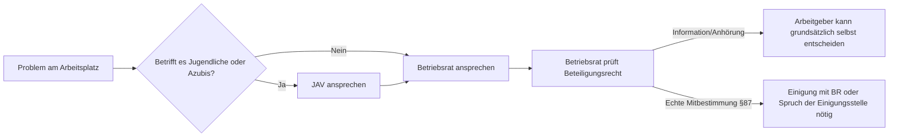

# LF1.3 – Recht, Schutz & Mitbestimmung

> **Zielgruppe:** Umschüler FIAE/FISI, 2. Lehrjahr
> **Prüfungsrelevanz:** AP1 (schriftlich) + Fachgespräch
> **Lernzeit:** Kerninhalt: 60–80 Min., mit Vertiefung (Nice-to-know, Fachgesprächs-Beispiele): 90–110 Min.
> **Status:** Final
> **Stand:** 2026-08-26 (Rechtsstände können sich ändern)

**Legende:** 🔴 Prüfungsstoff (hohe Relevanz) · 🟡 Kontextwissen (mittlere Relevanz) · 🟢 Nice to know

---

## IHK-Kernfragen

| # | Frage | Abschnitt |
|---|---|---|
| 1 | Welche Pflichten und Rechte haben Azubi und Betrieb nach BBiG jeweils? | [1](#1-rechte--pflichten-der-duale-tausch) |
| 2 | Bei welchen Themen hat der Betriebsrat ein echtes Mitbestimmungsrecht (Vetorecht)? | [2](#2-mitbestimmung-i--der-betriebsrat) |
| 3 | Wie unterscheidet sich die JAV vom Betriebsrat, und wie hängen beide zusammen? | [3](#3-mitbestimmung-ii--die-jav) |
| 4 | Welche 6 Merkmale schützt das AGG, und was bedeutet Beweislastumkehr? | [4](#4-fair-play-i--das-agg--diversity) |
| 5 | Welche Schutzfristen gelten beim Mutterschutz, und wer muss einer Kündigung Schwerbehinderter zustimmen? | [5](#5-fair-play-ii--besonderer-schutz) |

---

## 1. Rechte & Pflichten (Der duale Tausch)

> **Grundprinzip (didaktisches Modell):** Das BBiG regelt das Ausbildungsverhältnis wie einen Tausch – jede Pflicht der einen Seite spiegelt ein Recht der anderen. Rechtlich handelt es sich nicht um einen Tausch gleichartiger Leistungen, das Bild hilft aber beim Einprägen der Systematik.

### 1.1 Pflichten und Rechte im Überblick

| Perspektive | Pflichten | Rechte |
|---|---|---|
| Azubi (§ 13 BBiG) | Lernpflicht, sorgfältiger Umgang mit Werkzeugen/IT-Systemen, Verschwiegenheit (Betriebsgeheimnisse/Datenschutz), Befolgung rechtmäßiger ausbildungsbezogener Weisungen, Führen des Ausbildungsnachweises (Berichtsheft), unverzügliche Krankmeldung nach betrieblichen Vorgaben | Fachgerechte Ausbildung, pünktliche Vergütung (§ 17 BBiG), Fürsorge, qualifiziertes Zeugnis, bezahlte Freistellung für Schule/Prüfungen, nur ausbildungszweckdienliche Aufgaben (§ 14 BBiG) |
| Betrieb (§ 14 BBiG) | Ausbildung nach Plan (Ausbildungsrahmenplan) bis zum Ausbildungsziel, Fürsorge- und Schutzpflicht (keine körperliche/sittliche Gefährdung, charakterliche Förderung), Vergütungspflicht (auch bei Krankheit, 6 Wochen), Freistellungspflicht, kostenlose Bereitstellung der Ausbildungsmittel (§ 14 Abs. 1 Nr. 3 BBiG) | Weisungsrecht (Ort/Zeit/Art der Arbeit), Nutzung der Arbeitsergebnisse, eingeschränktes Kündigungsrecht (nach Probezeit nur aus wichtigem Grund) |

> **IHK-Typfrage:** *Der Chef verlangt, dass du am Wochenende sein privates WLAN zu Hause einrichtest. Musst du das tun?*
> **Musterantwort:** Nein, regelmäßig nicht. Nach § 14 Abs. 3 BBiG dürfen Azubis nur Aufgaben übernehmen, die dem Ausbildungszweck dienen. Die Einrichtung des privaten WLANs beim Chef zu Hause hat keinen erkennbaren Bezug zum Ausbildungsziel, deshalb darf ich diese Aufgabe grundsätzlich ablehnen. Zusätzlich müssten bei jeder Tätigkeit außerhalb der regulären Arbeitszeit ohnehin die arbeitszeitrechtlichen Vorgaben beachtet werden.

🔴 **Stolperstein:** "Ich muss alles tun, was der Chef sagt." Ausbildungsfremde Tätigkeiten (privates Auto waschen, wochenlanges reines Putzen) sind nach § 14 BBiG unzulässig – der Azubi darf sie verweigern.

🟡 **Kontextwissen:** Nach der Probezeit kann der Betrieb einem Azubi nur noch aus wichtigem Grund kündigen. Der Azubi selbst kann nach § 22 BBiG mit 4 Wochen Frist kündigen, wenn er die Berufsausbildung ganz aufgeben oder sich für eine andere Berufstätigkeit ausbilden lassen möchte – die Kündigung muss schriftlich erfolgen und den Grund angeben. Der Gesetzgeber schützt hier bewusst die strukturell schwächere Seite.

---

## 2. Mitbestimmung I – Der Betriebsrat

> **Grundprinzip:** Der Betriebsrat hat drei Stufen der Beteiligung – nur bei der höchsten Stufe darf der Chef nicht ohne Zustimmung entscheiden.

### 2.1 Die drei Stufen der Beteiligung

| Stufe | Bedeutung | Beispiel |
|---|---|---|
| Information | Arbeitgeber muss informieren, entscheidet aber allein | Wirtschaftliche Lage, bestimmte Planungen |
| Beratung/Anhörung | Betriebsrat wird beteiligt, Arbeitgeber entscheidet aber grundsätzlich selbst | Kündigung – ohne vorherige Anhörung ist sie unwirksam, der BR kann sie aber i. d. R. nicht verhindern |
| Mitbestimmung (echtes Beteiligungsrecht) | Maßnahme ist ohne Einigung mit dem BR (oder Spruch der Einigungsstelle) nicht durchsetzbar | Arbeitszeit, Pausen, Überstunden, Urlaubsgrundsätze, technische Überwachungseinrichtungen, Sozialeinrichtungen (§ 87 BetrVG) |

🟡 **Praxis-Tipp:** Der Betriebsrat hat **kein allgemeines Vetorecht gegen Kündigungen** – die Anhörungspflicht bei Kündigungen (§ 102 BetrVG) ist ein eigener, schwächerer Beteiligungstyp als die echte Mitbestimmung nach § 87 BetrVG. Bei Nichteinigung in einem Mitbestimmungsfall entscheidet notfalls die **Einigungsstelle**.

> **IHK-Typfrage:** *Der Chef will Überwachungskameras installieren, um die Produktivität zu messen. Darf er das allein?*
> **Musterantwort:** Nein. Eine Kamera ist objektiv geeignet, Verhalten oder Leistung von Beschäftigten zu überwachen – dabei kommt es nicht nur auf die konkrete Absicht des Arbeitgebers an. Deshalb greift regelmäßig § 87 Abs. 1 Nr. 6 BetrVG: Der Betriebsrat hat ein echtes Mitbestimmungsrecht, ohne seine Zustimmung darf der Chef die Kameras nicht installieren. Zusätzlich müssen Datenschutzrecht und Verhältnismäßigkeit beachtet werden.

🔴 **Stolperstein:** "Der Betriebsrat bestimmt bei Gehaltserhöhungen mit." Meist falsch: Löhne sind in der Regel Sache der Tarifpartner (Gewerkschaft), nicht des Betriebsrats – außer bei innerbetrieblichen Lohngrundsätzen oder der Verteilung von Prämien.

🟡 **Kontextwissen:** Grundlage ist das Betriebsverfassungsgesetz (BetrVG). Ein Betriebsrat wird in Betrieben mit in der Regel mindestens 5 ständigen wahlberechtigten Arbeitnehmern gewählt, von denen 3 wählbar sein müssen – maßgeblich ist der einzelne Betrieb, nicht das gesamte Unternehmen. Die regelmäßigen Wahlen finden alle 4 Jahre statt. Betriebsratsmitglieder genießen besonderen Kündigungsschutz.

🟢 **Nice to know:** Im öffentlichen Dienst heißt das entsprechende Gremium **Personalrat** und richtet sich nach den Personalvertretungsgesetzen von Bund/Ländern – die Mitbestimmungsrechte ähneln denen des Betriebsrats, sind aber nicht identisch.

---

## 3. Mitbestimmung II – Die JAV

> **Grundprinzip:** Die JAV ist die "kleine Schwester" des Betriebsrats – sie vertritt gezielt die Interessen von Azubis und jungen Beschäftigten, kann aber nur über den Betriebsrat wirksam werden.

### 3.1 JAV im Überblick

| Aspekt | Regelung | IHK-Relevanz |
|---|---|---|
| Aktives Wahlrecht | Alle Azubis (unabhängig vom Alter) + alle Arbeitnehmer unter 18 Jahren | 🔴 |
| Passives Wahlrecht | Alle Azubis/Arbeitnehmer unter 25 Jahren | 🔴 |
| Voraussetzung | Es muss einen Betriebsrat geben – ohne BR keine JAV | 🔴 |
| Aufgaben | Wacht über Einhaltung von BBiG/JArbSchG/Ausbildungsordnung, nimmt Anregungen entgegen, beantragt Maßnahmen beim Betriebsrat | 🟡 |
| Übernahmeanspruch | JAV-Mitglieder können unter den Voraussetzungen des § 78a BetrVG ihre unbefristete Weiterbeschäftigung verlangen – dafür müssen sie dies innerhalb der letzten 3 Monate vor Ausbildungsende schriftlich beantragen. Kein automatischer Anspruch ohne dieses Verlangen. | 🔴 |

> **IHK-Typfrage:** *Erkläre das Verhältnis zwischen JAV und Betriebsrat. Warum braucht die JAV den BR, um etwas durchzusetzen?*
> **Musterantwort:** Die JAV hat kein eigenes Mitbestimmungsrecht gegenüber dem Arbeitgeber – sie kann Anliegen der Azubis sammeln und Maßnahmen beim Betriebsrat beantragen, muss die eigentliche Durchsetzung aber über den BR laufen lassen, der über die gesetzlichen Beteiligungsrechte nach BetrVG verfügt. Ein JAV-Mitglied darf dafür an allen Betriebsratssitzungen teilnehmen und dort die Interessen der Jugend direkt einbringen.

🔴 **Stolperstein:** "Die JAV kann eigenständig mit dem Chef verhandeln." Falsch – die JAV hat kein eigenes Mitbestimmungsrecht gegenüber dem Arbeitgeber. Sie kann Anliegen sammeln und Maßnahmen beim Betriebsrat beantragen; ohne bestehenden Betriebsrat gibt es keine JAV.

🟡 **Praxis-Tipp:** Der Übernahmeanspruch nach § 78a BetrVG ist kein Selbstläufer: Er setzt ein rechtzeitiges, schriftliches Verlangen voraus, und der Arbeitgeber kann unter bestimmten Voraussetzungen beim Arbeitsgericht beantragen, dass kein Arbeitsverhältnis zustande kommt. Der Sinn der Regelung bleibt aber, dass JAV-Mitglieder sich trauen können, kritisch aufzutreten, ohne eine Nichtübernahme als Vergeltung fürchten zu müssen.

---

## 4. Fair Play I – Das AGG & Diversity

> **Grundprinzip:** Das AGG verbietet Benachteiligung aus 6 klar benannten Gründen – und kehrt im Streitfall die Beweislast zulasten des Arbeitgebers um.

### 4.1 Die 6 Diskriminierungsmerkmale

| # | Merkmal | IHK-Relevanz |
|---|---|---|
| 1 | Rasse / ethnische Herkunft *(Begriff steht so im Gesetzestext, wird aber fachlich/politisch kritisch gesehen – gemeint sind keine biologischen "Rassen")* | 🔴 |
| 2 | Geschlecht (m/w/d) | 🔴 |
| 3 | Religion / Weltanschauung | 🔴 |
| 4 | Behinderung | 🔴 |
| 5 | Alter | 🔴 |
| 6 | Sexuelle Identität | 🔴 |

> **IHK-Typfrage:** *Ein Unternehmen schreibt eine Stelle aus: "Wir suchen einen christlichen Entwickler, der Mitglied unserer Kirche ist." Ist das zulässig?*
> **Musterantwort:** Nein, das ist grundsätzlich unzulässig. Die Anzeige benachteiligt Bewerber aufgrund der Religion (Merkmal 3 des AGG) und ist nur in seltenen Ausnahmefällen zulässig, etwa wenn die Religionszugehörigkeit für eine konkrete Tätigkeit eine tatsächlich entscheidende berufliche Anforderung darstellt (z. B. bestimmte Stellen bei kirchlichen Arbeitgebern) – für eine normale Entwicklerstelle liegt dieser Ausnahmefall nicht vor. Eine erfolgreiche Diskriminierungsrüge führt dabei nicht automatisch zu einem Einstellungsanspruch, sondern typischerweise zu Schadensersatz- oder Entschädigungsansprüchen.

🔴 **Stolperstein:** "Positive Diskriminierung ist verboten." Falsch: Gezielte Förderung benachteiligter Gruppen ist nach § 5 AGG ausdrücklich erlaubt – verboten ist nur die klassische, benachteiligende Diskriminierung.

🟡 **Kontextwissen:** Bei der **Beweislastumkehr** (§ 22 AGG) muss die betroffene Person zunächst belastbare Indizien vortragen, die eine Benachteiligung vermuten lassen – ein bloßer Verdacht reicht nicht. Gelingt das, muss der Arbeitgeber beweisen, dass keine Diskriminierung vorlag. Diese Regel gilt im Zivilprozess. Ansprüche nach dem AGG müssen zudem innerhalb von 2 Monaten schriftlich geltend gemacht werden (§ 15 AGG).

---

## 5. Fair Play II – Besonderer Schutz

> **Grundprinzip:** Mutterschutz und Schwerbehindertenrecht greifen unabhängig vom AGG zusätzlich, weil sie nicht nur Diskriminierung verhindern, sondern aktiv besondere Lebenslagen absichern.

### 5.1 Mutterschutz (MuSchG)

| Aspekt | Regelung | IHK-Relevanz |
|---|---|---|
| Schutzfrist vor der Geburt | 6 Wochen: grundsätzlich kein Beschäftigungsverbot im absoluten Sinn – die Schwangere darf auf ausdrücklichen, jederzeit widerruflichen Wunsch weiterarbeiten | 🔴 |
| Schutzfrist nach der Geburt | 8 Wochen absolutes Beschäftigungsverbot, verlängert auf 12 Wochen bei Mehrlingsgeburten oder bestimmten Behinderungen des Kindes | 🔴 |
| Kündigungsschutz | Kündigungsverbot während der Schwangerschaft und bis 4 Monate nach der Geburt – gilt, wenn dem Arbeitgeber die Schwangerschaft bekannt ist oder sie ihm binnen 2 Wochen nach Zugang der Kündigung mitgeteilt wird; Ausnahmen nur mit behördlicher Zulässigkeitserklärung | 🔴 |
| Arbeitsplatz | Keine Nachtarbeit, kein Kontakt mit Gefahrstoffen | 🟡 |

### 5.2 Schwerbehindertenrecht (SGB IX)

| Aspekt | Regelung | IHK-Relevanz |
|---|---|---|
| Schwellenwert | Schwerbehinderung ab GdB 50; bei GdB 30/40 ist unter bestimmten Voraussetzungen eine **Gleichstellung** möglich, die Beschäftigungsschutz und Fördermöglichkeiten auslöst (aber nicht automatisch alle Rechte) | 🔴 |
| Rechte | 5 Tage Zusatzurlaub, besonderer Kündigungsschutz (Zustimmung des Integrationsamts nötig, mit Ausnahmen), Recht auf Teilzeit | 🔴 |
| Pflicht für Betriebe | Beschäftigungsquote für Betriebe ab 20 Arbeitsplätzen, sonst Ausgleichsabgabe | 🟡 |

> **IHK-Typfrage:** *Wer muss zustimmen, bevor einem Schwerbehinderten gekündigt werden kann?*
> **Musterantwort:** Bei schwerbehinderten Menschen ist vor einer ordentlichen oder außerordentlichen Kündigung grundsätzlich die vorherige Zustimmung des Integrationsamts erforderlich – ohne sie ist die Kündigung unwirksam. Dieser besondere Kündigungsschutz gilt jedoch nicht uneingeschränkt: In den ersten 6 Monaten des Arbeitsverhältnisses sowie in weiteren gesetzlich geregelten Fällen greift er nicht.

🟡 **Praxis-Tipp:** Im Vorstellungsgespräch darf eine schwangere Bewerberin bei einer unzulässigen Frage nach einer Schwangerschaft wahrheitswidrig antworten ("Recht zur Lüge") – die Frage selbst ist bereits unzulässig, weil sie eine Benachteiligung wegen des Geschlechts vorbereiten würde.

---

## Voice-Map: Wen spreche ich wann an?



---

## Selbsttest

| # | Frage | Kurzantwort |
|---|---|---|
| 1 | Darf ein Azubi private Tätigkeiten für den Chef verweigern? | Ja, wenn sie nicht dem Ausbildungszweck dienen (§ 14 BBiG) |
| 2 | Bei welcher Beteiligungsstufe hat der Betriebsrat ein Vetorecht? | Bei der Mitbestimmung (§ 87 BetrVG) |
| 3 | Wer ist zur JAV wählbar? | Arbeitnehmer unter 25 Jahren sowie Azubis unabhängig vom Alter |
| 4 | Wie viele Diskriminierungsmerkmale kennt das AGG? | 6 (Rasse/ethnische Herkunft, Geschlecht, Religion/Weltanschauung, Behinderung, Alter, sexuelle Identität) |
| 5 | Wie lange dauert die Schutzfrist nach der Geburt? | Grundsätzlich 8 Wochen, bei Mehrlingsgeburten oder bestimmten Behinderungen des Kindes 12 Wochen |
| 6 | Ab welchem GdB gilt jemand als schwerbehindert? | GdB 50 |
| 7 | Wer muss vor der Kündigung eines Schwerbehinderten zustimmen? | Das Integrationsamt |

---

## IHK-Cheatsheet

| Begriff | Kurzdefinition |
|---|---|
| § 13 BBiG | Pflichten des Auszubildenden (Lernpflicht, Sorgfalt, Verschwiegenheit, Berichtsheft) |
| § 14 BBiG | Pflichten des Ausbildenden, u. a. nur ausbildungszweckdienliche Aufgaben |
| § 17 BBiG | Regelt den Anspruch auf angemessene Vergütung |
| § 22 BBiG | Kündigung: nach Probezeit für den Azubi nur bei Berufsaufgabe/-wechsel, schriftlich mit Grund |
| BetrVG | Betriebsverfassungsgesetz – Grundlage des Betriebsrats |
| § 87 BetrVG | Katalog echter Mitbestimmungsrechte (u. a. Arbeitszeit, Überwachung, Sozialeinrichtungen wie Kantine/Parkplätze/Kita) |
| Einigungsstelle | Entscheidet bei Nichteinigung zwischen Arbeitgeber und Betriebsrat in Mitbestimmungsfällen |
| JAV | Jugend- und Auszubildendenvertretung, braucht einen bestehenden Betriebsrat |
| § 78a BetrVG | Übernahmeanspruch für JAV-Mitglieder nach rechtzeitigem schriftlichem Antrag |
| AGG | Allgemeines Gleichbehandlungsgesetz, 6 Diskriminierungsmerkmale |
| § 22 AGG | Beweislastumkehr: nach belastbaren Indizien muss der Arbeitgeber Diskriminierungsfreiheit beweisen |
| MuSchG | Mutterschutzgesetz – Schutzfristen und Kündigungsverbot |
| GdB 50 / Gleichstellung | Schwelle für Schwerbehinderung; bei GdB 30/40 ist Gleichstellung möglich |

---

## Prüfungstaktik

| Aufgabentyp | Typische Formulierung | Beispiel aus AP1 | Was die IHK hören will |
|---|---|---|---|
| Rechtsprüfung im Fallbeispiel | "Darf X das tun/anordnen?" | "Der Ausbilder verlangt, dass der Azubi sein privates Auto wäscht. Darf er das?" | Konkrete Norm nennen (§ 14 BBiG), Begründung, klares Ja/Nein |
| Zuordnung von Beteiligungsrechten | "Welches Recht greift bei X?" | "Ordnen Sie zu: Einführung von Kurzarbeit – Information, Anhörung oder Mitbestimmung?" | Fallabhängig antworten: Betrifft die Kurzarbeit die Verteilung der Arbeitszeit, greift Mitbestimmung (§ 87 BetrVG); ist sie eine rein betriebswirtschaftliche Entscheidung ohne Arbeitszeit-Bezug, reicht Information/Anhörung |
| Diskriminierungsprüfung | "Ist Formulierung X zulässig?" | "Prüfen Sie die Stellenanzeige 'Verkäuferin gesucht, Deutsch Muttersprache' auf AGG-Verstöße." | Betroffenes Merkmal benennen, Beweislastumkehr erwähnen |
| Bewertung/Diskussion | "Nimm Stellung zu These X" | "Nehmen Sie Stellung zur These: Der Kündigungsschutz für Schwerbehinderte schreckt Firmen von deren Einstellung ab." | Pro- und Contra-Argument, dann begründete eigene Position |

---

## Merk-Sätze fürs Fachgespräch

> Jede Pflicht im BBiG hat ein Gegenrecht – Azubi und Betrieb stehen sich als "Tauschpartner" gegenüber, nicht als Befehlsempfänger und Befehlsgeber.

> Nur bei echter Mitbestimmung (§ 87 BetrVG) hat der Betriebsrat ein Vetorecht – bei Information und Anhörung entscheidet der Chef am Ende allein.

> Die JAV kann Themen setzen und Maßnahmen beantragen, ihre Beteiligungsrechte laufen aber über den Betriebsrat – deshalb setzt eine JAV einen bestehenden Betriebsrat voraus.

> Das AGG dreht im Streitfall die Beweislast um – schon Indizien reichen, damit der Arbeitgeber Diskriminierungsfreiheit beweisen muss.

> Mutterschutz und Schwerbehindertenrecht schützen zusätzlich zum AGG – sie sichern konkrete Lebenslagen ab, nicht nur die Abwesenheit von Diskriminierung.

---

```yaml
lernfeld: LF1.3
titel: Recht, Schutz & Mitbestimmung
status: final
stand: 2026-08-26
quellen:
  - LF1.3- Recht, Schutz & Mitbestimmung
  - LF1.3.1- Rechte & Pflichten (Der duale Tausch)
  - LF1.3.2- Mitbestimmung I - Der Betriebsrat
  - LF1.3.3- Mitbestimmung II - Die JAV
  - LF1.3.4- Fair Play I - Das AGG & Diversity
  - LF1.3.5- Fair Play II - Besonderer Schutz
```