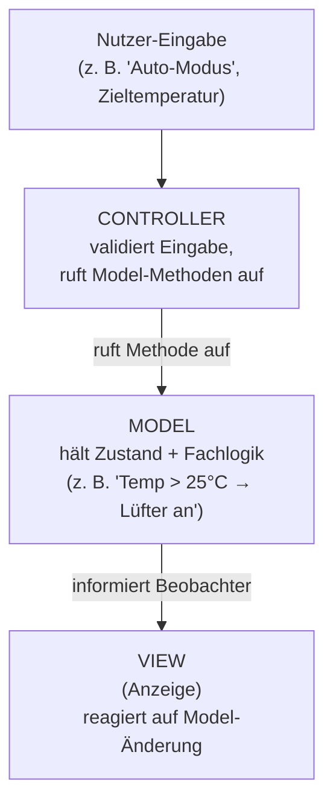

# Python vs. TypeScript & MVC-Architekturen (Django, Angular, NestJS)

> **Zielgruppe:** Umschüler FIAE/FISI, 2. Lehrjahr
> **Prüfungsrelevanz:** AP1 (schriftlich) + Fachgespräch
> **Lernzeit:** Ca. 45–60 Minuten
> **Status:** Review
> **Stand:** 2026 (referenzierte Versionen: Angular 19/20, NestJS 11, Django 5.x)

---

## IHK-Kernfragen

| # | Frage | Abschnitt |
|---|-------|-----------|
| 1 | Was ist der zentrale Unterschied zwischen Python und TypeScript bei der Typisierung? | [→ 2. Typisierung im Vergleich](#2-typisierung-im-vergleich) |
| 2 | Wofür wird Python typischerweise eingesetzt, wofür TypeScript? | [→ 3. Einsatzgebiete & Ökosysteme](#3-einsatzgebiete--ökosysteme) |
| 3 | Was sind Model, View und Controller im klassischen MVC-Muster? | [→ 4. Klassisches MVC – das Grundmuster](#4-klassisches-mvc--das-grundmuster) |
| 4 | Ist Django MVC? Ist Angular MVC? | [→ 5. Framework-Realität: Django, Angular, NestJS](#5-framework-realität-django-angular-nestjs) |
| 5 | Wie würdest du eine Lüftungssteuerung nach klassischem MVC aufbauen? | [→ 4.1 Codebeispiel: Lüftungssteuerung](#41-codebeispiel-lüftungssteuerung-in-vanilla-typescript) |

---

## 1. Grundphilosophie: zwei unterschiedliche Denkweisen

> Python will, dass Code aussieht wie gut lesbarer Text. TypeScript will, dass Fehler schon beim Bauen auffallen, nicht erst beim Betrieb.

Stell dir zwei Handwerksbetriebe vor: Der eine (Python) arbeitet nach dem Prinzip „Erfahrung und klare Absprachen reichen, wir schauen bei der Abnahme genau hin" – flexibel, aber Fehler zeigen sich oft erst am fertigen Werkstück. Der andere (TypeScript) arbeitet nach Norm-Maßblättern, die vor Baubeginn geprüft werden – mehr Vorarbeit, aber Maßfehler fallen auf, bevor überhaupt Material verbaut wird.

| Aspekt | Python | TypeScript | IHK-Relevanz |
|--------|--------|------------|:---:|
| Sprachtyp | Dynamisch typisiert, interpretiert | Superset von JavaScript, statisch typgeprüft, wird zu JS kompiliert | 🔴 |
| Blockstruktur | Einrückung (Whitespace-sensitiv) | `{ }`-Klammern | 🟡 |
| Ausführung | Direkt per Interpreter (`python main.py`) | Kompilierung via `tsc`, dann Ausführung als JS (Browser/Node) | 🔴 |
| Ausführung (moderne Tools) | – | Bei `ts-node`, Bun oder Deno läuft die Kompilierung intern und unsichtbar ab – der Schritt entfällt nicht, er wird nur nicht mehr manuell aufgerufen | 🟢 |
| Designziel | Lesbarkeit, „ein offensichtlicher Weg" | Fehler früh erkennen, große JS-Codebasen absichern | 🔴 |

---

## 2. Typisierung im Vergleich

> Python prüft Typen zur Laufzeit (wenn überhaupt), TypeScript prüft sie beim Kompilieren – bevor der Code läuft.

| Aspekt | Python | TypeScript | IHK-Relevanz |
|--------|--------|------------|:---:|
| Typ-Prüfung | Dynamisch, zur Laufzeit | Statisch, zur Compile-Zeit | 🔴 |
| Typangaben | Optional (Type Hints, PEP 484) | Verpflichtend/empfohlen, sonst Typ-Inferenz | 🔴 |
| Typsystem | Locker, Duck-Typing-Tendenz | Strukturell („shape-based": gleiche Form = gleicher Typ) | 🟡 |
| Prüfwerkzeug | `mypy` (optional, extern) | `tsc` (fester Bestandteil des Build-Prozesses) | 🟡 |

**IHK-Typfrage:**
> *„Nennen Sie den Hauptunterschied zwischen der Typisierung von Python und TypeScript."*
> Musterantwort: Python typisiert dynamisch zur Laufzeit, Typangaben sind optional. TypeScript typisiert statisch zur Compile-Zeit über den Compiler `tsc` – Typfehler werden erkannt, bevor der Code überhaupt ausgeführt wird.

**Fachgespräch-Falle:** Duck Typing und strukturelle Typisierung wirken wie Gegensätze, sind es aber nicht ganz. TypeScripts strukturelles Typsystem ist im Kern eine *formalisierte, compile-zeit-geprüfte* Form von Duck Typing – "wenn es die gleiche Form hat, gilt es als gleicher Typ" ist bei beiden Sprachen das Grundprinzip, nur dass TypeScript das schon vor der Ausführung durchsetzt. 🟡

---

## 3. Einsatzgebiete & Ökosysteme

> Python ist der Allrounder für Backend, Automatisierung und Data/KI. TypeScript ist der Standard für große, wartbare Frontend- und Full-Stack-JavaScript-Projekte.

| Bereich | Python | TypeScript | IHK-Relevanz |
|---------|--------|------------|:---:|
| Web-Backend | Django, Flask | Node.js-Backends (NestJS, Express+TS) | 🔴 |
| Frontend/SPA | – (nicht typisch) | Angular, React/Vue mit TS | 🔴 |
| Automatisierung/Scripting | Kernstärke (Admin-Skripte, DevOps) | Untypisch | 🟡 |
| Data Science/KI | Quasi-Standard (NumPy, pandas, PyTorch) | Kaum verbreitet | 🟢 |

**Praxis-Faustregel:** Viele Firmen kombinieren TypeScript im Frontend mit Python im Backend – starkes UI-Tooling trifft auf ein reiches Backend-Ökosystem. 🟡

---

## 4. Klassisches MVC – das Grundmuster

> Model kennt seinen Zustand und seine Fachlogik, View beobachtet das Model, Controller vermittelt zwischen Nutzereingabe und Model. Keine Schicht macht den Job einer anderen.

Das ist das Muster, das für die Prüfung zählt – unabhängig von jedem Framework. Beispiel: eine Lüftungssteuerung.



| Rolle | Aufgabe | IHK-Relevanz |
|-------|---------|:---:|
| Model | Zustand halten, Fachlogik ausführen, Beobachter (Views) informieren | 🔴 |
| View | Zustand darstellen, auf Model-Änderungen reagieren (Observer/Listener) | 🔴 |
| Controller | Eingaben entgegennehmen, validieren, Model-Methoden aufrufen – **ändert selbst nichts an der Darstellung** | 🔴 |

**IHK-Typfrage:**
> *„Warum darf der Controller im MVC-Muster die View nicht direkt ändern?"*
> Musterantwort: Der Controller vermittelt nur zwischen Eingabe und Model. Die Darstellung wird ausschließlich vom Model über den Beobachter-Mechanismus angestoßen – so bleibt die Trennung der Zuständigkeiten (Separation of Concerns) erhalten und das Model bleibt unabhängig von der konkreten Darstellung.

Dieses reine Muster lässt sich sauber in **Vanilla TypeScript ohne Framework** umsetzen – genau das ist die empfohlene Referenz für Prüfungsaufgaben und Klassendiagramme. 🔴

### 4.1 Codebeispiel: Lüftungssteuerung in Vanilla TypeScript

Kompaktes Beispiel für Model (mit Beobachter-Mechanismus), View und Controller – als Referenz für ein Prüfungs-Klassendiagramm:

```typescript
// MODEL – hält Zustand + Fachlogik, informiert Beobachter
class LueftungsModel {
  private temperatur = 0;
  private luefterAn = false;
  private beobachter: Array<() => void> = [];

  registriereBeobachter(fn: () => void): void {
    this.beobachter.push(fn);
  }

  setTemperatur(temp: number): void {
    this.temperatur = temp;
    this.luefterAn = temp > 25; // Fachlogik
    this.benachrichtigeBeobachter();
  }

  get status() {
    return { temperatur: this.temperatur, luefterAn: this.luefterAn };
  }

  private benachrichtigeBeobachter(): void {
    this.beobachter.forEach((fn) => fn());
  }
}

// VIEW – beobachtet das Model, stellt Zustand dar
class LueftungsView {
  constructor(private model: LueftungsModel) {
    model.registriereBeobachter(() => this.render());
  }

  render(): void {
    const { temperatur, luefterAn } = this.model.status;
    console.log(`Temp: ${temperatur}°C | Lüfter: ${luefterAn ? "AN" : "AUS"}`);
  }
}

// CONTROLLER – nimmt Eingaben entgegen, validiert, ruft Model auf
class LueftungsController {
  constructor(private model: LueftungsModel) {}

  eingabeZieltemperatur(rohwert: string): void {
    const temp = Number(rohwert);
    if (Number.isNaN(temp)) {
      console.warn("Ungültige Eingabe");
      return;
    }
    this.model.setTemperatur(temp); // Controller ändert NICHT die Darstellung selbst
  }
}

// Verdrahtung
const model = new LueftungsModel();
const view = new LueftungsView(model);
const controller = new LueftungsController(model);

controller.eingabeZieltemperatur("28"); // → Temp: 28°C | Lüfter: AN
```

**IHK-Relevanz:** 🔴 – genau dieses Muster (Model mit `registriereBeobachter`, Controller ohne direkten View-Zugriff) ist die erwartete Antwort auf Kernfrage #5.

---

## 5. Framework-Realität: Django, Angular, NestJS

> Kein modernes Framework setzt „Lehrbuch-MVC" 1:1 um – jedes biegt das Muster für seinen Zweck zurecht. Für die Prüfung zählt trotzdem das reine Muster aus Abschnitt 4.

### 5.1 Django (Python) → MTV, nicht MVC

Django nennt sein Muster offiziell **MTV** (Model–Template–View):

| Django-Begriff | Entspricht im MVC | Datei | IHK-Relevanz |
|----------------|-------------------|-------|:---:|
| Model | Model | `models.py` | 🔴 |
| Template | View (Darstellung) | `templates/*.html` | 🔴 |
| View | Controller | `views.py` | 🔴 |
| „Controller" | Übernimmt Django selbst über den URL-Dispatcher | `urls.py` | 🟡 |

**Merken:** Bei Django tauschen View und Controller quasi die Namen – die Django-„View" macht das, was im klassischen MVC der Controller tut.

**Trennschärfe-Hinweis:** Die Django-View liefert nur die *Auswahl* (welches Template) und die *Daten* dafür – die eigentliche Darstellungslogik (HTML-Struktur, Schleifen, Bedingungen im Markup) liegt ausschließlich im Template selbst. 🔴

### 5.2 Angular (TypeScript) → Component-based, kein klassisches MVC

Seit Angular 2+ gibt es keine eigene Controller-Schicht mehr (Unterschied zu AngularJS 1.x):

| Angular-Baustein | Rolle | IHK-Relevanz |
|-------------------|-------|:---:|
| Component-Klasse (TS) | Mischung aus View-Logik + Controller-Verhalten | 🔴 |
| Template (HTML) | Darstellung, Datenbindung zur Component | 🔴 |
| Service (oft mit RxJS) | Datenzugriff/Logik – optionales Model-artiges Pattern | 🟡 |
| Signal (seit Angular 16+) | Reaktiver Zustandscontainer, der Views bei Änderung automatisch aktualisiert | 🟡 |

**Merken:** Ein striktes, beobachtbares Model-Objekt ist bei Angular kein Pflichtbestandteil des Frameworks, sondern höchstens ein zusätzliches Entwurfsmuster. Angular ist MVC-*inspiriert*, aber kein Referenzbeispiel für „reines" MVC in der Prüfung.

**Update (Stand 2026):** Seit Angular 16+ gibt es **Signals** – ein nativ ins Framework integriertes reaktives Pattern, das dem Observer-Prinzip des klassischen Models sehr nahekommt: Ein Signal hält einen Zustand, und jede View, die es liest, aktualisiert sich automatisch bei Änderung. Die Aussage "kein Model-Pattern im Framework" gilt damit nicht mehr uneingeschränkt – Signals sind kein vollwertiges Model mit Fachlogik, aber ein natives Beobachter-Mechanismus. 🟡

**Erwartungssteuerung:** In der schriftlichen AP1 werden Signals als recht junge Neuerung vermutlich noch nicht abgefragt – Prüfungsinhalte laufen den Framework-Versionen meist einige Jahre hinterher. Im Fachgespräch punktet der Hinweis dagegen als Zusatzwissen, das Aktualität zeigt. 🟢

### 5.3 NestJS (TypeScript) → Layered/Modular Architecture

| NestJS-Baustein | Aufgabe | IHK-Relevanz |
|-------------------|---------|:---:|
| Controller | Nimmt HTTP-Requests entgegen, ruft Service auf, gibt Response zurück | 🔴 |
| Service | Enthält Businesslogik, meist stateless pro Request | 🔴 |
| Repository | Datenzugriffsschicht – kapselt Datenbank-Queries, gibt Entities zurück | 🔴 |
| Entity (z. B. TypeORM-Entity) | Passive Datenstruktur (reine Daten), **kennt keine Views/Controller** | 🔴 |

**Merken:** Repository und Entity sind zwei unterschiedliche Konzepte, keine Zeile: Das **Repository** ist die Datenzugriffsschicht (Queries, Speichern, Laden), die **Entity** ist die reine Datenstruktur, die dabei transportiert wird. Der entscheidende Unterschied zu klassischem MVC: Die Entity ist eine *passive* Datenstruktur ohne Beobachter-Mechanismus – NestJS ist daher formal eine Schichtenarchitektur (Controller → Service → Repository → Entity), nicht reines MVC. 🔴

---

## 6. Typische Prüfungsfehler – und wie man sie vermeidet

Statt Abschnitt 5 zu wiederholen: Hier sind die Fehler, die Umschüler im Fachgespräch am häufigsten machen.

| Typischer Fehler | Warum das falsch ankommt | Richtige Formulierung |
|-------------------|----------------------------|--------------------------|
| „Django ist MVC" | Django nennt sein eigenes Muster explizit MTV, nicht MVC | „Django ist MTV, eine Django-spezifische Variante von MVC, bei der das Framework den Controller-Teil über den URL-Dispatcher übernimmt." |
| „Angular ist ein MVC-Framework" | Seit Angular 2+ gibt es keine eigene Controller-Schicht mehr | „Angular ist Component-based. Die Component übernimmt View- und Controller-Aufgaben in einer Klasse." |
| „NestJS hat ein Model wie im klassischen MVC" | Die Entity in NestJS ist passiv, kennt keine Beobachter | „NestJS hat eine passive Entity ohne Observer-Mechanismus – formal eine Schichtenarchitektur, kein MVC." |
| „TypeScript wird immer manuell mit `tsc` kompiliert" | Bei `ts-node`/Bun/Deno läuft die Kompilierung intern, nur unsichtbar | „TypeScript wird immer kompiliert – ob der Schritt sichtbar (`tsc`) oder intern (`ts-node`, Bun) passiert, ändert daran nichts." |
| „Duck Typing und strukturelle Typisierung sind Gegensätze" | TS' Strukturtypisierung ist eine formalisierte, geprüfte Form von Duck Typing | „Beide folgen dem Prinzip 'gleiche Form = gleicher Typ' – TypeScript prüft das nur schon vor der Ausführung." |

**Merksatz für den Prüfer:** Wenn nach „ist Framework X reines MVC?" gefragt wird, lautet die sichere Antwort so gut wie immer: *nein, aber MVC-verwandt* – mit konkreter Begründung, welche Schicht abweicht.

---

## Selbsttest

| # | Frage | Kurzantwort |
|---|-------|-------------|
| 1 | Wann wird ein TypeScript-Typfehler erkannt? | Zur Compile-Zeit, durch `tsc` |
| 2 | Welche Datei enthält bei Django die Fachlogik/Daten? | `models.py` |
| 3 | Warum ist Angular kein „reines" MVC? | Keine eigene Controller-Schicht seit Angular 2+, Component übernimmt View+Controller-Rolle (siehe auch Signals in 5.2 – ändert daran nichts, ergänzt nur das Model-Bild) |
| 4 | Was macht das Model in NestJS anders als im klassischen MVC? | Es ist passiv, kennt keine Beobachter (Views/Controller) |
| 5 | Welches Framework sollte man für ein MVC-Klassendiagramm in der Prüfung als Referenz nehmen? | Ein frameworkloses (Vanilla) TypeScript-Beispiel, nicht Angular oder NestJS |
| 6 | Was ändert sich an der Model-Aussage zu Angular seit Version 16? | Signals bringen ein natives reaktives Pattern, das dem Observer-Prinzip nahekommt – "kein Model-Pattern" gilt nicht mehr uneingeschränkt |

---

## IHK-Cheatsheet

| Begriff | Kurzdefinition |
|---------|-----------------|
| Type Hints | Optionale Typangaben in Python (PEP 484), geprüft von Tools wie `mypy`, nicht zur Laufzeit |
| `tsc` | TypeScript-Compiler, übersetzt `.ts` nach `.js` und prüft Typen |
| Strukturelles Typsystem | „Shape-based": gleiche Objektform = gleicher Typ (TypeScript) |
| MTV | Model-Template-View, Django-Variante von MVC |
| Observer-Pattern | Mechanismus, mit dem das Model seine Views über Zustandsänderungen informiert |
| Separation of Concerns | Trennprinzip: jede Schicht hat genau eine Zuständigkeit |
| Component (Angular) | Kombiniert View-Logik und Controller-Verhalten in einer TS-Klasse |
| Signal (Angular 16+) | Nativer reaktiver Zustandscontainer – Views aktualisieren sich automatisch bei Änderung |
| Layered Architecture | Schichtenmodell (z. B. Controller → Service → Repository bei NestJS) |
| Repository (NestJS) | Datenzugriffsschicht, kapselt Datenbank-Queries |
| Entity (NestJS/TypeORM) | Passive Datenstruktur ohne Beobachter-Mechanismus, wird vom Repository geliefert |
| Duck Typing | „Wenn es aussieht wie ein X, wird es wie ein X behandelt" – lockeres Typverhalten; TypeScripts strukturelles Typsystem ist eine formalisierte Variante davon |

---

## Prüfungstaktik

| Aufgabentyp | Typische Formulierung | Was die IHK hören will |
|-------------|------------------------|--------------------------|
| Sprachvergleich | „Vergleichen Sie Python und TypeScript hinsichtlich der Typisierung" | Dynamisch/Laufzeit vs. statisch/Compile-Zeit, konkretes Werkzeug nennen (`mypy`, `tsc`) |
| MVC-Klassendiagramm | „Modellieren Sie ein MVC-System für [Szenario]" | Reines MVC ohne Framework-Bezug, Observer-Mechanismus explizit einzeichnen |
| Framework-Einordnung | „Ist Angular ein MVC-Framework?" | Nein, seit Angular 2+ Component-based; Begründung mit fehlender Controller-Schicht |
| Architektur-Begründung | „Warum ist NestJS kein reines MVC?" | Passives Model ohne Beobachter, formal Layered Architecture |

---

## Merk-Sätze für die mündliche Prüfung

> Python prüft Typen zur Laufzeit, TypeScript beim Kompilieren.

> Bei Django tauschen View und Controller im Vergleich zum Lehrbuch-MVC quasi ihre Rollen.

> Angular ist Component-based – es gibt keine eigene Controller-Schicht mehr.

> NestJS ist eine Schichtenarchitektur: Controller → Service → Repository → Entity, kein reines MVC.

> Für ein Prüfungs-Klassendiagramm zu MVC gilt: kein Framework, sondern das reine Muster zeigen.

---

```yaml
titel: "Python vs. TypeScript & MVC-Architekturen (Django, Angular, NestJS)"
typ: "A"
lernfeld: "LF8"
stichworte: [Python, TypeScript, MVC, MTV, Django, Angular, NestJS, Architektur, Signals]
versionen: { angular: "19/20", nestjs: "11", django: "5.x" }
status: review
stand: 2026
aktualisiert: 2026-08-07
```
