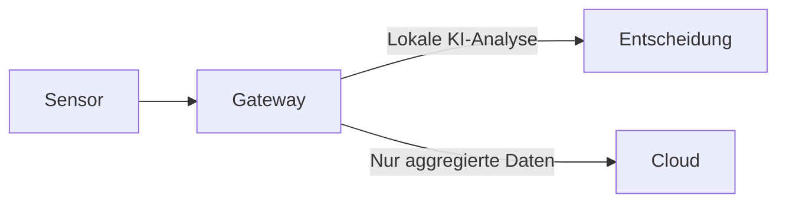
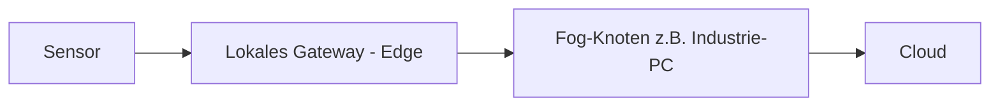
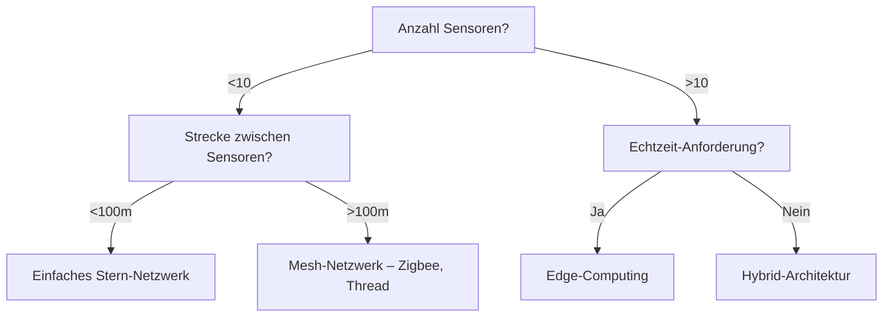

# Deep Dive 1: IoT-Komponenten & Topologien

*Von der Hardware zur sicheren Systemarchitektur – alles für stabile IoT-Systeme*

---

## 📌 Inhaltsverzeichnis

1. [Die 5 Kernkomponenten eines IoT-Systems](#1-die-5-kernkomponenten-eines-iot-systems)
2. [Topologien: Aufbau von IoT-Netzwerken](#2-topologien-aufbau-von-iot-netzwerken)
3. [Sicherheitsarchitektur: Absicherung von IoT-Systemen](#3-sicherheitsarchitektur-absicherung-von-iot-systemen)
4. [Entscheidungsbaum: Welche Topologie passt zu deinem Projekt?](#4-entscheidungsbaum-welche-topologie-passt-zu-deinem-projekt)
5. [Checkliste: IoT-System sicher aufbauen](#5-checkliste-iot-system-sicher-aufbauen)
6. [Weiterführende Ressourcen](#6-weiterführende-ressourcen)

---

## 1. Die 5 Kernkomponenten eines IoT-Systems

| **Komponente**       | **Funktion**                                  | **Beispiele**                     | **Richtpreise (2026)** | **Auswahlkriterien**                          |
|-----------------------|-----------------------------------------------|-----------------------------------|------------------------|-----------------------------------------------|
| **Sensoren**          | Erfassen physikalische Daten (Temperatur, Vibration, Feuchtigkeit) | SW-420 (Vibration), DHT22 (Temperatur/Feuchtigkeit), ADXL345 (Beschleunigung) | 2–20 €                 | **Messbereich**, **Genauigkeit**, **Stromverbrauch**, **Schnittstelle** (analog/digital/I²C/SPI) |
| **Mikrocontroller**   | Verarbeitet Sensordaten und steuert Aktionen | ESP32, Raspberry Pi Pico, Arduino Uno, STM32 | 5–50 €                 | **WLAN/Bluetooth**, **GPIO-Pins**, **Stromverbrauch**, **Programmiersprache** (C++, MicroPython) |
| **Gateway**           | Verbindet Sensoren mit der Cloud (MQTT-Broker, VPN) | Raspberry Pi 4, BeagleBone (bei einfachen Brücken auch ESP32 mit Ethernet) | 30–100 €               | **Rechenleistung**, **Speicher**, **Betriebssystem** (Linux/RTOS) – für MQTT-Broker & Datenbanken wird ein Linux-System empfohlen |
| **Cloud/Backend**     | Speichert, analysiert und visualisiert Daten | AWS IoT Core, InfluxDB, Grafana, Node-RED | 0–50 €/Monat           | **Skalierbarkeit**, **Kosten**, **API-Zugriff**, **Datenbank** |
| **Aktoren**           | Führen Aktionen aus (z. B. Warnmeldung, Steuerung) | Relais-Modul, LED, Buzzer, OLED-Display | 1–15 €                 | **Spannungsbereich**, **Schaltleistung**, **Schnittstelle** |

---

### 🔍 Beispiel: Komponenten für ein Predictive-Maintenance-System

| **Komponente**       | **Beispiel**                     | **Aufgabe im System**                                                                 |
|-----------------------|----------------------------------|---------------------------------------------------------------------------------------|
| **Sensor**            | ADXL345 (Beschleunigungssensor)  | Misst Vibrationen der Maschine in 3 Achsen (X, Y, Z)                                  |
| **Mikrocontroller**   | ESP32 DevKit                     | Liest Sensor aus, sendet Daten über WiFi an MQTT-Broker, steuert Warn-LED            |
| **Gateway**           | Raspberry Pi 4                   | Fungiert als MQTT-Broker, speichert Daten in InfluxDB, sendet E-Mail-Warnungen        |
| **Cloud**             | AWS IoT Core                     | Langzeitspeicherung, KI-basierte Anomalieerkennung (optional)                        |
| **Aktor**             | Relais-Modul + LED               | Schaltet bei Warnung eine LED ein oder schließt einen 24 V-Steuerkreis (z. B. zum Digital-Eingang einer SPS) |

---

## 2. Topologien: Aufbau von IoT-Netzwerken

### 📌 Topologie 1: Einfaches Stern-Netzwerk (Single-Hop)

*(1 Sensor → 1 Gateway → Cloud)*


| **Vorteile**               | **Nachteile**               | **Einsatzgebiet**          |
|-----------------------------|-----------------------------|----------------------------|
| ✅ Einfach zu implementieren | ❌ Single Point of Failure  | Smart Home                 |
| ✅ Geringe Latenz            | ❌ Skalierbarkeit begrenzt  | Kleine Industrieanlagen    |
| ✅ Geringe Kosten            |                             |                            |

---

### 📌 Topologie 2: Mesh-Netzwerk (Multi-Hop)

*(Sensoren kommunizieren untereinander und mit Gateway – z. B. über Zigbee, Thread oder BLE Mesh)*


| **Vorteile**               | **Nachteile**                     | **Einsatzgebiet**          |
|-----------------------------|-----------------------------------|----------------------------|
| ✅ Ausfallsicher             | ❌ Komplexere Implementierung      | Smart City                 |
| ✅ Hohe Reichweite           | ❌ Höherer Stromverbrauch (bei batteriebetriebenen Knoten) | Große Industriehallen      |
| ✅ Skalierbar                | ❌ Benötigt Routing-Protokoll (z. B. Zigbee Pro, Thread) |                            |

---

### 📌 Topologie 3: Edge-Computing (Datenverarbeitung vor Ort)

*(Sensor → Gateway → Lokale Analyse → Cloud)*



| **Vorteile**               | **Nachteile**                   | **Einsatzgebiet**          |
|-----------------------------|---------------------------------|----------------------------|
| ✅ Echtzeit-Analyse          | ❌ Höhere Hardware-Anforderungen | Predictive Maintenance    |
| ✅ Geringere Cloud-Kosten    | ❌ Komplexere Software           | Autonome Roboter           |
| ✅ Datenschutz               |                                 |                            |

---

### 📌 Topologie 4: Hybrid (Cloud + Edge + Fog)

*(Kombination aus Edge, Fog und Cloud für maximale Flexibilität)*



| **Vorteile**               | **Nachteile**               | **Einsatzgebiet**          |
|-----------------------------|-----------------------------|----------------------------|
| ✅ Optimale Balance          | ❌ Sehr komplex             | Industrie 4.0             |
| ✅ Ausfallsicher             | ❌ Hohe Hardware-Kosten      | Smart Grids                |
| ✅ Kosteneffizient           |                             |                            |

---

## 3. Sicherheitsarchitektur: Absicherung von IoT-Systemen

### 🔒 Ebene 1: Hardware-Sicherheit

| **Maßnahme**               | **Umsetzung**                                  | **Beispiel**                     |
|-----------------------------|-----------------------------------------------|-----------------------------------|
| **Standard-Passwörter vermeiden** | **Individuelle Passwörter** für jeden Dienst (Web-Interface, SSH, MQTT-Zugang) | `mosquitto_passwd` für MQTT-Broker; starkes Passwort für Web-Login vergeben |
| **Firmware-Updates erzwingen** | **Automatische Updates** (z. B. über OTA)    | ESP32 mit `ESP32_OTA` Bibliothek  |
| **Physikalischen Zugang schützen** | **Geheimen Schalter** oder **Gehäuse**       | Sensoren in abschließbaren Gehäusen montieren |

---

### 🔒 Ebene 2: Netzwerk-Sicherheit

| **Maßnahme**               | **Umsetzung**                                  | **Beispiel**                     |
|-----------------------------|-----------------------------------------------|-----------------------------------|
| **MQTT mit TLS verschlüsseln** | **Port 8883** statt 1883, Zertifikate         | `client.connect("ESP32", "user", "pass", true)` |
| **Firewall-Regeln**         | **Nur notwendige Ports öffnen**               | Raspberry Pi: `sudo ufw allow 8883/tcp` |
| **VPN für Remote-Zugriff**  | **WireGuard oder OpenVPN** (nur wenn Fernwartung nötig) | `sudo apt install wireguard`      |

---

### 🔒 Ebene 3: Daten-Sicherheit

| **Maßnahme**               | **Umsetzung**                                  | **Beispiel**                     |
|-----------------------------|-----------------------------------------------|-----------------------------------|
| **Datenverschlüsselung**    | **AES-256** für lokale Speicherung            | InfluxDB-Daten auf LUKS-verschlüsseltem Volume speichern |
| **DSGVO-konforme Cloud**    | **Europäische Server** (z. B. AWS Frankfurt) | `aws configure` (Region: `eu-central-1`) |

---

### 🔒 Ebene 4: Cloud-Sicherheit

| **Maßnahme**               | **Umsetzung**                                  | **Beispiel**                     |
|-----------------------------|-----------------------------------------------|-----------------------------------|
| **IAM-Rollen (AWS/Azure)**  | **Minimale Berechtigungen** (Least Privilege) | `AWS IoT Core Policy: "iot:Connect"` |
| **Automatische Backups**    | **Tägliche Snapshots**                        | AWS RDS mit automatischen Backups |

---

## 4. Entscheidungsbaum: Welche Topologie passt zu deinem Projekt?



📌 **Beispiel-Entscheidungen:**

- **1 Maschine mit 5 Sensoren in einer Werkshalle (10 m Radius)** → Stern-Netzwerk (ESP32 → Raspberry Pi → MQTT → Cloud).
- **100 Mülltonnen in einer Stadt (5 km Radius)** → LoRaWAN-Sternnetz mit mehreren Gateways (Sensoren funken direkt an Gateways, keine direkte Sensor-zu-Sensor-Kommunikation).

---

## 5. Checkliste: IoT-System sicher aufbauen

| Kategorie   | Maßnahme                                      | Erledigt? |
|-------------|-----------------------------------------------|-----------|
| Hardware    | ✅ Standard-Passwörter (Web, SSH, MQTT) geändert | ⬜ |
|             | ✅ Firmware-Updates aktiviert                  | ⬜ |
| Netzwerk    | ✅ MQTT über TLS (Port 8883)                   | ⬜ |
|             | ✅ Firewall-Regeln konfiguriert                 | ⬜ |
|             | ✅ VPN für Fernwartung eingerichtet (nur bei Remote-Zugriff nötig) | ⬜ |
| Daten       | ✅ Sensordaten lokal verschlüsselt (AES-256 / LUKS) | ⬜ |
|             | ✅ Cloud-Speicher in Europa                    | ⬜ |
| Monitoring  | ✅ Logs werden zentral gespeichert (Wazuh)     | ⬜ |
|             | ✅ Automatische Warnungen bei Anomalien         | ⬜ |

---

## 6. Weiterführende Ressourcen

| Ressource | Link | Beschreibung |
|-----------|------|--------------|
| IoT Security Guide (ENISA) | [ENISA IoT and Smart Infrastructures](https://www.enisa.europa.eu/topics/iot-and-smart-infrastructures) | Offizielle Empfehlungen der EU für IoT-Sicherheit |
| ESP32 Secure Boot Guide | [Espressif Secure Boot](https://docs.espressif.com/projects/esp-idf/en/latest/esp32/security/secure-boot.html) | Schritt-für-Schritt-Anleitung für Secure Boot |
| LoRaWAN (Stern-Netzwerk) | [The Things Network LoRaWAN Docs](https://www.thethingsnetwork.org/docs/lorawan/) | Dokumentation zu LoRaWAN-Architektur und Gateways |
| Mesh-Protokolle (Zigbee, Thread) | [Connectivity Standards Alliance (CSA)](https://csa-iot.org/) | Offizielle Basis für Zigbee, Matter und Thread |
| Praktisches LoRa-Mesh (Open Source) | [Meshtastic](https://meshtastic.org/) | Beispiel für ein einfaches, nicht LoRaWAN-konformes Mesh auf LoRa-Basis |

```

