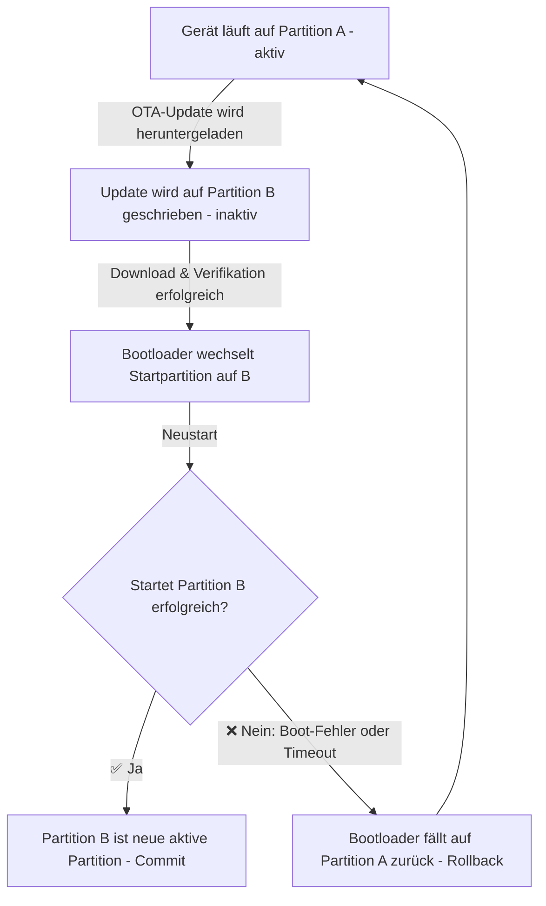
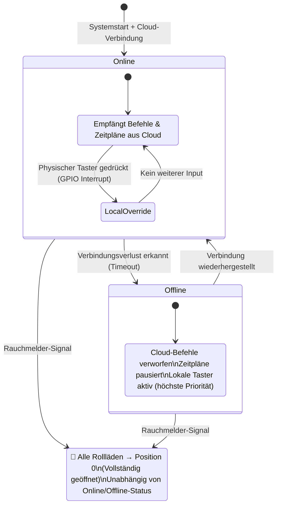
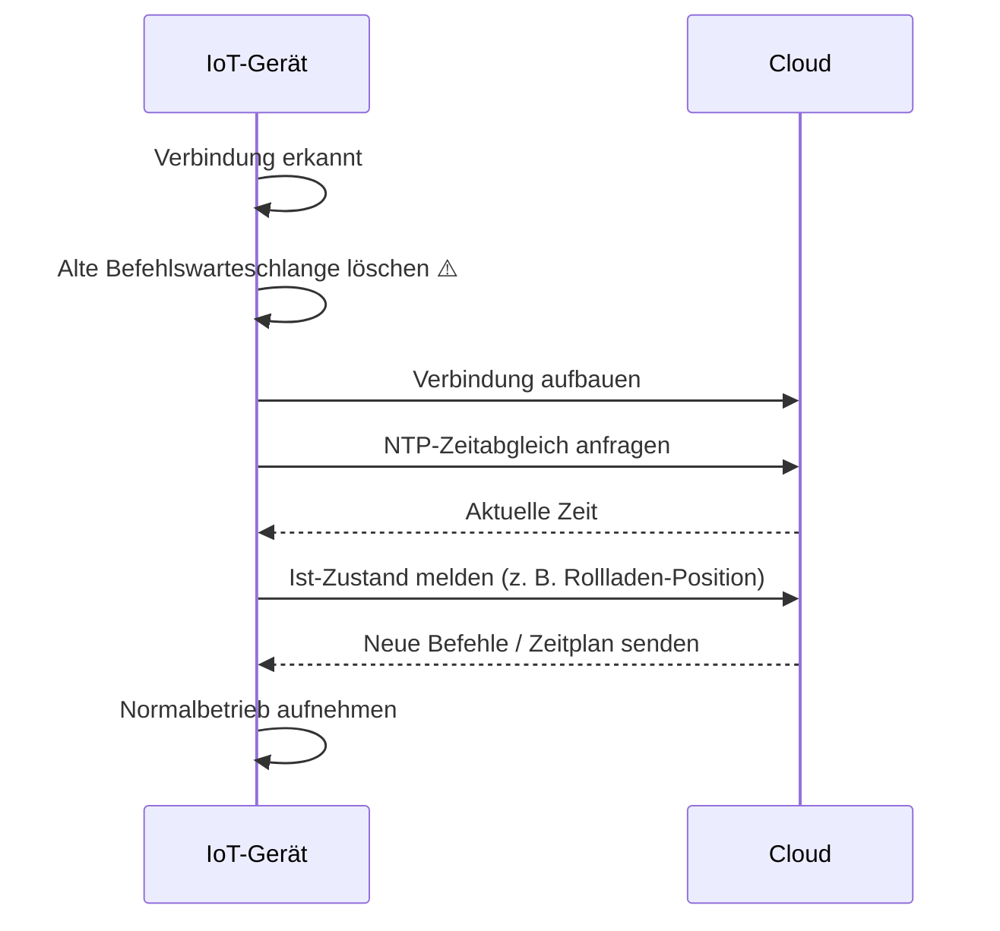
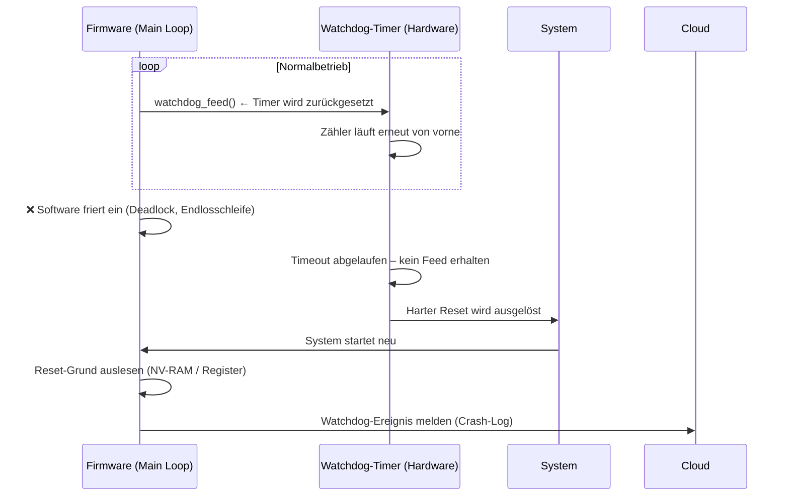
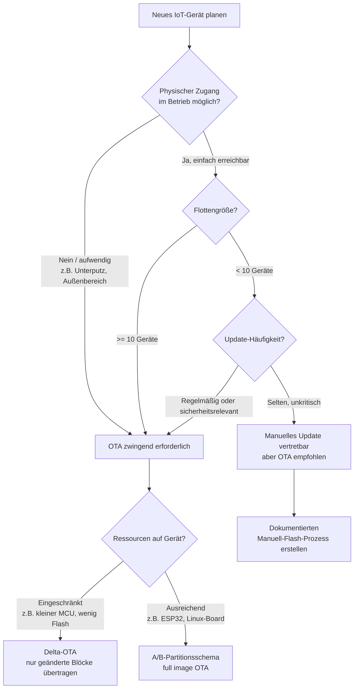

# Deep Dive 2: Robustheit, Wartung & Wirtschaftlichkeit im IoT-Flottenbetrieb

*Von der Firmware bis zur Flottenkalkulation – wie IoT-Systeme in der Praxis überlebensfähig bleiben*

---

## 📌 Inhaltsverzeichnis

1. [Gesetzlicher Rahmen & Support-Zyklen](#1-gesetzlicher-rahmen--support-zyklen)
2. [OTA vs. Non-OTA: Der wirtschaftliche Direktvergleich](#2-ota-vs-non-ota-der-wirtschaftliche-direktvergleich)
3. [OTA-Architektur: A/B-Partitionsschema](#3-ota-architektur-ab-partitionsschema)
4. [Ausfallsicherheit: Lokale Fail-Safe-Logik](#4-ausfallsicherheit-lokale-fail-safe-logik)
5. [Der Hardware-Watchdog: Segen und Fehlertarnung](#5-der-hardware-watchdog-segen-und-fehlertarnung)
6. [Entscheidungsbaum: OTA-Strategie wählen](#6-entscheidungsbaum-ota-strategie-wählen)
7. [Checkliste: Robuste IoT-Firmware & Betrieb](#7-checkliste-robuste-iot-firmware--betrieb)
8. [Weiterführende Ressourcen](#8-weiterführende-ressourcen)

---

## 1. Gesetzlicher Rahmen & Support-Zyklen

Seit dem **EU Cyber Resilience Act (CRA)** ist ein Mindestsicherheits-Support von **5 Jahren** für vernetzte Produkte im professionellen Umfeld gesetzlich verpflichtend. Die tatsächliche Planung hängt stark vom Einsatzzweck ab:

| **Segment** | **Support-Dauer** | **Begründung / Treiber** |
|---|---|---|
| **Consumer IoT** (z. B. Smart-Home-Lampen) | 2–3 Jahre | Oft herstellerabhängig, bisher freiwillig – durch CRA zunehmend reguliert |
| **Enterprise / Logistik** | 5–7 Jahre | Orientiert sich an betrieblichen Abschreibungszyklen |
| **Industrial IoT / Gebäudeautomatisierung** | 10–15 Jahre | Heizthermostate, Industriesensoren – hohe Wechselkosten, lange Planungshorizonte |

> 💡 **IHK-Relevanz:** Der CRA ist seit 2024 in Kraft und betrifft alle Hersteller vernetzter Produkte, die in der EU verkauft werden. Für Systemintegratoren bedeutet das: Support-Zeiträume müssen **vor** der Komponentenauswahl feststehen.

---

## 2. OTA vs. Non-OTA: Der wirtschaftliche Direktvergleich

### 📊 Kalkulation: 100 Sensoren, 5 Jahre Laufzeit, ~3,5 kritische Updates

| **Kriterium** | **System MIT OTA** | **System OHNE OTA** |
|---|---|---|
| **Update-Methode** | Zentral über Update-Server (automatisiert) | Physisch vor Ort: USB / seriell |
| **Fehlertoleranz beim Update** | Hoch – A/B-Partitionsschema verhindert Totalausfall | Gering – fehlgeschlagener Flash = defektes Gerät |
| **Sicherheitsrisiko zwischen Updates** | Minimal (Patch in Minuten ausgerollt) | Hoch (System bleibt wochenlang ungepacht) |
| **Administrativer Aufwand (5 Jahre)** | ~10–12 Stunden (Server-Monitoring, Rollout-Kontrolle) | ~146 Stunden (Anfahrt, Demontage, Flash, Test, Montage) |
| **Initiale Infrastrukturkosten** | Einmalig: Update-Server, Signierzertifikate, Rollout-Management (~500–2.000 € je nach Plattform) | Keine – aber irrelevant angesichts der laufenden Wartungskosten |
| **Wirtschaftlichkeit** | ✅ Ausgezeichnet – amortisiert sich beim 1. Update | ❌ Nicht vertretbar – Personalkosten übersteigen Gerätewert |

> 💡 **Hinweis zu OTA-Infrastrukturkosten:** Der Aufbau eines OTA-Systems ist nicht kostenlos. Ein selbst gehosteter Update-Server (z. B. Mender, SWUpdate) kostet einmalig Einrichtungszeit; ein Code-Signing-Zertifikat liegt bei ~100–300 €/Jahr. Diese Investition amortisiert sich bei einer Flotte von 100 Geräten bereits beim **ersten ausgerollten Sicherheitspatch** vollständig.

### 🔴 Das Negativbeispiel: Die Wartungsfalle

> 100 Unterputz-Sensoren werden ohne OTA verbaut. Pro Sicherheitsupdate: Hinfahren, Verkleidung abschrauben, Kabel anstecken, flashen, testen, zuschrauben.
>
> **Konservative Rechnung:** 25 Minuten × 100 Geräte × 3,5 Updates = **~146 Stunden Handarbeit**
>
> Bei einem Stundensatz von 60 €: **8.760 € Personalkosten** – nur für Updates.
> Der Gerätewert der gesamten Flotte lag bei ~3.000 €.
> **Die Personalkosten ruinieren das Projektbudget im Nachhinein.**

---

## 3. OTA-Architektur: A/B-Partitionsschema

Das A/B-Schema ist der Industriestandard für ausfallsicheres OTA. Das Prinzip: Das Gerät hält immer **zwei vollständige Firmware-Partitionen** vor.

| **Phase** | **Beschreibung** |
|---|---|
| **Download** | Neue Firmware wird auf die inaktive Partition geschrieben – laufender Betrieb ungestört |
| **Verifikation** | Hash / Signatur der neuen Firmware wird geprüft, bevor der Bootloader umschaltet |
| **Boot-Test** | Gerät startet von neuer Partition; bei Fehler oder ausbleibendem „Commit-Signal" automatischer Rollback |
| **Commit** | Erst wenn die Firmware erfolgreich gestartet und sich selbst als stabil gemeldet hat, wird die alte Partition als veraltet markiert |

> ⚠️ **Typischer Anfängerfehler:** Das Commit-Signal (die explizite Bestätigung „Update erfolgreich") wird vergessen. Dann fällt das Gerät nach jedem Neustart auf die alte Firmware zurück – ohne Fehlermeldung.

---

## 4. Ausfallsicherheit: Lokale Fail-Safe-Logik

Ein robustes IoT-Gerät darf bei Verbindungsverlust zur Cloud **niemals unkontrolliert einfrieren**. Es muss autonom in einen definierten sicheren Zustand übergehen.

### Zustandsdiagramm: IoT-Rollladensteuerung

### Verhalten nach Wiederverbindung (Reconnect-Sequenz)

> 💡 **Warum wird die Queue gelöscht?** Veraltete Befehle aus der Offline-Phase könnten gefährlich sein (z. B. „Rollladen schließen" obwohl inzwischen Alarm ausgelöst wurde). Die Queue-Löschung ist kein Datenverlust – sie ist **Sicherheitsarchitektur**.

### Prioritätenmodell (Zusammenfassung)

| **Priorität** | **Auslöser** | **Aktion** |
|---|---|---|
| 🔴 **1 – Notfall** | Rauchmelder-Signal | Alle Rollläden auf Position 0 – kein Override möglich |
| 🟡 **2 – Lokal** | Physischer Taster (GPIO Interrupt) | Direkte Ausführung – überschreibt Cloud-Befehle |
| 🟢 **3 – Cloud** | MQTT-Befehl / Zeitplan | Normalbetrieb online |

---

## 5. Der Hardware-Watchdog: Segen und Fehlertarnung

Ein Watchdog-Timer ist ein **Hardware-Zeitzähler**, der das System über einen harten Reset neustartet, wenn die Software einfriert und den Timer nicht mehr regelmäßig zurücksetzt (*„den Hund füttern"*).

### Funktionsprinzip

### Die Schattenseite: Verschleierung von Software-Bugs

> ⚠️ **Der Watchdog bekämpft das Symptom (die Blockade) – niemals die Ursache (den Bug).**

| **Fehlertyp** | **Ablauf ohne Gegenmassnahme** | **Folge** |
|---|---|---|
| **Memory Leak** | RAM füllt sich über ~48h, System friert ein, Watchdog löst Reset aus | Bug „verschwindet" nach Neustart – Ursache bleibt unbehandelt |
| **Socket Leak** | Netzwerk-Stack erschöpft sich, Kommunikation bricht zusammen | Reset scheinbar hilfreich – nächste Krise in 48h |
| **Watchdog-Dauerschleife** | Fehlerhafte Firmware-Update oder unbehandelter Edge Case lässt Main Loop im Minutentakt abstürzen | Gerät startet permanent neu – ohne Monitoring unsichtbar |

### Notwendige Gegenmaßnahmen (Best Practices)

| **Maßnahme** | **Umsetzung** | **Zweck** |
|---|---|---|
| **Reset-Reason-Abfrage** | Beim Booten: Reset-Ursache aus NV-Register auslesen (`esp_reset_reason()` bei ESP32) | Unterscheidet Power-On von Watchdog-Reset – ermöglicht gezieltes Handeln |
| **Crash-Logging** | Watchdog-Ereignis mit Timestamp, Zähler und letztem Systemzustand im Flash speichern | Lokale Beweissicherung auch ohne Netzwerk |
| **Incident-Reporting** | Nach jedem Neustart: Crash-Log an Cloud-Server senden | Watchdog-Dauerschleife wird im Dashboard sichtbar |
| **Watchdog-Zähler überwachen** | Schwellenwert definieren (z. B. >3 Resets/Stunde = Alarm) | Frühwarnung vor eskalierende Instabilität |

> 💡 **Faustformel für AE:** Software ist erst dann fertig, wenn sie sich selbst beobachten kann (*Observability*). Ein System das schweigend abstürzt und neustartet, ist in der Produktion wertlos.

---

## 6. Entscheidungsbaum: OTA-Strategie wählen

📌 **Beispiel-Entscheidungen:**

- **5 Laborsensoren in einem Schulungsraum, jährliches Update**: Manuell vertretbar – aber OTA spart trotzdem Zeit ab dem ersten Sicherheitspatch.
- **80 Sensoren in einer Produktionshalle, monatliche Firmware-Iterationen**: OTA mit A/B-Schema, Rollout in Batches (zuerst 10%, dann 100%).
- **Thermostate in 200 Hotelzimmern, 10 Jahre Laufzeit**: OTA ist hier keine Option sondern eine wirtschaftliche Pflicht.

> 📝 **Delta-OTA vs. Full-Image-OTA:** Beim Full-Image-OTA (A/B-Schema) wird immer die komplette Firmware übertragen – sicher und einfach, aber speicher- und bandbreitenintensiv. Delta-OTA überträgt nur die tatsächlich geänderten Bytes (z. B. via `bsdiff`-Algorithmus), was bei eingeschränktem Flash-Speicher oder teurem Mobilfunk-Datentarif (z. B. NB-IoT, LTE-M) entscheidend sein kann. Der Nachteil: Delta-Patches müssen für jede Ausgangsversion neu generiert werden – das erhöht die Komplexität im Update-Management spürbar.

---

## 7. Checkliste: Robuste IoT-Firmware & Betrieb

| **Kategorie** | **Maßnahme** | **Erledigt?** |
|---|---|---|
| **OTA** | OTA-Fähigkeit von Anfang an eingeplant (kein Nachrüsten) | ⬜ |
| | A/B-Partitionsschema implementiert | ⬜ |
| | Commit-Signal nach erfolgreichem Update vorhanden | ⬜ |
| | Automatischer Rollback bei Boot-Fehler getestet | ⬜ |
| | Update-Server mit Signaturprüfung (kein unsigniertes Firmware-Flash) | ⬜ |
| **Fail-Safe** | Offline-Verhalten definiert und dokumentiert | ⬜ |
| | Lokale Taster / Interrupts haben höchste Priorität | ⬜ |
| | Befehlswarteschlange (Queue) wird bei Reconnect geleert | ⬜ |
| | Notfall-Override (z. B. Brandschutz) ist hardwareseitig abgesichert | ⬜ |
| | NTP-Zeitsync nach Reconnect implementiert | ⬜ |
| **Watchdog** | Hardware-Watchdog aktiviert (nicht nur Software-Watchdog) | ⬜ |
| | Reset-Reason wird beim Booten ausgelesen | ⬜ |
| | Crash-Log wird lokal im Flash gespeichert | ⬜ |
| | Watchdog-Ereignisse werden nach Neustart an Cloud gemeldet | ⬜ |
| | Watchdog-Dauerschleife im Monitoring erkennbar (Alert bei >3 Resets/h) | ⬜ |
| **Wirtschaftlichkeit** | Support-Zeitraum (CRA) vor Komponentenauswahl festgelegt | ⬜ |
| | OTA-Infrastrukturkosten (Server, Zertifikate) in Projektbudget eingeplant | ⬜ |
| | OTA-Gesamtkosten gegen manuelle Wartungskosten kalkuliert | ⬜ |
| | Abschreibungszyklus mit geplanter Gerätelebensdauer abgeglichen | ⬜ |

---

## 8. Weiterführende Ressourcen

| **Ressource** | **Link** | **Beschreibung** |
|---|---|---|
| EU Cyber Resilience Act (CRA) | [EUR-Lex CRA](https://eur-lex.europa.eu/legal-content/DE/TXT/?uri=CELEX:32024R2847) | Volltext der Verordnung (DE) – relevant für Support-Fristen und Patch-Pflichten |
| ENISA – IoT Security Guidelines | [ENISA IoT Security](https://www.enisa.europa.eu/topics/iot-and-smart-infrastructures) | Offizielle EU-Empfehlungen für sichere IoT-Infrastrukturen |
| ESP-IDF OTA Dokumentation | [Espressif OTA Guide](https://docs.espressif.com/projects/esp-idf/en/latest/esp32/api-reference/system/ota.html) | Praxisnahe Anleitung für A/B-OTA auf dem ESP32 |
| ESP-IDF Reset Reason API | [esp_reset_reason()](https://docs.espressif.com/projects/esp-idf/en/latest/esp32/api-reference/system/misc_system_api.html#_CPPv416esp_reset_reasonv) | Reset-Grund programmatisch auslesen – direkte Implementierungsreferenz |
| Mender.io (OTA-Plattform) | [Mender OTA](https://mender.io/) | Open-Source OTA-Lösung mit A/B-Support für Linux-basierte IoT-Geräte |
| SWUpdate (Embedded OTA) | [SWUpdate Docs](https://sbabic.github.io/swupdate/) | Leichtgewichtige OTA-Lösung für Embedded Linux (z. B. auf Raspberry Pi / Yocto) |