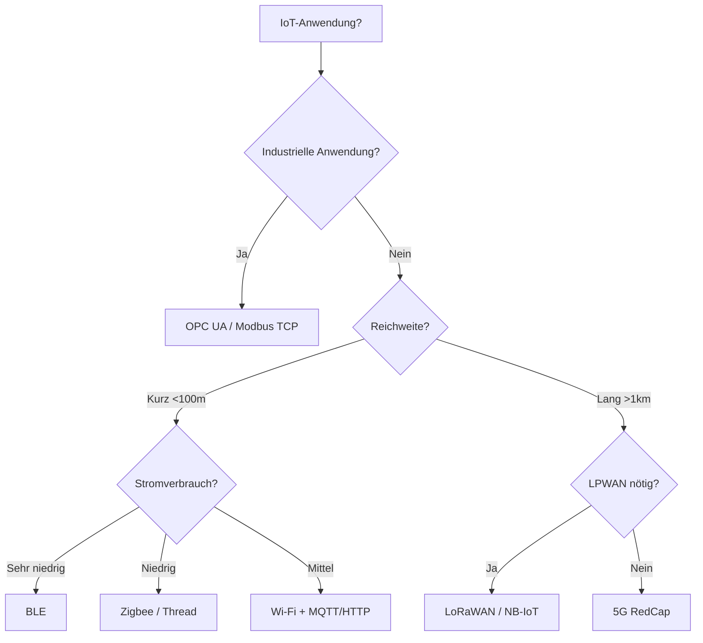

# 📡 IoT-Protokolle 2026 – Komplettleitfaden für Umschüler

*Fachinformatiker Anwendungsentwicklung (FIAE) & Systemintegration (FISI) – IHK-Prüfungsrelevant*

---

## 📖 Inhaltsverzeichnis

1. [Einführung: Was sind IoT-Protokolle?](#1--einführung-was-sind-iot-protokolle)

2. [Grundbegriffe: Broker, Gateway & OSI-Schichten](#2--grundbegriffe-broker-gateway--osi-schichten)

3. [Protokoll-Übersicht (Pflichtwissen)](#3--protokoll-übersicht-pflichtwissen)

4. [Protokoll-Stacks: Wie Geräte kommunizieren](#4--protokoll-stacks-wie-geräte-kommunizieren)

5. [Entscheidungshilfe: Welches Protokoll für welchen Fall?](#5--entscheidungshilfe-welches-protokoll-für-welchen-fall)

6. [Sicherheit in IoT-Protokollen](#6--sicherheit-in-iot-protokollen)

7. [QoS in MQTT (Datenqualität)](#7--qos-in-mqtt-datenqualität)

8. [Code-Beispiele (für Entwickler)](#8--code-beispiele-für-entwickler)

9. [Zukunftstrends (2025–2026)](#9--zukunftstrends-20252026)

10. [Prüfungsfragen & Musterantworten](#10--prüfungsfragen--musterantworten)

11. [Praktische Lernquellen](#11--praktische-lernquellen)

12. [Zusammenfassung: Was du für die IHK können musst](#12--zusammenfassung-was-du-für-die-ihk-können-musst)

---

## 1. 🧩 Einführung: Was sind IoT-Protokolle?

*(Für Quereinsteiger: Einfache Erklärung mit Alltagsbeispielen)*

### 🔹 Die Brief-Analogie

Stell dir vor, du schickst einen **Brief** an einen Freund:

- **Format**: Du schreibst den Text in einem bestimmten Stil (z. B. "Liebe Grüße").
- **Umschlag**: Du wählst die richtige Größe und klebst eine Briefmarke drauf.
- **Postweg**: Du wirfst den Brief in den Briefkasten – die Post transportiert ihn zum Ziel.

**Ein IoT-Protokoll ist genau so ein "Briefstandard" für Maschinen:**

| **Briefbestandteil** | **IoT-Protokoll-Äquivalent**     | **Beispiel**                            |
| -------------------- | -------------------------------- | --------------------------------------- |
| Briefformat          | Datenformat (z. B. JSON, Binär)  | `{"temperatur": 23.5, "einheit": "°C"}` |
| Umschlag             | Protokoll-Header (Metadaten)     | MQTT-Topic: `sensors/temperature`       |
| Postweg              | Transportprotokoll (TCP/UDP)     | MQTT nutzt TCP Port 1883/8883           |
| Poststempel          | Zeitstempel & Bestätigung        | QoS 1/2 in MQTT                         |

> 💡 **Merksatz:** Ohne Protokolle könnten Geräte nicht miteinander kommunizieren – selbst wenn sie dieselbe Hardware nutzen!
> *(Analogie: Zwei Köche können nicht zusammenarbeiten, wenn einer Deutsch und der andere Chinesisch spricht – selbst wenn beide Messer und Töpfe haben.)*

---

### 🔹 Warum gibt es so viele verschiedene Protokolle?

Jedes Protokoll hat **Stärken und Schwächen** für bestimmte Anwendungen:

| **Anforderung**              | **Passendes Protokoll** | **Beispiel**                       |
| ---------------------------- | ----------------------- | ---------------------------------- |
| **Geringer Stromverbrauch**  | LoRaWAN, BLE            | Batteriebetriebene Sensoren        |
| **Große Reichweite**         | LoRaWAN, NB-IoT         | Stromzähler in ländlichen Gebieten |
| **Echtzeit-Kommunikation**   | OPC UA, TSN             | Roboterarme in Fabriken            |
| **Cloud-Anbindung**          | MQTT, HTTP/2            | Smart-Home-Geräte → AWS IoT        |
| **Einfache Implementierung** | MQTT, CoAP              | Mikrocontroller (Arduino, ESP32)   |

---

## 2. 🔑 Grundbegriffe: Broker, Gateway & OSI-Schichten

*(Diese Begriffe musst du verstehen, bevor du in die Protokolle einsteigst!)*

### 🔹 Was ist ein **Broker**?

Ein **Broker** ist eine zentrale Vermittlungsstelle (wie eine Telefonzentrale).

```

[Sensor 1] ──┐
[Sensor 2] ──┼──→ [BROKER] ──→ [Cloud / App]
[Sensor 3] ──┘
```

- **Aufgabe:** Nimmt Nachrichten von Sendern (Publishern) an und verteilt sie an Empfänger (Subscriber).
- **Beispiel:** Mosquitto, HiveMQ (für MQTT).
- **Vorteil:** Sender und Empfänger müssen sich nicht kennen – der Broker regelt alles.

### 🔹 Was ist ein **Gateway**?

Ein **Gateway** ist ein "Übersetzer" zwischen verschiedenen Protokollen/Netzwerken.

```
[Zigbee-Sensor] ──→ [GATEWAY] ──→ [MQTT/Cloud]
   (lokal)        (übersetzt)    (Internet)
```

- **Aufgabe:** Verbindet inkompatible Netzwerke (z. B. Zigbee ↔ WLAN).
- **Beispiel:** Philips Hue Bridge, Raspberry Pi als IoT-Gateway.
- **Vorteil:** Macht Geräte cloudfähig, die selbst kein Internet können.

### 🔹 OSI-Schichten-Zuordnung der IoT-Protokolle

| **OSI-Schicht**       | **Layer** | **IoT-Protokolle**                |
| --------------------- | --------- | --------------------------------- |
| Anwendungsschicht     | Layer 7   | MQTT, CoAP, HTTP/2, OPC UA, AMQP  |
| Darstellungsschicht   | Layer 6   | JSON, CBOR, Protobuf              |
| Sitzungsschicht       | Layer 5   | TLS, DTLS                         |
| Transportschicht      | Layer 4   | TCP (MQTT), UDP (CoAP)            |
| Vermittlungsschicht   | Layer 3   | IP, 6LoWPAN, LoRaWAN              |
| Sicherungsschicht     | Layer 2   | LoRaWAN MAC, BLE, Zigbee, Thread  |
| Bitübertragungsschicht| Layer 1   | LoRa (Funk), Ethernet, WLAN, NB-IoT |

> ⚠️ **Prüfungsrelevant:** MQTT arbeitet auf **Layer 7** und nutzt **TCP (Layer 4)**.

---

## 3. 📊 Protokoll-Übersicht (Pflichtwissen)

### 🔹 Legende

| **Symbol** | **Bedeutung**                                                          |
| ---------- | ---------------------------------------------------------------------- |
| ⭐⭐⭐⭐⭐  | **Pflicht für IHK-Prüfung** (muss man kennen und anwenden können)      |
| ⭐⭐⭐     | Wichtig, aber nicht auswendig lernen                                   |
| ⭐⭐       | Nice-to-have (für Diskussionen)                                        |
| **FIAE**   | Relevant für **Fachinformatiker Anwendungsentwicklung** (Software/Cloud) |
| **FISI**   | Relevant für **Fachinformatiker Systemintegration** (Hardware/Netzwerk)  |

---

### 🔹 Haupttabelle: Alle wichtigen IoT-Protokolle

| **Protokoll**  | **Typ**   | **Reichweite** | **Datenrate** | **Energie**  | **Sicherheit**      | **FIAE** | **FISI** | **Einsatzgebiet**         |
| -------------- | --------- | -------------- | ------------- | ------------ | ------------------- | -------- | -------- | ------------------------- |
| **MQTT**       | Anwendung | Global         | Mittel        | Niedrig      | TLS (Port 8883)     | ⭐⭐⭐⭐⭐ | ⭐⭐⭐⭐ | Cloud-Anbindung           |
| **CoAP**       | Anwendung | Lokal          | Niedrig       | Sehr niedrig | DTLS                | ⭐⭐⭐⭐ | ⭐⭐⭐   | Ressourcenschwache Geräte |
| **HTTP/2**     | Anwendung | Global         | Hoch          | Mittel       | TLS (HTTPS)         | ⭐⭐⭐⭐⭐ | ⭐⭐⭐   | REST-APIs, Web-IoT        |
| **AMQP**       | Anwendung | Global         | Hoch          | Mittel       | TLS                 | ⭐⭐⭐⭐ | ⭐⭐     | Enterprise-Messaging      |
| **LoRaWAN**    | Netzwerk  | **2–15 km**    | 0,3–27 kbit/s | Sehr niedrig | AES-128             | ⭐⭐     | ⭐⭐⭐⭐⭐ | Langstrecken-Sensoren     |
| **NB-IoT**     | Netzwerk  | Mobilfunk-Netz | Niedrig       | Niedrig      | SIM + TLS           | ⭐⭐     | ⭐⭐⭐⭐⭐ | Mobilfunk-IoT             |
| **BLE**        | Netzwerk  | 10–100 m       | Niedrig       | Sehr niedrig | AES-CCM             | ⭐⭐⭐   | ⭐⭐⭐⭐  | Wearables, Smart Home     |
| **Zigbee**     | Netzwerk  | 10–100 m       | Niedrig       | Niedrig      | AES-128             | ⭐⭐     | ⭐⭐⭐⭐  | Smart Home, Mesh          |
| **Thread**     | Netzwerk  | 10–100 m       | Niedrig       | Niedrig      | AES-128             | ⭐       | ⭐⭐⭐   | Smart Home, IPv6          |
| **OPC UA**     | Anwendung | Lokal          | Hoch          | Mittel       | Zertifikate (X.509) | ⭐⭐⭐   | ⭐⭐⭐⭐⭐ | Industrie 4.0             |
| **Modbus TCP** | Anwendung | Lokal          | Mittel        | Mittel       | ⚠️ Keine            | ⭐⭐     | ⭐⭐⭐⭐  | Legacy-Industrie          |

---

### 🔍 Wichtige Spalten erklärt

| **Spalte**     | **Was bedeutet das?**                                                  |
| -------------- | ---------------------------------------------------------------------- |
| **Typ**        | Anwendung = Datenformat (z. B. MQTT), Netzwerk = Transport (LoRaWAN)   |
| **Reichweite** | Maximale Entfernung zwischen Sender und Empfänger                      |
| **Datenrate**  | Wie viele Daten pro Sekunde übertragen werden können                   |
| **Energie**    | Stromverbrauch (wichtig für batteriebetriebene Geräte)                 |
| **Sicherheit** | Verschlüsselungsmethode (ohne Verschlüsselung = **unsicher!**)         |

---

## 4. 🔗 Protokoll-Stacks: Wie Geräte kommunizieren

| **Anwendung**     | **Protokoll-Stack**             | **Datenfluss**                        | **Beispiel**                |
| ----------------- | ------------------------------- | ------------------------------------- | --------------------------- |
| **Smart Home**    | Zigbee → MQTT → Cloud           | Sensor → Gateway → Cloud              | Philips Hue → AWS IoT       |
| **Industrie 4.0** | OPC UA → MQTT → TSN → Cloud     | Maschine → Edge-Gateway → Cloud       | Roboterarm → MindSphere     |
| **Wearables**     | BLE → HTTP/2 → Cloud            | Smartwatch → Smartphone → Cloud       | Fitbit → Google Fit         |
| **Smart City**    | NB-IoT → CoAP → Cloud           | Sensor → Mobilfunk → Dashboard        | Luftqualitäts-Sensor        |
| **Landwirtschaft**| LoRaWAN → MQTT → Cloud          | Bodensensor → Gateway → Cloud         | Bewässerungssteuerung       |

> 💡 **Merksatz:** Je weiter die Daten müssen, desto mehr Protokolle sind im Spiel!

---

## 5. 🌳 Entscheidungshilfe: Welches Protokoll für welchen Fall?

### 📊 Mermaid-Diagramm



### 📄 Textfallback

1. **Industrielle Anwendung?**
   - Ja → OPC UA oder Modbus TCP
   - Nein → weiter zu Frage 2

2. **Reichweite?**
   - Kurz (<100 m) → weiter zu Frage 3
   - Lang (>1 km) → LoRaWAN, NB-IoT oder 5G RedCap

3. **Stromverbrauch?**
   - Sehr niedrig → BLE
   - Niedrig → Zigbee oder Thread
   - Mittel → Wi-Fi mit MQTT/HTTP

---

## 6. 🔒 Sicherheit in IoT-Protokollen

> ⚠️ **Ohne Verschlüsselung = nicht prüfungsrelevant!**

### 🔹 Sicherheitsmechanismen im Vergleich

| **Protokoll**  | **Sicherheitsmechanismus**       | **Port**  | **Beispiel-Konfiguration**       | **FIAE**  | **FISI**  |
| -------------- | -------------------------------- | --------- | -------------------------------- | --------- | --------- |
| **MQTT**       | TLS (Transportverschlüsselung)   | 8883      | `client.tls_set()` in Python     | ⭐⭐⭐⭐⭐ | ⭐⭐⭐⭐  |
| **HTTP/2**     | TLS (HTTPS)                      | 443       | Immer HTTPS verwenden!           | ⭐⭐⭐⭐⭐ | ⭐⭐⭐   |
| **CoAP**       | DTLS (UDP-Verschlüsselung)       | 5684      | CoAP über DTLS + Zertifikate     | ⭐⭐⭐⭐ | ⭐⭐⭐   |
| **LoRaWAN**    | AES-128 (Datenverschlüsselung)   | –         | `app_key` in TTN-Konfiguration   | ⭐⭐     | ⭐⭐⭐⭐⭐ |
| **OPC UA**     | Zertifikate (Ende-zu-Ende)       | 4840      | X.509-Zertifikate für Maschinen  | ⭐⭐⭐   | ⭐⭐⭐⭐⭐ |
| **Modbus TCP** | ⚠️ Keine (nur TCP)               | 502       | Nur in isolierten Netzwerken!    | ⭐⭐     | ⭐⭐⭐⭐  |
| **Zigbee**     | AES-128 (Netzwerkebene)          | –         | Standardmäßig aktiviert          | ⭐⭐     | ⭐⭐⭐⭐  |

### ⚠️ Wichtige Sicherheitsregeln für die IHK-Prüfung

1. **MQTT** → Immer TLS (Port 8883 statt 1883)
2. **LoRaWAN** → `app_key` ist Pflicht (AES-128)
3. **Modbus TCP** → Nur in isolierten Netzwerken (keine Verschlüsselung!)
4. **OPC UA** → Immer mit Zertifikaten konfigurieren

> 💡 **Begründung in der Prüfung:** "Ohne Verschlüsselung können Daten abgefangen und manipuliert werden (Man-in-the-Middle-Angriffe)."

---

## 7. 📈 QoS in MQTT (Quality of Service)

| **QoS-Level** | **Name**            | **Bedeutung**                          | **Beispiel**                | **Nachteil**           |
| ------------- | ------------------- | -------------------------------------- | --------------------------- | ---------------------- |
| **QoS 0**     | "Fire and Forget"   | Einmal gesendet, keine Bestätigung     | Temperatur-Sensor → Cloud   | Daten können verloren  |
| **QoS 1**     | "Mindestens einmal" | Wird gesendet bis Bestätigung kommt    | Alarmanlage → Steuerung     | Duplikate möglich      |
| **QoS 2**     | "Genau einmal"      | Genau einmal zugestellt (keine Dupes)  | Roboterarm-Schaltbefehl     | Höherer Overhead       |

> 💡 **Merksatz:**

> - **QoS 0** = Postkarte (kann verloren gehen)
> - **QoS 1** = Einschreiben (kommt an, vielleicht doppelt)
> - **QoS 2** = Einschreiben mit Rückschein (genau einmal)

---

## 8. 💻 Code-Beispiele (für Entwickler)

> 🔹 **Hinweis für Umschüler ohne Programmiererfahrung:** Du musst die Code-Beispiele **nicht auswendig** können! Es reicht, die Logik zu verstehen.

### 📌 1. MQTT in Python (paho-mqtt)

```python
import paho.mqtt.client as mqtt

# 1. MQTT-Client erstellen (wie ein "Telefon" für MQTT-Nachrichten)
client = mqtt.Client()

# 2. TLS-Verschlüsselung aktivieren (WICHTIG FÜR PRÜFUNG!)
#    Port 8883 = sicher (TLS), Port 1883 = unsicher
client.tls_set()  # Ohne diese Zeile = unsicher!

# 3. Mit Broker verbinden (HiveMQ = kostenloser Test-Broker)
client.connect("broker.hivemq.com", 8883)

# 4. Nachricht senden (Pub/Sub-Modell)
#    - "sensors/temperature" = Topic (wie ein "Kanal")
#    - "23.5°C" = Payload (die eigentlichen Daten)
#    - qos=0 = "Fire and Forget"
client.publish("sensors/temperature", "23.5°C", qos=0)

# 5. Verbindung schließen
client.disconnect()
```

**🔹 Wichtige Punkte für die Prüfung:**

- `client.tls_set()` → Verschlüsselung aktivieren
- Port **8883** → sicherer MQTT-Port (TLS)
- **Topic** → "Adresse", an die die Nachricht gesendet wird

---

### 📌 2. CoAP in Python (aiocoap) – Korrigierte Version

```python
import asyncio
from aiocoap import Context, Message, GET

# CoAP ist ASYNCHRON → braucht async/await!
async def get_temperature():
    # 1. Client-Context erstellen (korrekte aiocoap-API!)
    protocol = await Context.create_client_context()

    # 2. CoAP-GET-Nachricht erstellen
    request = Message(code=GET, uri="coap://example.com/temperature")

    # 3. Antwort abwarten (UDP-basiert, aber async!)
    response = await protocol.request(request).response

    # 4. Daten auslesen (Payload = binäre Daten)
    print(f"Temperatur: {response.payload.decode()}")

# Event-Loop starten (notwendig für async-Code)
asyncio.run(get_temperature())
```

**🔹 Wichtige Punkte für die Prüfung:**

- `async/await` → CoAP ist asynchron
- Port **5683** → Standard, **5684** → mit DTLS
- **DTLS** → Verschlüsselung für CoAP

---

### 📌 3. LoRaWAN-Gateway-Konfiguration (The Things Network)

```yaml
# 1. Gerätekonfiguration für The Things Network (TTN)
device:
  dev_eui: "A840418181818181"   # Eindeutige Geräte-ID
  app_eui: "70B3D57ED0000000"   # Anwendungs-ID
  app_key: "2B7E151628AED2A6ABF7158809CF4F3C"  # AES-128-Schlüssel

# 2. Sicherheitshinweis:
#    - Ohne app_key = UNVERSCHLÜSSELT (unsicher!)
#    - Datenrate: 0,3–27 kbit/s (langsam, aber energieeffizient)
#    - Reichweite: 2–15 km
```

**🔹 Wichtige Punkte für die Prüfung:**

- `app_key` → Aktiviert AES-128-Verschlüsselung
- Reichweite → bis zu **15 km**
- Energieverbrauch → sehr niedrig (Jahre mit einer Batterie)

---

## 9. 🚀 Zukunftstrends (2025–2026)

| **Technologie**   | **Was ist das?**                   | **Vorteile**                    | **FIAE** | **FISI** |
| ----------------- | ---------------------------------- | ------------------------------- | -------- | -------- |
| **Matter**        | Smart-Home-Standard (Google/Apple) | Herstellerübergreifend          | ⭐       | ⭐⭐     |
| **5G RedCap**     | Günstige 5G-Variante für IoT       | Hohe Datenrate, globale Reichweite | ⭐⭐    | ⭐⭐⭐⭐  |
| **Wi-Fi HaLow**   | Langstrecken-WLAN (bis 1 km)       | Geringer Stromverbrauch         | ⭐       | ⭐⭐     |
| **TSN**           | Time-Sensitive Networking          | Garantierte Latenz (Echtzeit)   | ⭐⭐     | ⭐⭐⭐⭐  |

> 💡 **Merksatz:** Matter = Smart Home, 5G RedCap = Mobilfunk-IoT, TSN = Industrie 4.0

---

## 10. 📝 Prüfungsfragen & Musterantworten

### 🔹 Grundlagenfragen

#### **Frage 1:** "Warum wird MQTT häufiger in IoT verwendet als HTTP?"

✅ **Musterantwort:**
> MQTT ist **leichtergewichtig** (weniger Overhead) und unterstützt das **Pub/Sub-Modell**. HTTP ist request/response-basiert und damit ineffizient für IoT. Zusätzlich verbraucht MQTT weniger Bandbreite und ist besser für instabile Netzwerke geeignet.

---

#### **Frage 2:** "Welches Protokoll eignet sich für ein batteriebetriebenes Sensor-Netzwerk mit 10 km Reichweite?"

✅ **Musterantwort:**
> **LoRaWAN** oder **NB-IoT.**

> - LoRaWAN: Sehr energieeffizient, Reichweite bis 15 km, Datenrate 0,3–27 kbit/s
> - NB-IoT: Nutzt Mobilfunknetze, gute Stadtabdeckung, SIM-Karte nötig
>
> Beide sind für **LPWAN** (Low Power Wide Area Network) optimiert.

---

#### **Frage 3:** "Auf welchen OSI-Schichten arbeiten MQTT, CoAP und LoRaWAN?"

✅ **Musterantwort:**

> - **MQTT:** Anwendungsschicht (Layer 7), nutzt TCP (Layer 4)
> - **CoAP:** Anwendungsschicht (Layer 7), nutzt UDP (Layer 4)
> - **LoRaWAN:** Sicherungsschicht (Layer 2) + Vermittlungsschicht (Layer 3)

---

#### **Frage 4:** "Wie sichert man MQTT-Datenübertragung ab?"

✅ **Musterantwort:**
> Durch **TLS-Verschlüsselung** (Port **8883** statt 1883).
> In der Praxis:

> - `client.tls_set()` in Python (paho-mqtt)
> - Zertifikate vom Broker
> - Authentifizierung (Benutzername/Passwort oder Client-Zertifikate)
>
> Ohne TLS sind Man-in-the-Middle-Angriffe möglich.

---

### 🔹 Industrielle IoT-Fragen

#### **Frage 5:** "Wann verwendet man OPC UA statt MQTT?"

✅ **Musterantwort:**

> - **OPC UA** → Echtzeit-Kommunikation in der Industrie (Roboterarme, CNC)
> - **MQTT** → Cloud-Anbindung (Sensoren → AWS IoT)
>
> **Unterschiede:**

> - OPC UA: Echtzeitfähig, zertifikatsbasiert, objektorientiertes Datenmodell
> - MQTT: Leichtgewichtig, Pub/Sub, cloud-optimiert

---

#### **Frage 6:** "Warum ist Modbus TCP unsicher?"

✅ **Musterantwort:**
> Modbus TCP hat **keine eingebaute Verschlüsselung** (nur TCP).
> **Risiken:**

> - Daten können mit Wireshark abgefangen werden
> - Befehle können manipuliert werden
>
> **Lösung:** Nur in **isolierten Netzwerken** (Fabriksnetz ohne Internetzugang) verwenden.

---

### 🔹 Sicherheitsfragen

#### **Frage 7:** "Warum ist LoRaWAN ohne `app_key` unsicher?"

✅ **Musterantwort:**
> Der `app_key` aktiviert die **AES-128-Verschlüsselung** in LoRaWAN.
> **Ohne `app_key`:**

> - Daten werden unverschlüsselt gesendet
> - Angreifer können Sensorwerte abfangen und lesen
> - Daten können manipuliert werden

---

#### **Frage 8:** "Was ist der Unterschied zwischen QoS 0, 1 und 2 in MQTT?"

✅ **Musterantwort:**

| **QoS** | **Bedeutung**       | **Beispiel**             | **Nachteil**       |
| ------- | ------------------- | ------------------------ | ------------------ |
| 0       | "Fire and Forget"   | Temperatur-Sensor        | Daten können verloren gehen |
| 1       | "Mindestens einmal" | Alarmanlage              | Duplikate möglich  |
| 2       | "Genau einmal"      | Roboterarm-Schaltbefehl  | Höherer Overhead   |

---

### 🔹 Praktische Fragen

#### **Frage 9:** "Wie würden Sie ein Smart-Home-System mit einem Raspberry Pi aufbauen?"

✅ **Musterantwort:**

> 1. **Sensoren** (Temperatur, Luftfeuchtigkeit) per **Zigbee** oder **BLE** mit dem Raspberry Pi verbinden
> 2. **Raspberry Pi als Gateway:**
>    - Empfängt Sensordaten lokal
>    - Sendet sie per **MQTT** an die Cloud
> 3. **Cloud** (AWS IoT, Home Assistant):
>    - Speichert und visualisiert Daten
>    - Sendet Steuerbefehle zurück
>
> **Protokollstack:** Zigbee/BLE → Raspberry Pi → MQTT → Cloud

---

#### **Frage 10:** "Welches Protokoll für eine industrielle Fertigungsstraße mit Echtzeit-Anforderungen?"

✅ **Musterantwort:**

> **OPC UA** oder **TSN** (Time-Sensitive Networking).

> - **OPC UA:** Echtzeitfähig, sicher (Zertifikate), industrieerprobt
> - **TSN:** Garantierte Latenz für synchronisierte Roboterarme
>
> Alternativ: MQTT mit QoS 2 für weniger kritische Echtzeit-Anwendungen.

---

## 11. 🎓 Praktische Lernquellen

### 🔹 📖 Offizielle Dokumentationen (verifiziert)

| **Thema**                | **Link**                                          | **Für wen?** |
| ------------------------ | ------------------------------------------------- | ------------ |
| MQTT Grundlagen          | [mqtt.org/getting-started](https://mqtt.org/getting-started/) | Beide        |
| MQTT mit Python (paho)   | [eclipse.org/paho](https://www.eclipse.org/paho/) | FIAE         |
| LoRaWAN-Spezifikation    | [lora-alliance.org/resource-hub](https://lora-alliance.org/resource-hub/) | FISI         |
| The Things Network Docs  | [thethingsnetwork.org/docs](https://www.thethingsnetwork.org/docs/) | FISI         |
| OPC UA Foundation        | [opcfoundation.org](https://opcfoundation.org/developer-tools/) | Beide        |
| aiocoap (CoAP für Python)| [aiocoap.readthedocs.io](https://aiocoap.readthedocs.io/)        | FIAE         |
| HiveMQ MQTT Essentials   | [hivemq.com/mqtt-essentials](https://www.hivemq.com/mqtt-essentials/) | Beide        |

---

### 🔹 🖥️ Interaktive Tools (kostenlos)

| **Tool**                       | **Link**                                  | **Zweck**                          |
| ------------------------------ | ----------------------------------------- | ---------------------------------- |
| HiveMQ Web Client              | [hivemq.com/demos/websocket-client](http://www.hivemq.com/demos/websocket-client/) | MQTT-Nachrichten testen            |
| The Things Network Console     | [console.thethingsnetwork.org](https://console.thethingsnetwork.org/) | LoRaWAN-Geräte registrieren        |
| Mosquitto MQTT-Broker          | [mosquitto.org](https://mosquitto.org/)   | Lokaler MQTT-Broker                |
| Wireshark                      | [wireshark.org](https://www.wireshark.org/) | Protokoll-Datenverkehr analysieren |

---

## 12. 📌 Zusammenfassung: Was du für die IHK können musst

### 🚨 Pflichtwissen (⭐⭐⭐⭐⭐ – Auswendig!)

| **Thema**                | **FIAE** | **FISI** | **Was du wissen musst**                                                            |
| ------------------------ | -------- | -------- | ---------------------------------------------------------------------------------- |
| **MQTT**                 | ⭐⭐⭐⭐⭐ | ⭐⭐⭐⭐  | Pub/Sub-Modell, QoS 0/1/2, TLS (Port 8883), `client.tls_set()`                     |
| **LoRaWAN**              | ⭐⭐     | ⭐⭐⭐⭐⭐ | Reichweite 2–15 km, AES-128 (`app_key`), Datenrate 0,3–27 kbit/s                   |
| **NB-IoT**               | ⭐⭐     | ⭐⭐⭐⭐⭐ | Mobilfunk-basiert, SIM + TLS, gute Stadtabdeckung                                  |
| **OPC UA**               | ⭐⭐⭐   | ⭐⭐⭐⭐⭐ | Echtzeit, Zertifikate (X.509), Industrie 4.0                                       |
| **Sicherheit (TLS/AES)** | ⭐⭐⭐⭐⭐ | ⭐⭐⭐⭐⭐ | Jedes Protokoll braucht Verschlüsselung!                                           |
| **Modbus TCP**           | ⭐⭐     | ⭐⭐⭐⭐⭐ | Keine Verschlüsselung → nur isolierte Netze!                                       |
| **OSI-Schichten**        | ⭐⭐⭐⭐ | ⭐⭐⭐⭐⭐ | MQTT (L7+TCP), CoAP (L7+UDP), LoRaWAN (L2/L3)                                     |

---

### 💡 Wichtig für Diskussionen (⭐⭐⭐)

| **Thema**       | **FIAE** | **FISI** | **Was du wissen solltest**                          |
| --------------- | -------- | -------- | --------------------------------------------------- |
| **CoAP**        | ⭐⭐⭐⭐ | ⭐⭐⭐   | REST-ähnlich, DTLS, UDP-basiert                     |
| **BLE**         | ⭐⭐⭐   | ⭐⭐⭐⭐  | Wearables, AES-CCM, sehr niedriger Stromverbrauch   |
| **Zigbee/Thread** | ⭐⭐    | ⭐⭐⭐⭐  | Smart Home, Mesh-Netzwerke, AES-128                 |
| **HTTP/2**      | ⭐⭐⭐⭐⭐ | ⭐⭐⭐   | REST-APIs, TLS (HTTPS auf Port 443)                 |
| **AMQP**        | ⭐⭐⭐⭐ | ⭐⭐     | Enterprise-Messaging, TLS, transaktionsorientiert   |

---

### 🌟 Nice-to-Have (⭐⭐)

| **Thema**        | **FIAE** | **FISI** | **Was du wissen kannst**                  |
| ---------------- | -------- | -------- | ----------------------------------------- |
| **Matter**       | ⭐       | ⭐⭐     | Smart-Home-Standard (Google/Apple/Amazon) |
| **5G RedCap**    | ⭐⭐     | ⭐⭐⭐⭐  | Günstige 5G-Variante für IoT              |
| **Wi-Fi HaLow**  | ⭐       | ⭐⭐     | Langstrecken-WLAN (bis 1 km)              |
| **TSN**          | ⭐⭐     | ⭐⭐⭐⭐  | Echtzeit-Ethernet für Industrie 4.0       |

---

## 📜 Lizenz & Hinweise

> 📚 Dieser Leitfaden ist Teil unseres **GitHub Wikis** für Umschüler im Bereich **Fachinformatik (FIAE/FISI)**.
>
> 🔄 **Stand:** 2026 | **Beiträge willkommen** via Pull Request!
>
> ⚖️ Alle Markenrechte liegen bei den jeweiligen Inhabern.