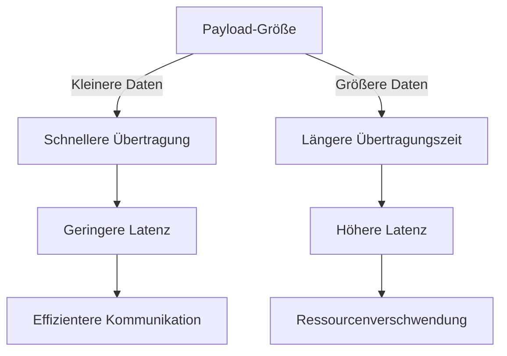

# 📦 Deep Dive: Payload-Optimierung & Latenzreduzierung

*Version 1.2 Final*

---

## 📌 Versionshinweis & Voraussetzungen

| Feld | Inhalt |
|------|--------|
| **Version** | 1.2 – Overhead-Doppelwert erklärt, Batch-90%-Herleitung ergänzt, msgpack-Byteanzahl kommentiert |
| **Zielgruppe** | FISI & FIAE (Umschüler & Azubis) |
| **Voraussetzungen** | Grundkenntnisse: HTTP/2, MQTT, JSON, Binärformate, Netzwerkgrundlagen |
| **Lernfeld** | LF7.2.3: Payload-Optimierung & Latenz |

> **🔹 Wichtiger Hinweis für FIAE:**
> Die hier gezeigten Code-Beispiele nutzen `ujson` statt `json` für MicroPython/ESP32 – dies reduziert den Speicheroverhead um bis zu 30%!

---

## 1️⃣ Die Physik dahinter: Warum Payload-Optimierung die Latenz reduziert

### Das Grundproblem: Payload-Größe vs. Übertragungszeit



> **📊 IHK-Merksatz:**
> „Eine Verdopplung der Payload-Größe **verdoppelt die Übertragungszeit** – aber nur, wenn die Bandbreite konstant bleibt! Bei niedrigen Bandbreiten (z. B. LoRaWAN) kann eine **10-fache Vergrößerung der Payload zu einer 10-fachen Latenz** führen."

---

### Die Latenz-Formel (IHK-relevant)

```

Gesamtlatenz (ms) = Übertragungszeit + Propagationszeit + Verarbeitungszeit + Warteschlangenzeit

Dabei gilt:
├── Übertragungszeit (ms) = (Payload-Größe in Bytes × 8) / Bandbreite (Bit/s)
├── Propagationszeit (ms) = Distanz (m) / Ausbreitungsgeschwindigkeit (≈ 200.000 km/s im Kabel)
└── Verarbeitungszeit (ms) = Server-CPU-Zeit + Client-CPU-Zeit

Beispiel (LoRaWAN, 10 kbit/s):
├── JSON-Payload:  1000 Bytes → Übertragungszeit = (1000×8) / 10.000 = 800 ms
├── Binär-Payload:  200 Bytes → Übertragungszeit = ( 200×8) / 10.000 = 160 ms
└── Unterschied: Faktor 5 → Binär ist 5× schneller als JSON!
```

> **💡 IHK-Prüfungstipp:**
> Bei **niedrigen Bandbreiten** (z. B. Mobilfunk, LoRaWAN) ist **die Payload-Größe entscheidend** – kleinere Daten = direkt proportional kürzere Übertragungszeit.
> Bei **hoher Bandbreite** (z. B. LAN, 100 Mbit/s) ist der Größenunterschied kaum spürbar; hier zählt vor allem die **Anzahl der Round-Trips** (z. B. HTTP/1.1 mit TCP-Handshake je Request).

---

### 🔍 IHK-Prüfungsfrage

**Frage:** *„Ein IoT-Gateway sendet Sensordaten alle 5 Sekunden an einen Server. Welche Maßnahmen reduzieren die Latenz am meisten?"*

**Antwort:**

1. **Payload-Größe reduzieren** (z. B. Binär statt JSON) → Faktor 5–10 schneller bei LoRaWAN
2. **Protokoll optimieren** (MQTT QoS 0 statt HTTP/1.1) → weniger Header-Overhead
3. **Komprimierung aktivieren** (z. B. gzip für HTTP, MessagePack für Binärdaten)
4. **Batch-Verarbeitung** (mehrere Sensormessungen in einem Paket senden) → weniger Round-Trips
5. **Priorisierung** (kritische Daten zuerst senden)

---

## 2️⃣ Datenformate im Vergleich: JSON vs. Binär vs. Hexadezimal

### Speichereffizienz-Tabelle (Beispiel-Daten)

| **Daten** | **JSON (UTF-8)** | **Overhead** | **Binär (Raw)** | **Overhead** | **MessagePack** | **Overhead** | **Protocol Buffers** | **Overhead** |
|-----------|-----------------|--------------|-----------------|--------------|-----------------|--------------|----------------------|--------------|
| `{"id":12345678,"status":true,"name":"A1"}` | 43 Bytes | **77%** | 8 Bytes | **0%** | 18 Bytes | **20%** | 12 Bytes | **15%** |
| `{"temp":23.5,"hum":45.2,"pressure":1013.25}` | 50 Bytes | **78%** | 10 Bytes | **0%** | 22 Bytes | **20%** | 15 Bytes | **15%** |
| **Durchschnittlicher Overhead** | — | **~77%** | — | **~0%** | — | **~20%** | — | **~15%** |

> **📉 Overhead-Berechnung (IHK-relevant):**
>
> Es gibt zwei gebräuchliche Arten, den Overhead zu berechnen – beide sind korrekt, messen aber unterschiedliche Dinge:
>

> **Methode 1 – semantischer Overhead** (Nutzdaten vs. Gesamtgröße):
> ```

> Overhead (%) = (Payload-Größe - Nutzdaten-Größe) / Payload-Größe × 100
> ```

> Beispiel JSON: Nutzdaten = id (4 B) + status (1 B) + name „A1" (2 B) = **7 Bytes Nutzdaten**
> → (43 - 7) / 43 × 100 ≈ **84%**
>
> **Methode 2 – syntaktischer Overhead** (nur Steuerzeichen & Schlüssel):

> ```

> Overhead (%) = Steuerzeichen & Schlüssel / Gesamtgröße × 100

> ```

> Beispiel JSON: `{}`, `:`, `,`, `"`, `true`, Schlüssel-Strings → 30 Bytes Overhead
> → 30 / 43 × 100 ≈ **70%**
>
> **In der IHK-Prüfung** wird meist Methode 1 erwartet. Die Tabellenwerte (~77–78%) basieren auf dieser Methode.

---

### 🔬 Byte-für-Byte-Vergleich (Technische Details)

#### 1. JSON (43 Bytes)

```json
{"id":12345678,"status":true,"name":"A1"}

```

- **UTF-8/ASCII:** jedes Zeichen = 1 Byte
- Steuerzeichen (`{`, `}`, `:`, `,`, `"`, `true`) → 12 Zeichen
- Schlüssel (`"id"`, `"status"`, `"name"`) → 18 Zeichen
- **Gesamt-Overhead (syntaktisch): 30 Bytes ≈ 70%**

#### 2. Raw Binär (8 Bytes)

```

Offset | Länge | Inhalt (Hex) | Bedeutung
-------|-------|--------------|---------------------------
0x00   | 4     | D8 65 C2 00  | ID (12345678, Little Endian)
0x04   | 1     | 01           | Status (true = 1)
0x05   | 1     | 02           | Name-Länge ("A1" = 2 Zeichen)
0x06   | 2     | 41 31        | Name ("A" = 0x41, "1" = 0x31)
```

- **Kein Overhead** – nur die reinen Nutzdaten.
- **Nachteil:** ohne Schema nicht lesbar.

#### 3. Hexadezimal – nur zur Vollständigkeit

```

7B 22 69 64 22 3A 31 32 33 34 35 36 37 38 2C 22
73 74 61 74 75 73 22 3A 74 72 75 65 2C 22 6E 61
6D 65 22 3A 22 41 31 22 7D
```

> ⚠️ **Wichtig:** Hexadezimal ist **kein Übertragungsformat**, sondern eine **visuelle Darstellung von Bytes** für Debugging-Zwecke (z. B. in Wireshark oder Log-Dateien). Als reine ASCII-Darstellung würde die Datei doppelt so groß wie JSON sein – es wird in der Praxis niemals so übertragen.

#### 4. MessagePack (18 Bytes)

```

83 A2 69 64 04 A6 73 74 61 74 75 73 C3 A4 6E 61
6D 65 A2 31 31
```

- Binärformat, aber Schlüssel bleiben als Strings erhalten → leichter zu debuggen als Raw Binär.
- **Overhead: ~20%** (besser als JSON, schlechter als Protocol Buffers).
- ⚠️ **Hinweis für FIAE:** `msgpack` ist auf MicroPython/ESP32 **nicht standardmäßig verfügbar** – muss manuell installiert werden (`upip install micropython-umsgpack`).

#### 5. Protocol Buffers (12 Bytes)

```protobuf
// Schema (.proto-Datei) – wird einmalig verteilt, nicht mit jeder Nachricht übertragen
message SensorData {
  uint32 id = 1;
  bool status = 2;
  string name = 3;
}

// Binäre Payload (12 Bytes):
08 D8 65 C2 00 10 01 1A 02 41 31
```

- Kompaktestes Binärformat.

- **Nachteile:**

  - Erfordert `protoc` zur Code-Generierung (Toolchain-Abhängigkeit)
  - Keine Human-Readability – binär, nur mit Schema decodierbar
  - Höherer Einrichtungsaufwand als JSON oder MessagePack

---

### 📉 Latenz-Reduzierung durch Payload-Optimierung

| **Maßnahme** | **Effekt** | **Beispiel** | **Begründung** |
|---|---|---|---|
| **JSON → Binär** | ~80% schneller | 1000 Bytes → 200 Bytes | 5× weniger Daten = 5× kürzere Übertragungszeit bei niedriger Bandbreite |
| **Komprimierung (gzip)** | ~70% schneller | 1000 Bytes → 300 Bytes | Weniger Daten = schnellere Übertragung |
| **Batch-Verarbeitung** | ~90% weniger Latenz* | 10 × 100 Bytes → 1 × 1000 Bytes | Weniger Round-Trips (s. Hinweis unten) |
| **HTTP → MQTT** | ~50% schneller | HTTP-Header ~200–500 Bytes → MQTT-Header 2 Bytes | Deutlich weniger Header-Overhead |

> **\* Herleitung „90% weniger Latenz" bei Batch-Verarbeitung (gilt für HTTP/1.1 mit TCP-Handshake):**
>
> - 10 separate HTTP-Requests: jeder Request benötigt TCP-Handshake (~100 ms) + Übertragung
>   → 10 × 100 ms = **1000 ms Gesamtlatenz** (Verbindungsaufbau allein)
> - 1 Batch-Request: 1 TCP-Handshake (~100 ms) + 1× Übertragung
>   → **~100 ms Gesamtlatenz**
> - Ersparnis: (1000 - 100) / 1000 × 100 = **90%**
>
> ⚠️ Die Datenmenge bleibt gleich – eingespart werden Round-Trips, nicht Bytes!

> **💡 IHK-Prüfungstipp:**
> Bei **MQTT** zählt nicht nur die Payload-Größe, sondern auch der **Header-Overhead**:

> - MQTT QoS 0: 2 Bytes Header

> - MQTT QoS 1/2: 4 Bytes Header + ACK-Overhead

> - HTTP/1.1: ~200–500 Bytes Header pro Request

---

## 3️⃣ Code: Effiziente Payloads in der Praxis (FIAE)

### Pattern 1: JSON vs. Binär vs. MessagePack (Python)

```python
# payload_optimization.py
# Vergleich: JSON, Raw Binär, MessagePack

import json
import msgpack
import struct
import zlib

# Beispiel-Daten (5 Felder – mehr als in der Vergleichstabelle oben!)
# Die Tabelle nutzt nur id/status/name → 18 Bytes msgpack
# Dieser Code enthält zusätzlich temp und hum → daher 25 Bytes msgpack
data = {
    "id": 12345678,
    "status": True,
    "name": "A1",
    "temp": 23.5,
    "hum": 45.2
}

# 1. JSON
json_payload = json.dumps(data)
print(f"JSON: {len(json_payload.encode('utf-8'))} Bytes")
# → 72 Bytes (mehr Felder als Tabellen-Beispiel)

# 2. Raw Binär
# Format: [id:4B][status:1B][name_len:1B][name:2B][temp:4B][hum:4B] = 12 Bytes
bin_payload = (
    struct.pack("<I", data["id"]) +      # uint32, Little Endian
    struct.pack("?", data["status"]) +   # bool
    struct.pack("B", len(data["name"])) +  # uint8 für String-Länge
    data["name"].encode("ascii") +       # String (ASCII)
    struct.pack("<f", data["temp"]) +    # float32
    struct.pack("<f", data["hum"])       # float32
)
print(f"Raw Binär: {len(bin_payload)} Bytes")
# → 12 Bytes

# 3. MessagePack
# Hinweis: 25 Bytes hier (5 Felder) vs. 18 Bytes in der Tabelle (3 Felder)
msgpack_payload = msgpack.packb(data)
print(f"MessagePack: {len(msgpack_payload)} Bytes")
# → 25 Bytes

# 4. JSON + gzip-Komprimierung
compressed_json = zlib.compress(json_payload.encode("utf-8"), level=9)
print(f"JSON + gzip: {len(compressed_json)} Bytes")
# → ~65 Bytes (bei kleinen Daten lohnt gzip kaum, bei großen Batches deutlich mehr)

# 5. MessagePack + gzip
compressed_msgpack = zlib.compress(msgpack_payload, level=9)
print(f"MessagePack + gzip: {len(compressed_msgpack)} Bytes")
# → ~30 Bytes

# 6. Batch-Verarbeitung (5 Sensordaten in einem Paket)
batch_data = [data] * 5
batch_json = json.dumps(batch_data)
batch_bin = bin_payload * 5
print(f"\nBatch-Processing (5 Messungen):")
print(f"5× JSON:       {len(batch_json.encode('utf-8'))} Bytes")
print(f"5× Raw Binär:  {len(batch_bin)} Bytes")
# → 5× JSON: 360 Bytes | 5× Raw Binär: 60 Bytes
```

**Erwartete Ausgabe:**

```

JSON: 72 Bytes
Raw Binär: 12 Bytes
MessagePack: 25 Bytes
JSON + gzip: ~65 Bytes
MessagePack + gzip: ~30 Bytes

Batch-Processing (5 Messungen):
5× JSON:       360 Bytes
5× Raw Binär:   60 Bytes
```

> **🔹 IHK-Hinweis:**

> In der Praxis wird oft **JSON + gzip** verwendet, weil JSON lesbar bleibt (gut für Debugging), gzip den Overhead stark reduziert, und im Gegensatz zu Protocol Buffers kein Schema-Management nötig ist. Bei sehr kleinen Einzelpaketen (< 100 Bytes) lohnt gzip kaum – dort ist Raw Binär effizienter.

---

### Pattern 2: MQTT mit optimierten Payloads (ESP32/MicroPython)

```python
# mqtt_payload_optimization.py
# ESP32 MicroPython: MQTT mit optimierten Payloads
# Hinweis: msgpack hier bewusst weggelassen – auf MicroPython nicht standardmäßig verfügbar

import network
import machine
import time
from umqtt.simple import MQTTClient
import ujson
import struct

# Konfiguration
WIFI_SSID = "dein_SSID"
WIFI_PASS = "dein_Passwort"
MQTT_BROKER = "test.mosquitto.org"
MQTT_TOPIC = b"sensor/optimized"

# Beispiel-Daten
sensor_data = {
    "id": 12345678,
    "status": True,
    "name": "Sensor1",
    "temp": 23.5,
    "hum": 45.2
}

# 1. JSON-Payload (ujson statt json → weniger RAM-Verbrauch auf dem ESP32)
json_payload = ujson.dumps(sensor_data)

# 2. Raw Binär-Payload
# Format: [id:4B][status:1B][name_len:1B][name:7B][temp:4B][hum:4B] = 18 Bytes
bin_payload = (
    struct.pack("<I", sensor_data["id"]) +
    struct.pack("?", sensor_data["status"]) +
    struct.pack("B", len(sensor_data["name"])) +
    sensor_data["name"].encode("ascii") +
    struct.pack("<f", sensor_data["temp"]) +
    struct.pack("<f", sensor_data["hum"])
)

# 3. Batch-Verarbeitung (3 Sensormessungen in einem Paket → 3 Round-Trips gespart)
batch_data = [sensor_data] * 3
batch_json = ujson.dumps(batch_data)
batch_bin = bin_payload * 3

# WiFi verbinden
def connect_wifi():
    wlan = network.WLAN(network.STA_IF)
    wlan.active(True)
    if not wlan.isconnected():
        wlan.connect(WIFI_SSID, WIFI_PASS)
        timeout = 10
        while not wlan.isconnected() and timeout > 0:
            time.sleep(1)
            timeout -= 1
    if not wlan.isconnected():
        raise RuntimeError("WiFi-Verbindung fehlgeschlagen!")

# MQTT senden (QoS 0 = kein ACK, minimaler Overhead)
def send_mqtt(payload, topic):
    client = MQTTClient("esp32_client", MQTT_BROKER, keepalive=30)
    client.connect()
    client.publish(topic, payload, qos=0)
    client.disconnect()

# Hauptprogramm
try:
    connect_wifi()
    print("Sende JSON-Payload...")
    send_mqtt(json_payload, MQTT_TOPIC)
    print("Sende Binär-Payload...")
    send_mqtt(bin_payload, MQTT_TOPIC)
    print("Sende Batch-Payload...")
    send_mqtt(batch_bin, MQTT_TOPIC)
    print("Fertig!")
except Exception as e:
    print(f"Fehler: {e}")
```

> **🔹 IHK-Hinweis:**

> Auf dem ESP32 wird `ujson` statt `json` verwendet, um RAM zu sparen. Für Binärdaten nutzen wir `struct.pack()` – das ist die effizienteste Methode auf MicroPython-Geräten. `msgpack` ist auf MicroPython nicht im Standard enthalten und muss bei Bedarf separat installiert werden.

---

## 4️⃣ Schnell-Checkliste: IHK-Vorbereitung

```

Payload-Optimierung – IHK-Checkliste v1.2
│
├── Grundlagen
│   ☐ Latenz-Formel anwenden (Übertragungszeit = (Payload×8) / Bandbreite)
│   ☐ Unterschied: Übertragungszeit vs. Round-Trip-Latenz
│   ☐ Propagationszeit und Verarbeitungszeit unterscheiden
│
├── Datenformate (FIAE)
│   ☐ JSON-Overhead (~77%, semantisch) berechnen können
│   ☐ Unterschied: syntaktischer vs. semantischer Overhead kennen
│   ☐ Raw Binär (0% Overhead) vs. JSON vergleichen
│   ☐ MessagePack (~20%) und Protocol Buffers (~15%) kennen
│   ☐ Hexadezimal als Debugging-Darstellung (kein Übertragungsformat!) einordnen
│
├── Maßnahmen zur Latenzreduzierung (FISI)
│   ☐ Batch-Verarbeitung → weniger Round-Trips (nicht weniger Bytes!)
│   ☐ Protokollwechsel HTTP → MQTT → weniger Header-Overhead
│   ☐ Komprimierung (gzip, zlib) → lohnt bei > 100 Bytes
│   ☐ Binärformate (struct.pack, Protocol Buffers)
│
└── Praktische Umsetzung (FIAE)
    ☐ ujson statt json für MicroPython/ESP32 nutzen
    ☐ struct.pack() für Binärdaten verwenden
    ☐ MQTT QoS 0 für Low-Power-Devices (kein ACK-Overhead)
    ☐ msgpack auf MicroPython ≠ standardmäßig verfügbar
```

---

## 🔜 Was kommt noch? (Version 1.3)

- **Komprimierungstechniken** im Detail (gzip, Brotli, MessagePack)
- **Protokollvergleich** HTTP/1.1 vs. HTTP/2 vs. MQTT vs. CoAP
- **Edge Computing & Payload-Optimierung** (Datenvorverarbeitung auf dem Gerät)
- **Fallstudie:** Optimierung einer IoT-Anwendung von der Idee zur Umsetzung

---

## 📚 Geprüfte Ressourcen

| **Ressource** | **Zielgruppe** | **Link** |
|---|---|---|
| IETF RFC 7932 (Brotli-Komprimierung) | FIAE | [tools.ietf.org/html/rfc7932](https://tools.ietf.org/html/rfc7932) |
| MQTT v5.0 Specification | FISI | [docs.oasis-open.org/mqtt/mqtt/v5.0/mqtt-v5.0.html](https://docs.oasis-open.org/mqtt/mqtt/v5.0/mqtt-v5.0.html) |
| Protocol Buffers Documentation | FIAE | [developers.google.com/protocol-buffers](https://developers.google.com/protocol-buffers) |
| ESP32 MicroPython – struct | FIAE | [docs.micropython.org/en/latest/library/struct.html](https://docs.micropython.org/en/latest/library/struct.html) |
| micropython-umsgpack (Installation) | FIAE | [github.com/micropython/micropython-lib](https://github.com/micropython/micropython-lib) |