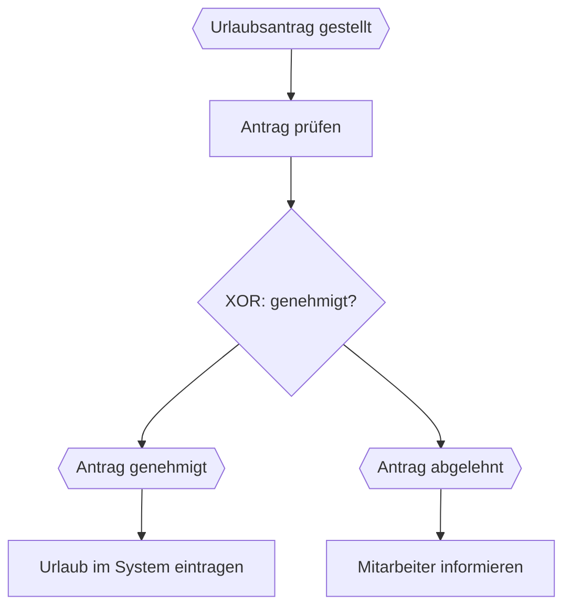
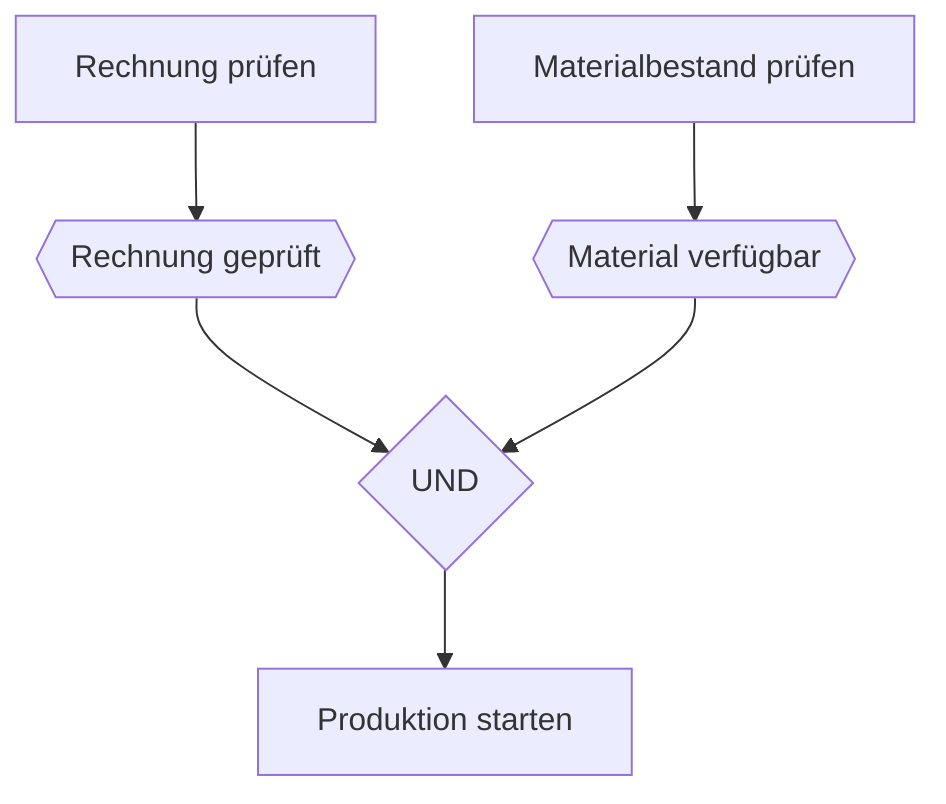
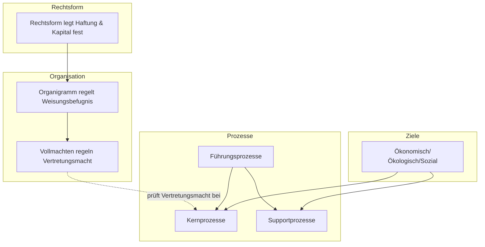

# LF1.4 – Das System Unternehmen

> **Zielgruppe:** Umschüler FIAE/FISI, 2. Lehrjahr
> **Prüfungsrelevanz:** AP1 (schriftlich) + Fachgespräch
> **Lernzeit:** Kerninhalt: 60–80 Min., mit Vertiefung (Nice-to-know, Fachgesprächs-Beispiele): 90–110 Min.
> **Status:** Final
> **Stand:** 2026-08-26 (Rechts- und Zahlenstände können sich ändern)

**Legende:** 🔴 Prüfungsstoff (hohe Relevanz) · 🟡 Kontextwissen (mittlere Relevanz) · 🟢 Nice to know

---

## IHK-Kernfragen

| # | Frage | Abschnitt |
|---|---|---|
| 1 | Wie unterscheiden sich Personen- und Kapitalgesellschaften bei Haftung und Kapital? | [1](#1-rechtsformen) |
| 2 | Was dürfen Prokura (ppa.) und Handlungsvollmacht (i.V.) jeweils – und wo liegt die Grenze? | [2](#2-organisation--vollmachten) |
| 3 | Welche drei Säulen der Nachhaltigkeit gibt es, und was ist ein Zielkonflikt? | [3](#3-unternehmensziele--markt) |
| 4 | Was unterscheidet Kern- von Supportprozessen? | [4](#4-geschäftsprozesse) |
| 5 | Wie sind Ereignisse und Funktionen in einer EPK korrekt verknüpft? | [4.2](#42-epk-ereignisgesteuerte-prozesskette) |

---

## 1. Rechtsformen

> **Grundprinzip (didaktisches Modell):** Personengesellschaften sind stärker durch die persönliche Beteiligung und Haftung der Gesellschafter geprägt. Bei Kapitalgesellschaften steht die rechtlich selbstständige Gesellschaft mit ihrer Kapitalausstattung und grundsätzlich beschränkten Haftung im Vordergrund – dafür gelten meist höhere Gründungs-, Publizitäts- und Organisationsanforderungen.

### 1.1 Die Rechtsformen im Überblick

| Rechtsform | Einordnung | Haftung | Mindestkapital | Leitung |
|---|---|---|---|---|
| Einzelunternehmen | Keine Gesellschaft (ggf. Einzelkaufmann/e.K.) | Inhaber grundsätzlich unbeschränkt privat | Kein gesetzliches Mindestkapital | Inhaber allein |
| GbR (Gesellschaft bürgerlichen Rechts) | Personengesellschaft (Grundform, entsteht oft ohne Vertrag) | Alle Gesellschafter voll, persönlich und gesamtschuldnerisch | Kein gesetzliches Mindestkapital | Grundsätzlich alle Gesellschafter |
| OHG | Personengesellschaft | Alle Gesellschafter voll und persönlich | Kein gesetzliches Mindestkapital | Grundsätzlich alle Gesellschafter |
| KG | Personengesellschaft | Komplementär unbeschränkt, Kommanditist grundsätzlich bis zur Haftsumme | Kein gesetzliches Mindestkapital | Grundsätzlich Komplementär |
| UG (haftungsbeschränkt) | Kapitalgesellschaft | Grundsätzlich Gesellschaftsvermögen | Ab 1 € Stammkapital | Geschäftsführer |
| GmbH | Kapitalgesellschaft | Grundsätzlich Gesellschaftsvermögen | 25.000 € Stammkapital (Mindesteinzahlung bei Gründung: 12.500 €) | Geschäftsführer |
| AG | Kapitalgesellschaft | Grundsätzlich haftet die Gesellschaft mit ihrem Gesellschaftsvermögen | 50.000 € Grundkapital | Vorstand leitet; Aufsichtsrat überwacht und bestellt den Vorstand; Hauptversammlung nimmt gesetzlich zugewiesene Aufgaben wahr |

> **IHK-Szenario zur GbR:** Zwei Fachinformatiker vereinbaren – auch ohne schriftlichen Vertrag – gemeinsam und auf eigene Rechnung ein Projekt durchzuführen. Dadurch kann eine GbR entstehen (§ 705 BGB); ein schriftlicher Gesellschaftsvertrag ist dafür nicht erforderlich. Die Gesellschafter haften im Außenverhältnis grundsätzlich persönlich und gesamtschuldnerisch, und sind grundsätzlich gemeinschaftlich zur Vertretung befugt, sofern der Gesellschaftsvertrag nichts anderes regelt (§ 720 BGB). Nicht jede gemeinsame Tätigkeit von Freiberuflern führt automatisch zu einer GbR – arbeitet eine Person nur als Subunternehmer für die andere, liegt möglicherweise keine GbR vor.

> **IHK-Typfrage:** *Szenario A (Start-up) sucht Investoren, die Geld geben, aber nicht mitreden sollen. Welche Rechtsform bzw. Beteiligungsart passt?*
> **Musterantwort:** Eine Kommanditgesellschaft (KG) passt gut zu dieser Anforderung: Die Investoren treten als Kommanditisten ein und sind grundsätzlich von der Geschäftsführung ausgeschlossen; ihre Haftung ist auf die Haftsumme begrenzt, während der Komplementär die Geschäfte führt und persönlich haftet. Von der Geschäftsführung ausgeschlossen zu sein bedeutet aber nicht rechtlos – Kommanditisten behalten gesetzliche Informations- und Kontrollrechte (§ 166 HGB). Alternativ kommt bei einer GmbH die Aufnahme stiller Gesellschafter infrage, die ebenfalls Kapital ohne Geschäftsführungsbefugnis einbringen.

🔴 **Stolperstein:** "Beschränkte Haftung (GmbH) heißt, dass niemand zahlt." Falsch – das eingezahlte Firmenkapital ist im Insolvenzfall weg. Die Haftungsbeschränkung gilt grundsätzlich für die Gesellschaft. Der Geschäftsführer kann daneben **persönlich** haften, wenn er eigene gesetzliche Pflichten verletzt, etwa bei Insolvenzverschleppung oder vorsätzlichem/grob fahrlässigem Fehlverhalten – das ist eine eigenständige Organhaftung, keine Durchgriffshaftung. Die eigentliche **Durchgriffshaftung** ist ein engerer Ausnahmefall: Sie durchbricht die rechtliche Trennung zwischen Gesellschaft und Gesellschafter/Geschäftsführer erst bei einem besonderen Missbrauch, etwa einer Vermischung von Gesellschafts- und Privatvermögen. Merksatz für die Prüfung: GmbH bedeutet nicht "keine Haftung", sondern grundsätzlich Haftung der Gesellschaft mit ihrem Gesellschaftsvermögen.

🟡 **Kontextwissen:** Die UG (haftungsbeschränkt) wird oft "Mini-GmbH" genannt, weil sie ab 1 € Stammkapital gegründet werden kann. Sie muss dafür jährlich ein Viertel des um Verlustvorträge bereinigten Jahresüberschusses als gesetzliche Rücklage ansparen (§ 5a Abs. 3 GmbHG). Erhöht sie ihr Stammkapital auf mindestens 25.000 €, entfallen die UG-Sonderregeln – eine formale Umwandlung in eine GmbH ist dafür nicht zwingend nötig, die Bezeichnung "UG (haftungsbeschränkt)" darf beibehalten werden.

🟡 **Kontextwissen – GmbH & Co. KG:** Eine beliebte Kombinationsform: Eine GmbH übernimmt die Rolle des Komplementärs einer KG. Dadurch haftet für die "unbeschränkte" Komplementär-Haftung wirtschaftlich nur das GmbH-Vermögen, nicht eine natürliche Person privat – ein beliebter Prüfungsfallstrick.

---

## 2. Organisation & Vollmachten

> **Grundprinzip:** Aufbauorganisation regelt, wer wem unterstellt ist – Vollmachten regeln, wer im Namen der Firma rechtsverbindlich handeln darf. Beides ist unabhängig voneinander zu prüfen.

### 2.1 Aufbauorganisation

| Organisationsform | Merkmal | Vor-/Nachteil |
|---|---|---|
| Einliniensystem | Jeder hat genau einen Vorgesetzten | Klarer Dienstweg, aber langsam |
| Mehrliniensystem | Mehrere Fachvorgesetzte möglich | Fachkompetenz entscheidet, aber Konfliktgefahr (zwei Chefs) |
| Stab-Linien-System | Einliniensystem, ergänzt um beratende Stabsstellen (z. B. Rechtsabteilung) ohne eigene Weisungsbefugnis | Fachwissen fließt ein, ohne den klaren Dienstweg zu durchbrechen – in der Praxis häufiger als ein reines Mehrliniensystem |
| Matrixorganisation | Kreuzung aus Funktion (z. B. IT) und Sparte (z. B. Produkt A) | Flexibel, aber oft "Meeting-Marathons" durch doppelte Abstimmung |

### 2.2 Vollmachten im Überblick

| Vollmacht | Umfang | Typische gesetzliche Grenze |
|---|---|---|
| Prokura (ppa.) | Grundsätzlich alle gerichtlichen und außergerichtlichen Geschäfte eines Handelsgewerbes, im Handelsregister eingetragen. Als **Einzelprokura** allein oder als **Gesamtprokura** nur gemeinsam mit anderen Prokuristen erteilbar | Grundstücksverkauf oder -belastung nur mit besonderer Ermächtigung (§ 49 Abs. 2 HGB); grundlegende gesellschaftsrechtliche Entscheidungen können zusätzlich den zuständigen Gesellschaftern/Organen vorbehalten sein |
| Generalhandlungsvollmacht (i. V.) | Ermächtigt zum Betrieb des gesamten Handelsgewerbes im gewöhnlichen Geschäftsverkehr (z. B. Einkauf, Verkauf) | Grundstücksgeschäfte, Eingehung von Wechselverbindlichkeiten, Aufnahme von Darlehen und Prozessführung nur mit besonderer Ermächtigung (§ 54 Abs. 2 HGB) |
| Arthandlungsvollmacht | Ermächtigt zu einer bestimmten Art wiederkehrender Geschäfte (z. B. Einkauf von Büromaterial, Abschluss von Wartungsverträgen bis zu einem üblichen Umfang) | Nur innerhalb der konkret benannten Geschäftsart |
| Spezial-/Einzelvollmacht | Ermächtigt zu einem einzelnen, konkret bestimmten Geschäft (z. B. Kauf eines bestimmten Servers, Unterzeichnung eines einzelnen Vertrags) | Nur dieses eine Geschäft; der Zusatz "i. A." (im Auftrag) weist im Schriftverkehr meist darauf hin, beweist aber allein nicht den Umfang der Vollmacht |

> **IHK-Typfrage:** *Ein Einkaufsleiter (i.V.) kauft einen Firmenwagen. Darf er das? Darf er auch das Firmengrundstück belasten?*
> **Musterantwort:** Den Firmenwagen darf der Einkaufsleiter kaufen, sofern das zu den für seinen Aufgabenbereich typischen Geschäften gehört – das deckt seine Handlungsvollmacht (i.V.). Das Firmengrundstück zu belasten, darf er dagegen nicht: Grundstücksgeschäfte sind – ebenso wie die Eingehung von Wechselverbindlichkeiten, Darlehensaufnahmen und Prozessführung – von der Handlungsvollmacht nach § 54 Abs. 2 HGB ausdrücklich ausgenommen und benötigen eine gesonderte Erlaubnis.

🔴 **Stolperstein:** "Ein Prokurist darf alles für die Firma entscheiden." Falsch – selbst die umfassende Prokura erlaubt nicht automatisch die Veräußerung oder Belastung von Grundstücken. Bei grundlegenden Unternehmensentscheidungen (Verkauf des ganzen Unternehmens, Namensänderung) muss zusätzlich geprüft werden, ob die Handlung überhaupt zum laufenden Betrieb gehört oder den zuständigen Organen/Gesellschaftern vorbehalten ist.

🟡 **Kontextwissen:** Prokura kann nur vom Inhaber des Handelsgeschäfts oder von dessen gesetzlichem Vertreter ausdrücklich erteilt werden (§ 48 HGB) und ist zur Eintragung ins Handelsregister anzumelden – die Prokura wirkt aber bereits mit der Erteilung, nicht erst durch die Eintragung.

---

## 3. Unternehmensziele & Markt

> **Grundprinzip:** Unternehmen verfolgen selten nur ein Ziel – das Drei-Säulen-Modell macht sichtbar, dass ökonomische, ökologische und soziale Ziele in Konflikt geraten können.

### 3.1 Die drei Säulen der Nachhaltigkeit

| Säule | Beispielziele |
|---|---|
| Ökonomisch | Gewinn, Rentabilität, Liquidität, Marktanteil |
| Ökologisch | Ressourcenschonung, Emissionsreduktion |
| Sozial | Faire Löhne, Jobsicherheit, Ausbildung |

### 3.2 Marktformen

| Marktform | Anzahl Anbieter | Konsequenz |
|---|---|---|
| Polypol | Viele Anbieter | Hoher Wettbewerb, wenig Preissetzungsmacht |
| Oligopol | Wenige Anbieter | Reaktion auf Konkurrenzverhalten wichtig |
| Monopol | Ein Anbieter | Hohe Preissetzungsmacht, oft reguliert |

🟢 **Nice to know:** Die Marktformen lassen sich auch von der Nachfrageseite her spiegeln: **Monopson** (ein Nachfrager) und **Oligopson** (wenige Nachfrager) beschreiben Nachfragemacht statt Anbietermacht – gelegentlich Prüfungsthema.

### 3.3 Zielbeziehungen

| Beziehung | Bedeutung | Beispiel |
|---|---|---|
| Zielkonflikt | Erreichen von Ziel A erschwert Ziel B | Schnelles Wachstum vs. nachhaltige Server-Nutzung |
| Zielharmonie | Erreichen von Ziel A unterstützt Ziel B | Effizientere Prozesse steigern zugleich Gewinn und senken Ressourcenverbrauch |
| Zielindifferenz/-neutralität | Ziele beeinflussen sich nicht gegenseitig | Neues Bürodesign vs. Exportquote in Übersee |

> **IHK-Typfrage:** *Formuliere einen Zielkonflikt für ein Szenario zwischen "schnellem Wachstum" und "nachhaltiger Server-Nutzung".*
> **Musterantwort:** Schnelles Wachstum verlangt oft kurzfristig mehr Rechenkapazität – der einfachste Weg ist häufig, zusätzliche Server ohne Rücksicht auf Energieeffizienz zuzubuchen. Das steht im Konflikt mit dem ökologischen Ziel, Ressourcen zu schonen und Emissionen zu senken. Eine Lösung könnte sein, Wachstum gezielt mit effizienterer Auslastung bestehender Server oder Green-Cloud-Anbietern zu verbinden, statt ökonomisches und ökologisches Ziel gegeneinander auszuspielen.

🔴 **Stolperstein:** "Umsatz ist gleich Gewinn." Falsch – Gewinn = Umsatz − Kosten. Viele Start-ups erzielen hohen Umsatz, machen aber Verlust, weil die Kosten (noch) höher sind.

🟡 **Kontextwissen – Magisches Dreieck der BWL:** Liquidität, Rentabilität und Sicherheit stehen oft in Spannung zueinander – z. B. bindet hohe Sicherheit (Rücklagen) Kapital, das sonst rentabler investiert werden könnte.

🟡 **Rechenbeispiele:**
- **Eigenkapitalrentabilität** = Gewinn / Eigenkapital × 100. Bei Gewinn 50.000 € und Eigenkapital 500.000 €: 50.000 / 500.000 × 100 = **10 %**
- **Umsatzrentabilität** = Gewinn / Umsatz × 100
- **Wirtschaftlichkeit** = Ertrag bzw. Leistung / Aufwand bzw. Kosten (> 1: wirtschaftlich · = 1: kostendeckend · < 1: unwirtschaftlich)

---

## 4. Geschäftsprozesse

> **Grundprinzip:** Nicht jeder wichtige Prozess ist ein Kernprozess – entscheidend ist, ob der Prozess unmittelbar zur Wertschöpfung für den Kunden beiträgt.

### 4.1 Prozessarten

| Prozessart | Merkmal | Beispiel |
|---|---|---|
| Führungs-/Steuerungsprozess | Gibt Orientierung: Planung, Qualitätsmanagement, Risikoanalyse | Unternehmensstrategie festlegen |
| Kernprozess | Trägt unmittelbar zur Erstellung und Lieferung der Kundenleistung bei | Softwareentwicklung, Produktion |
| Supportprozess | Unterstützt die Kernprozesse, ohne selbst die zentrale Kundenleistung zu erbringen | IT-Support, HR, Buchhaltung, Onboarding |

> **IHK-Typfrage:** *Warum ist der Onboarding-Prozess für neue Mitarbeiter oft ein Supportprozess, obwohl er extrem wichtig ist?*
> **Musterantwort:** Wichtigkeit und Kernprozess-Status sind zwei unabhängige Dimensionen. Das Onboarding sichert zwar die Leistungsfähigkeit der Belegschaft und ist damit strategisch wichtig – es trägt aber nicht unmittelbar zur Erstellung der Kundenleistung bei, sondern ermöglicht sie nur. Deshalb zählt Onboarding zu den Supportprozessen, auch wenn eine Vernachlässigung langfristig den Kernprozess gefährden kann.

🟡 **Praxis-Tipp:** Die Einordnung ist kontextabhängig: IT-Support ist in einem klassischen Produktionsunternehmen meist ein Supportprozess. Bei einem IT-Serviceanbieter, der genau diesen Support verkauft, ist derselbe Prozess dagegen ein Kernprozess – ein beliebtes Fachgesprächs-Beispiel.

### 4.2 EPK (Ereignisgesteuerte Prozesskette)

> **Merksatz (vereinfachte EPK-Lernregel):** Auf jedes Ereignis folgt eine Funktion, auf jede Funktion folgt ein Ereignis – niemals zwei Ereignisse oder zwei Funktionen direkt hintereinander. In dieser Lernregel wird eine XOR-/ODER-Entscheidung durch eine Funktion vorbereitet: Das Ereignis selbst ist nur ein passiver Zustand und trifft keine Entscheidung, der Konnektor stellt anschließend die Verzweigung dar. Mehrere Pfade dürfen aber über UND/ODER/XOR wieder in ein Ereignis zusammenlaufen.

| Element | Symbol | Bedeutung |
|---|---|---|
| Ereignis | Sechseck | Ein eingetretener Zustand ("Urlaubsantrag gestellt") |
| Funktion | Rechteck | Eine ausgeführte Tätigkeit ("Antrag prüfen") |
| UND | Verknüpfung | Alle folgenden Pfade werden ausgeführt |
| ODER | Verknüpfung | Mindestens ein folgender Pfad wird ausgeführt |
| XOR | Verknüpfung | Genau ein folgender Pfad wird ausgeführt (exklusiv) |

**Beispiel XOR (Verzweigung nach einer Funktion):**



**Beispiel UND (zwei vorgelagerte Funktionen erzeugen die Bedingungen, erst danach startet die gemeinsame Funktion):**



🔴 **Stolperstein:** Eine EPK, die zwei Ereignisse direkt hintereinander zeigt (z. B. "Antrag gestellt" → "Antrag genehmigt" ohne die dazwischenliegende Funktion "Antrag prüfen"), verletzt die Grundregel der EPK-Notation. Ebenso fehlerhaft: ein Ereignis, das selbst über ein ODER/XOR verzweigt – die Entscheidung muss von einer Funktion ausgehen, nicht vom passiven Zustand.

---

## Unternehmens-Dashboard: Wie alles zusammenhängt



---

## Selbsttest

| # | Frage | Kurzantwort |
|---|---|---|
| 1 | Wer haftet bei einer GbR/OHG? | Alle Gesellschafter voll, persönlich (bei GbR zusätzlich gesamtschuldnerisch) |
| 2 | Wie hoch ist das Mindestkapital einer AG? | 50.000 € Grundkapital |
| 3 | Hat ein Kommanditist gar keine Rechte? | Doch – von der Geschäftsführung ausgeschlossen, aber Informations- und Kontrollrechte (§ 166 HGB) |
| 4 | Darf ein Prokurist ohne Zusatzerlaubnis ein Grundstück verkaufen? | Nein |
| 5 | Nenne die drei Säulen der Nachhaltigkeit. | Ökonomisch, ökologisch, sozial |
| 6 | Wie berechnet man die Eigenkapitalrentabilität? | Gewinn / Eigenkapital × 100 |
| 7 | Welche drei Prozesskategorien gibt es? | Führungs-/Steuerungsprozesse, Kernprozesse, Supportprozesse |
| 8 | Darf in einer EPK ein Ereignis selbst per XOR verzweigen? | Nein – nur eine Funktion darf verzweigen, ein Ereignis ist passiv |

---

## IHK-Cheatsheet

| Begriff | Kurzdefinition |
|---|---|
| GbR | Personengesellschaft-Grundform, entsteht oft ohne Vertrag, volle gesamtschuldnerische Haftung |
| Durchgriffshaftung | Enge Ausnahme, in der trotz GmbH/UG der Geschäftsführer privat haftet (z. B. Insolvenzverschleppung, Vermögensvermischung) |
| Komplementär | Grundsätzlich vollhaftender, geschäftsführungsbefugter Gesellschafter einer KG (Vertrag kann dies näher regeln) |
| Kommanditist | Von der Geschäftsführung ausgeschlossen, haftet bis zur Haftsumme, behält aber Informations-/Kontrollrechte |
| UG (haftungsbeschränkt) | "Mini-GmbH" ab 1 € Stammkapital, Rücklagepflicht: 1/4 des Jahresüberschusses |
| Prokura (ppa.) | Grundsätzlich umfassende Vollmacht; als Einzel- oder Gesamtprokura möglich; Grundstücksverkauf/-belastung nur mit besonderer Ermächtigung |
| Generalhandlungsvollmacht (i.V.) | Vollmacht für typische Geschäfte des Aufgabenbereichs, ohne Grundstücke/Darlehen/Wechsel/Prozessführung |
| Spezial-/Einzelvollmacht (i.A.) | Vollmacht nur für ein einzelnes, konkretes Geschäft |
| Zielkonflikt / Zielharmonie / Zielindifferenz | Zwei Ziele stehen sich entgegen / unterstützen sich / beeinflussen sich nicht |
| Magisches Dreieck der BWL | Liquidität, Rentabilität, Sicherheit stehen oft in Spannung zueinander |
| Führungs-/Kern-/Supportprozess | Die 3 Prozesskategorien: Orientierung geben / Wertschöpfung / Unterstützung |
| EPK | Ereignisgesteuerte Prozesskette: Ereignis (Sechseck) → Funktion (Rechteck); nur Funktionen dürfen per UND/ODER/XOR verzweigen |

---

## Prüfungstaktik

| Aufgabentyp | Typische Formulierung | Beispiel aus AP1 | Was die IHK hören will |
|---|---|---|---|
| Rechtsformwahl begründen | "Welche Rechtsform passt zu Szenario X?" | "Ein Start-up sucht Investoren ohne Mitspracherecht. Welche Rechtsform/Beteiligungsart passt?" | Konkrete Rechtsform/Rolle nennen + Begründung anhand Haftung/Mitsprache |
| Vollmachtsprüfung im Fallbeispiel | "Darf Person X mit Vollmacht Y die Handlung Z vornehmen?" | "Ein Prokurist will das Firmengrundstück verkaufen. Darf er das?" | Grundregel nennen + Ausnahme/Grenze der Vollmacht klar benennen |
| Zuordnung Prozesskategorie | "Ist X ein Führungs-, Kern- oder Supportprozess?" | "Ordnen Sie zu: 'Kantine betreiben' – welche Prozesskategorie, und begründen Sie." | Zuordnung + Begründung über (fehlende) direkte Wertschöpfung beim Kunden |
| Bewertung/Diskussion | "Nimm Stellung zu These X" | "Nehmen Sie Stellung zur These: 'Die GmbH ist die beliebteste Rechtsform in Deutschland, weil sie das beste Modell ist.'" | Pro- und Contra-Argument (Haftungsbeschränkung vs. Bürokratie/Kapitalbedarf), dann begründete eigene Position |

---

## Merk-Sätze fürs Fachgespräch

> Personengesellschaften sind durch die persönliche Beteiligung und Haftung der Gesellschafter geprägt, Kapitalgesellschaften durch die rechtlich selbstständige Gesellschaft mit ihrer Kapitalausstattung – dafür gelten meist höhere Gründungs- und Publizitätsanforderungen.

> Von der Geschäftsführung ausgeschlossen zu sein heißt nicht rechtlos zu sein – Kommanditisten behalten Informations- und Kontrollrechte, auch ohne im Tagesgeschäft mitzureden.

> Beschränkte Haftung schützt das Privatvermögen, aber nicht bei Insolvenzverschleppung oder Vermögensvermischung – die Durchgriffshaftung ist die enge Ausnahme, die diese Regel bestätigt.

> Selbst die umfassendste Vollmacht (Prokura) deckt keine Grundlagengeschäfte wie Grundstücksverkauf ab – dafür bleiben die Gesellschafter/Organe zuständig.

> Ökonomische, ökologische und soziale Ziele stehen nicht automatisch im Einklang – neben dem Zielkonflikt gibt es aber auch Zielharmonie und Zielindifferenz.

> In einer EPK folgt auf jedes Ereignis eine Funktion und umgekehrt – und nur eine Funktion darf per ODER/XOR verzweigen, niemals ein passives Ereignis.

---

```yaml
lernfeld: LF1.4
titel: Das System Unternehmen
status: final
stand: 2026-08-26
quellen:
  - LF1.4- Das System Unternehmen
  - LF1.4.1- Rechtsformen
  - LF1.4.2- Organisation & Vollmachten
  - LF1.4.3- Unternehmensziele & Markt
  - LF1.4.4- Geschäftsprozesse
```