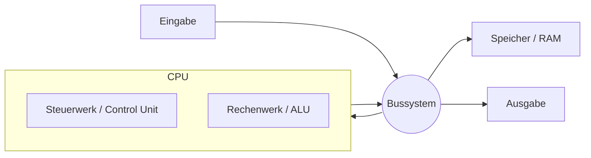

# LF2.1 – Die Logik der Maschinen

> **Zielgruppe:** Umschüler FIAE/FISI, 2. Lehrjahr
> **Prüfungsrelevanz:** AP1 (schriftlich) + Fachgespräch
> **Lernzeit:** Kerninhalt: 70–90 Min., mit Vertiefung (Nice-to-know, Rechenbeispiele): 100–120 Min.
> **Status:** Final
> **Stand:** 2026-08-27

**Legende:** 🔴 Prüfungsstoff (hohe Relevanz) · 🟡 Kontextwissen (mittlere Relevanz) · 🟢 Nice to know

---

## IHK-Kernfragen

| # | Frage | Abschnitt |
|---|---|---|
| 1 | Warum zeigt eine 1-TB-Festplatte unter Windows nur ca. 931 GB an? | [1.2](#12-speichergrößen-si-vs-iec) |
| 2 | Wie funktionieren die Grundgatter AND, OR und NOT, und wie kombiniert man sie? | [1.3](#13-logikgatter) |
| 3 | Welche Aufgabe haben Steuer-, Adress- und Datenbus jeweils? | [2.2](#22-das-bussystem) |
| 4 | Was passiert in den vier Phasen des Befehlszyklus? | [3.1](#31-der-befehlszyklus-instruction-cycle) |
| 5 | Warum bedeutet eine doppelte GHz-Zahl nicht automatisch doppelte Rechenleistung? | [3.2](#32-taktfrequenz-und-ipc) |

---

## 1. Das digitale Alphabet

> **Grundprinzip:** Digitale Schaltungen verarbeiten Informationen mithilfe unterscheidbarer logischer Zustände, die meist als 0 und 1 dargestellt werden – physikalisch repräsentiert durch unterschiedliche Spannungsbereiche. Um komplexe Informationen darzustellen, nutzen wir das Dualsystem (Basis 2). Da Binärzahlen für Menschen schwer lesbar sind (z. B. 11111111), nutzen wir das Hexadezimalsystem (Basis 16) als kompakte Schreibweise (z. B. FF).

### 1.1 Zahlensysteme im Vergleich

| System | Basis | Ziffern | Beispiel | Verwendung |
|---|---|---|---|---|
| Dezimal | 10 | 0–9 | 255 | Menschliche Alltagssprache |
| Dual (Binär) | 2 | 0, 1 | 11111111 | Darstellung digitaler Zustände und von Maschinencode |
| Hexadezimal | 16 | 0–9, A–F | FF | Kompakte Darstellung binärer Werte (z. B. Farben, Speicherwerte, MAC-Adressen, IPv6) |

> **IHK-Typfrage:** *Wandle die Dezimalzahl 163 in Binär- und Hexadezimalsystem um.*
> **Musterantwort:** 163 = 128 + 32 + 2 + 1 = 10100011 (binär). Für Hexadezimal wird die Binärzahl in 4er-Blöcke geteilt: 1010 0011 → A3 (hexadezimal). Probe: A3₁₆ = 10·16 + 3 = 163.

🔴 **Stolperstein:** "Im Hexadezimalsystem geht es nach F mit G weiter." Falsch – nach F (=15 dezimal) folgt 10 (hexadezimal), was dezimal 16 entspricht. Es gibt nur die Ziffern 0–9 und A–F.

🟡 **Praxis-Tipp:** MAC-Adressen und IPv6-Adressen werden in Hexadezimal notiert, weil ein Hex-Zeichen genau 4 Bit (ein "Nibble") darstellt – das macht lange Binärfolgen kompakt lesbar, ohne die 1:1-Beziehung zum Binärcode zu verlieren (anders als beim Dezimalsystem).

### 1.2 Speichergrößen: SI vs. IEC

| Einheit (SI, 10ˣ) | Bytes | Einheit (IEC, 2ˣ) | Bytes | Differenz |
|---|---|---|---|---|
| KB (Kilobyte) | 1.000 | KiB (Kibibyte) | 1.024 | 2,4 % |
| MB (Megabyte) | 1.000.000 | MiB (Mebibyte) | 1.048.576 | 4,9 % |
| GB (Gigabyte) | 1.000.000.000 | GiB (Gibibyte) | 1.073.741.824 | 7,4 % |
| TB (Terabyte) | 1.000.000.000.000 | TiB (Tebibyte) | 1.099.511.627.776 | 10,0 % |

> **IHK-Typfrage:** *Warum zeigt eine 1-TB-Festplatte unter Windows nur ca. 931 GB an?*
> **Musterantwort:** Festplattenhersteller geben die Kapazität im dezimalen SI-System an: 1 TB = 1.000.000.000.000 Byte. Die Anzeige des Betriebssystems entspricht bei solchen Kapazitätsangaben einer binär berechneten Größe, wird aber traditionell weiterhin mit "GB" statt "GiB" beschriftet. Rechnet man die 1.000.000.000.000 Byte in Gibibyte um (÷ 1.073.741.824), ergeben sich ca. 931 GiB. Es fehlen also nicht wirklich rund 69 GB an Speicherplatz – die Hauptursache der Differenz ist die unterschiedliche Rechenbasis (10ˣ vs. 2ˣ), nicht tatsächlicher Datenverlust. Kleinere zusätzliche Abweichungen können durch Partitionierung und Dateisystem-Verwaltungsdaten entstehen.

🔴 **Stolperstein:** Verwechslung von Bit (kleines b) und Byte (großes B) bei Transferraten – 1 GB/s ist etwas ganz anderes als 1 Gbit/s (Faktor 8). Ein "100-Mbit/s-Anschluss" schafft rechnerisch theoretisch 12,5 MB/s; praktisch liegt der nutzbare Durchsatz wegen Protokoll- und Übertragungs-Overhead meist etwas niedriger.

### 1.3 Logikgatter

| Gatter | Regel | Boolesche Schreibweise |
|---|---|---|
| AND (UND) | Ausgang ist 1, wenn ALLE Eingänge 1 sind | A ∧ B |
| OR (ODER) | Ausgang ist 1, wenn MINDESTENS ein Eingang 1 ist | A ∨ B |
| NOT (NICHT) | Kehrt das Signal um (Inverter, 1 Eingang) | ¬A |

**Wahrheitstabelle AND:**

| A | B | Ausgang |
|---|---|---|
| 0 | 0 | 0 |
| 0 | 1 | 0 |
| 1 | 0 | 0 |
| 1 | 1 | 1 |

**Wahrheitstabelle OR:**

| A | B | Ausgang |
|---|---|---|
| 0 | 0 | 0 |
| 0 | 1 | 1 |
| 1 | 0 | 1 |
| 1 | 1 | 1 |

**Wahrheitstabelle NOT:**

| A | Ausgang |
|---|---|
| 0 | 1 |
| 1 | 0 |

🟡 **Kontextwissen:** Neben den Grundgattern gibt es weitere wichtige Gatter: **NAND**, **NOR**, **XOR** und **XNOR** – sie können je nach Aufgabenstellung ebenfalls vorkommen. NAND (= negiertes AND) und NOR (= negiertes OR) gelten als "universelle Gatter", weil sich aus ihnen allein sämtliche anderen Logikgatter aufbauen lassen. XOR (Ausgang 1, wenn die Eingänge unterschiedlich sind) ist z. B. zentraler Baustein des Volladdierers.

> **IHK-Typfrage:** *Entwirf eine Schaltung: "Maschine läuft NUR, wenn Schutzgitter zu UND (Startknopf gedrückt ODER eine zusätzliche Servicefreigabe aktiv)."*
> **Musterantwort:** Die Bedingung lautet: Schutzgitter ∧ (Startknopf ∨ Servicefreigabe). Zunächst werden die Signale "Startknopf gedrückt" und "Servicefreigabe aktiv" über ein OR-Gatter verknüpft – der Normalbetrieb kann also entweder über den Startknopf oder über die Servicefreigabe ausgelöst werden. Der Ausgang dieses OR-Gatters wird zusammen mit dem Signal "Schutzgitter zu" in ein AND-Gatter geführt. Nur wenn das Schutzgitter zu UND (Startknopf ODER Servicefreigabe) erfüllt ist, läuft die Maschine – das Schutzgitter ist also in jedem Fall zwingend, nicht optional.

🔴 **Stolperstein:** Bei der Klammerung entscheidet die Reihenfolge über die Sicherheit: (Schutzgitter ∧ Startknopf) ∨ Servicefreigabe würde bedeuten, dass die Maschine bei aktiver Servicefreigabe auch **ohne** geschlossenes Schutzgitter liefe – ein sicherheitskritischer Fehler. Die korrekte Klammerung ist Schutzgitter ∧ (Startknopf ∨ Servicefreigabe). In realen sicherheitskritischen Anlagen wird eine solche Freigabe zudem nie allein durch eine einfache Gatterlogik umgesetzt – zusätzlich gelten Anforderungen an Not-Halt, Überwachung und Ausfallsicherheit. Auch begrifflich ist Vorsicht geboten: Ein realer "Wartungsschlüssel" schaltet in der Praxis meist einen eigenen, reduzierten Betriebsmodus (z. B. Tippbetrieb mit geöffnetem Gitter unter Zustimmungstaste) frei, statt einfach eine ODER-Alternative zum normalen Startknopf zu sein – deshalb wird in diesem Lernbeispiel bewusst der neutralere Begriff "Servicefreigabe" verwendet.

🟡 **Praxis-Tipp:** Ein **Volladdierer** kombiniert XOR-, AND- und OR-Gatter (Summe = A XOR B XOR Übertrag-rein; neuer Übertrag = (A AND B) OR (Übertrag-rein AND (A XOR B))) – das zeigt, wie aus wenigen Grundgattern komplexe Rechenwerke (Addierwerke der ALU) entstehen.

---

## 2. Der Bauplan (Architektur)

> **Grundprinzip:** Die Von-Neumann-Architektur prägt seit 1945 die meisten Universalrechner – sie erklärt, warum Daten immer erst durch die "Poststelle" der Busse müssen, bevor sie verarbeitet werden können.

### 2.1 Die Von-Neumann-Architektur


*Vereinfachte Darstellung – reale Systeme enthalten zusätzlich Controller, Register, Caches und weitere Schnittstellen.*

Sie besteht aus **Rechenwerk (ALU)**, **Steuerwerk (Control Unit)**, **Speicher**, **Eingabe** und **Ausgabe** – verbunden über ein gemeinsames Bussystem.

🟡 **Kontextwissen:** Moderne PCs verwenden meist eine **modifizierte** Von-Neumann-Architektur: Auf oberster Ebene teilen sich Programme und Daten weiterhin den Hauptspeicher, intern besitzen Prozessoren aber oft getrennte L1-Instruktions- und Datencaches, mehrere Speicherkanäle und mehrere Kerne – das mildert den im nächsten Abschnitt beschriebenen Flaschenhals ab, beseitigt ihn aber nicht grundsätzlich.

### 2.2 Das Bussystem

| Bus-Typ | Aufgabe | Analogie |
|---|---|---|
| Steuerbus | Überträgt Steuersignale (z. B. Lesen, Schreiben, Interrupt-Anforderung, Busanforderung) | Der Dirigent / Verkehrspolizist |
| Adressbus | Übermittelt die Speicheradresse ("Wo?") | Der Postbote, der die Hausnummer sucht |
| Datenbus | Übermittelt die eigentlichen Nutz- und ggf. Befehlsdaten ("Was?") | Der LKW, der das Paket transportiert |

🔴 **Stolperstein:** "Bus" (logische Verbindung/Übertragungskanal) und "Slot" (physischer Steckplatz wie PCIe) werden oft gleichgesetzt – ein Slot ist die physische Schnittstelle, der Bus die dahinterliegende logische Datenverbindung. Ebenfalls falsch: die Annahme, Daten- und Adressbus seien immer gleich breit – ihre Breite (Anzahl paralleler Leitungen) wird unabhängig voneinander festgelegt.

> **IHK-Typfrage:** *Erkläre den "Von-Neumann-Flaschenhals".*
> **Musterantwort:** Im klassischen Von-Neumann-Modell teilen sich Programm und Daten denselben Speicher und dasselbe Bussystem – dadurch konkurrieren Befehlsabruf und Datenzugriff um dieselbe Verbindung, was einen Engpass erzeugt. Moderne Prozessoren mildern diesen Effekt durch Caches, Pipelines und mehrere interne Datenpfade deutlich ab, beseitigen das grundlegende Problem aber nicht vollständig.

🟢 **Nice to know:** Die klassische **Harvard-Architektur** trennt Programm- und Datenspeicher sowie deren Zugriffswege voneinander (jeweils eigener Bus) und mildert den Von-Neumann-Flaschenhals dadurch deutlich ab. In der Praxis existieren daneben modifizierte Harvard-Varianten, bei denen die Trennung nur auf bestimmten Ebenen gilt (z. B. viele Mikrocontroller sowie CPU-interne Caches), während PCs überwiegend (modifizierte) Von-Neumann-Architekturen nutzen.

🟡 **Kontextwissen:** Bei einem Prozessor mit 32-Bit breitem Adressbus lassen sich rechnerisch 2^32 = 4.294.967.296 Adressen direkt ansprechen – bei byteweiser Adressierung entspricht das ca. 4 GiB physikalisch adressierbarem Speicher. Ein Betriebssystem braucht davon aber auch Adressraum für Geräte (Grafikkarte, BIOS/UEFI etc.), weshalb einem 32-Bit-System oft weniger als 4 GiB nutzbarer RAM zur Verfügung stehen. Die Technik **PAE** (Physical Address Extension) kann einem 32-Bit-Betriebssystem ermöglichen, mehr als 4 GiB physischen RAM zu verwalten (bis zu 64 GB) – ein einzelner Prozess verfügt dadurch aber nicht automatisch über einen größeren zusammenhängenden 32-Bit-Adressraum.

### 2.3 Netztopologien

> **Hinweis:** Hier geht es um **Netzwerk-Topologien** (wie Computer im Netzwerk miteinander verkabelt sind) – nicht zu verwechseln mit dem CPU-internen Bussystem aus Abschnitt 2.2.

| Topologie | Beschreibung | Vorteil | Nachteil |
|---|---|---|---|
| Stern | Alle Geräte an einem Zentralverteiler | Ausfall eines Kabels legt nur 1 Gerät lahm | Zentraler Single Point of Failure (ohne redundante Verteiler) |
| Ring | Geschlossener Kreis | Geringer Kabelaufwand | Ausfall eines Geräts unterbricht alles, sofern keine Redundanz/Bypass vorhanden ist |
| Bus | Alle Geräte an einer Hauptleitung | Einfach zu installieren | Klassische Variante (z. B. altes Koax-Ethernet): Kollisionen möglich, Kabelbruch kann den gesamten Netzabschnitt beeinträchtigen; in modernen Switched-Ethernet-Netzen kaum noch verbreitet |

### 2.4 Das EVA-Prinzip

> **Merksatz:** Eingabe → Verarbeitung → Ausgabe – jedes datenverarbeitende Gerät lässt sich auf dieses Grundmuster zurückführen, vom Großrechner bis zum Fahrkartenautomaten.

> **IHK-Typfrage:** *Wende das EVA-Prinzip auf einen Fahrkartenautomaten an.*
> **Musterantwort:** Eingabe: Der Fahrgast wählt das Ziel und steckt Geld/Karte ein. Verarbeitung: Der Automat berechnet den Fahrpreis, prüft den eingezahlten Betrag und ermittelt ggf. das Rückgeld. Ausgabe: Der Automat druckt das Ticket und gibt Wechselgeld aus.

---

## 3. Der Programmablauf

> **Grundprinzip:** Jedes Programm wird auf der CPU letztlich in Grundoperationen abgearbeitet. Viele Lehrmodelle beschreiben diesen Ablauf mit den Phasen Fetch, Decode, Execute und einer abschließenden Ergebnisphase, die je nach Befehl als **Store** (Schreiben in den Speicher) oder **Write-back** (Schreiben in ein Register) bezeichnet wird – je nach Prozessor und Befehl (z. B. ein Sprungbefehl wie `JMP`) kann diese Phase auch ganz entfallen.

### 3.1 Der Befehlszyklus (Instruction Cycle)


| Phase | Aktion | Beteiligte Komponenten |
|---|---|---|
| 1. Fetch (Holen) | Der nächste Befehl wird aus dem Speicher – in der Praxis meist zunächst aus dem Instruktionscache, bei einem Cache-Miss aus dem RAM – in die CPU geladen. Der Befehlszähler liefert zunächst die Adresse des nächsten Befehls; nach dem Abruf wird er normalerweise auf die folgende Instruktion weitergestellt – bei Sprung-/Verzweigungsbefehlen kann er stattdessen einen anderen Wert erhalten | Befehlszähler → Adressbus → Speicher → Datenbus → Befehlsregister |
| 2. Decode (Dekodieren) | Das Steuerwerk "liest" den Befehl und ermittelt, was zu tun ist | Steuerwerk (Decoder) |
| 3. Execute (Ausführen) | Der Befehl wird ausgeführt (z. B. Rechnen) | ALU, Akkumulator |
| 4. Store/Write-back (sofern erforderlich) | Das Ergebnis wird – falls der Befehl das vorsieht – in ein Register (Write-back) oder in den Speicher (Store) geschrieben | ALU → RAM/Register |

> **IHK-Typfrage:** *Simuliere den Ablauf des Befehls `ADD A, B` mit A=5 und B=3.*
> **Musterantwort:** Für dieses Beispiel wird angenommen, dass `ADD A, B` bedeutet: A ← A + B, wobei B unverändert bleibt (die genaue Bedeutung hängt von Prozessorarchitektur und Assemblersprache ab). Fetch: Der Befehl wird aus dem RAM geladen und ins Befehlsregister übernommen. Decode: Das Steuerwerk erkennt die Operation "Addition" mit den Operanden A und B. Execute: Die ALU addiert die aktuellen Werte (5 + 3 = 8). Store/Write-back: Das Ergebnis 8 wird in Register A zurückgeschrieben – Register A enthält danach den Wert 8, Register B bleibt bei 3.

🟡 **Kontextwissen:** Die CPU führt **Maschinencode** aus (binär codierte Maschineninstruktionen). **Assembler** (Mnemonics wie `MOV`, `ADD`) ist eine für Menschen lesbare 1:1-Schreibweise dafür, beispielhaft für eine fiktive Architektur:
```
Maschinencode: 10010011 00101010
Assembler:      MOV A, #42
```
Hochsprachen wie C werden von einem Compiler direkt in Maschinencode übersetzt. Java ist ein Sonderfall: Es wird zunächst in Bytecode übersetzt und dann von der Java Virtual Machine ausgeführt bzw. per JIT-Compiler zur Laufzeit in Maschinencode übersetzt – die CPU selbst versteht am Ende aber auch hier nur Maschinencode.

### 3.2 Taktfrequenz und IPC

> **IHK-Typfrage:** *Warum bedeutet eine doppelte GHz-Zahl nicht automatisch doppelte Rechenleistung?*
> **Musterantwort:** Die Taktfrequenz (GHz) gibt an, wie viele Taktzyklen die CPU pro Sekunde ausführt – sie sagt aber nichts darüber aus, wie viele Befehle pro Taktzyklus tatsächlich abgearbeitet werden (IPC, Instructions per Cycle). Eine CPU mit niedrigerer Taktfrequenz, aber effizienterer Architektur (höherer IPC, z. B. durch Pipelining oder mehr Ausführungseinheiten) kann in der Praxis mehr leisten als eine höher getaktete CPU mit niedrigerem IPC. Für eine einzelne CPU und eine bestimmte Arbeitslast lässt sich die Anzahl abgearbeiteter Instruktionen näherungsweise als Taktfrequenz × IPC betrachten – die tatsächliche Anwendungsleistung hängt aber zusätzlich von Kernanzahl, Cache, Parallelisierung und weiteren Faktoren ab.

🟢 **Nice to know – CISC vs. RISC:** RISC-Prozessoren (z. B. ARM) setzen traditionell auf einen kleineren, gleichförmigeren Befehlssatz; CISC-Prozessoren (z. B. klassische x86) bieten traditionell komplexere, teils mehrzyklige Befehle. Moderne Prozessoren vermischen beide Konzepte – x86-CPUs zerlegen ihre CISC-Befehle intern häufig in einfachere RISC-ähnliche Mikrooperationen. Aus der Einordnung RISC/CISC allein lässt sich deshalb kein zuverlässiger Rückschluss auf den IPC-Wert einer konkreten CPU ziehen.

🟢 **Nice to know – Pipelining:** Wie beim Wäschewaschen (Waschen → Trocknen → Falten) muss die CPU nicht auf den kompletten Abschluss eines Befehlszyklus warten, bevor sie den nächsten Befehl startet: Während Befehl 1 in der Execute-Phase ist, kann Befehl 2 bereits decodiert und Befehl 3 bereits geholt werden. Das funktioniert idealerweise bei voneinander unabhängigen Befehlen – Datenabhängigkeiten, Sprungbefehle oder Cache-Fehler können die Pipeline anhalten oder leeren und den Geschwindigkeitsvorteil schmälern.

🟢 **Nice to know:** Tritt während des Befehlszyklus ein **Hardware-Interrupt** auf (z. B. ein Tastendruck), unterbricht die CPU den aktuellen Ablauf nach der laufenden Instruktion, sichert den Zustand (Register, Befehlszähler) und springt in eine Interrupt-Service-Routine, bevor sie danach zum ursprünglichen Programm zurückkehrt.

---

## Selbsttest

| # | Frage | Kurzantwort |
|---|---|---|
| 1 | Was ist 163 in Hexadezimal? | A3 |
| 2 | Wie viele Byte hat 1 GiB? | 1.073.741.824 Byte |
| 3 | Wann ist der Ausgang eines OR-Gatters 1? | Wenn mindestens ein Eingang 1 ist |
| 4 | Welcher Bus überträgt die Speicheradresse? | Der Adressbus |
| 5 | Was besagt der Von-Neumann-Flaschenhals? | Programm und Daten teilen sich Speicher/Bus, was den Datenfluss begrenzt |
| 6 | Nenne die vier Phasen des Befehlszyklus. | Fetch, Decode, Execute und gegebenenfalls Store/Write-back |
| 7 | Versteht die CPU Java-Quellcode direkt? | Nein, nur Maschinencode – Java läuft über Bytecode/JVM bzw. JIT-Compiler |
| 8 | Ein Prozessor hat 2,5 GHz und schafft im Schnitt 3 IPC. Wie viele Instruktionen/Sekunde ergibt das näherungsweise? | 2,5 Mrd. × 3 = 7,5 Mrd. Instruktionen/Sekunde |
| 9 | Welche zwei Gatter gelten als "universell", weil sich daraus alle anderen bauen lassen? | NAND und NOR |

---

## IHK-Cheatsheet

| Begriff | Kurzdefinition |
|---|---|
| Dualsystem | Zahlensystem zur Basis 2 (0/1) – Darstellung digitaler Zustände und von Maschinencode |
| GiB vs. GB | GiB = 2³⁰ Byte (binär), GB = 10⁹ Byte (dezimal), Differenz ca. 7,4 % |
| AND / OR / NOT | Grundgatter: alle 1 / mindestens ein 1 / Signal umkehren |
| NAND / NOR | "Universelle" Gatter – aus ihnen lassen sich alle anderen Logikgatter aufbauen |
| Von-Neumann-Architektur | ALU + Steuerwerk + Speicher + E/A, verbunden über gemeinsames Bussystem |
| Steuer-/Adress-/Datenbus | Steuersignale / Speicheradresse / eigentliche Daten |
| Von-Neumann-Flaschenhals | Engpass durch gemeinsame Nutzung von Speicher/Bus für Programm und Daten |
| Harvard-Architektur | Trennt Programm- und Datenspeicher, mildert den Flaschenhals deutlich ab |
| EVA-Prinzip | Eingabe → Verarbeitung → Ausgabe |
| Fetch–Decode–Execute–Store/Write-back | Die Phasen des Befehlszyklus (Ergebnisphase je nach Befehl vorhanden oder nicht) |
| IPC | Instructions per Cycle – zusammen mit Taktfrequenz entscheidend für reale Leistung |

---

## Prüfungstaktik

| Aufgabentyp | Typische Formulierung | Beispiel aus AP1 | Was die IHK hören will |
|---|---|---|---|
| Umrechnung | "Wandle X in System Y um" | "Wandle die Dezimalzahl 200 in Binär- und Hexadezimalsystem um." | Nachvollziehbarer Rechenweg, nicht nur das Ergebnis |
| Fehlerursache erklären | "Warum zeigt X nur Y an?" | "Warum zeigt eine 500-GB-SSD unter dem Betriebssystem weniger als 500 GB an?" | SI/IEC-Unterschied benennen + konkrete Umrechnung |
| Schaltung entwerfen | "Entwirf eine Schaltung für Bedingung X" | "Ein Alarm soll nur auslösen, wenn Sensor A ODER Sensor B anschlägt UND das System scharf geschaltet ist." | Logische Verknüpfung korrekt aus Gattern aufbauen, Gatternamen benennen |
| Prozess simulieren | "Simuliere den Ablauf von Befehl X" | "Simuliere den Befehlszyklus für `SUB A, B` mit A=10, B=4." | Alle 4 Phasen einzeln durchgehen, Endergebnis nennen |

---

## Merk-Sätze fürs Fachgespräch

> GB und GiB unterscheiden sich nicht durch einen Marketingtrick allein, sondern durch zwei unterschiedliche mathematische Basen (10ˣ vs. 2ˣ) – die "fehlenden Bytes" sind ein Rechenbasis-Effekt, kein Datenverlust.

> Steuer-, Adress- und Datenbus beantworten drei verschiedene Fragen: Was soll passieren? Wo? Und welche Daten werden übertragen? – wer das durcheinanderbringt, hat die Von-Neumann-Architektur nicht verstanden.

> Der Von-Neumann-Flaschenhals ist kein Fehler, sondern eine bewusste Design-Entscheidung mit Kompromiss – Flexibilität (ein Speicher für alles) gegen maximale Geschwindigkeit (getrennte Speicher wie bei Harvard). Moderne CPUs mildern ihn durch Caches und Pipelines ab, beseitigen ihn aber nicht vollständig.

> Taktfrequenz allein sagt nichts über Leistung aus – erst zusammen mit IPC (Instructions per Cycle) ergibt sich ein realistisches Bild der Rechengeschwindigkeit.

> Die CPU kennt nur Nullen und Einsen – jede Programmiersprache oberhalb von Maschinencode ist nur eine für Menschen gemachte Übersetzungsebene.

---

```yaml
lernfeld: LF2.1
titel: Die Logik der Maschinen
status: final
stand: 2026-08-27
quellen:
  - LF2.1- Die Logik der Maschinen
  - LF2.1.1- Das digitale Alphabet
  - LF2.1.2- Der Bauplan (Architektur)
  - LF2.1.3- Der Programmablauf
```