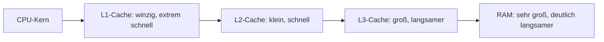
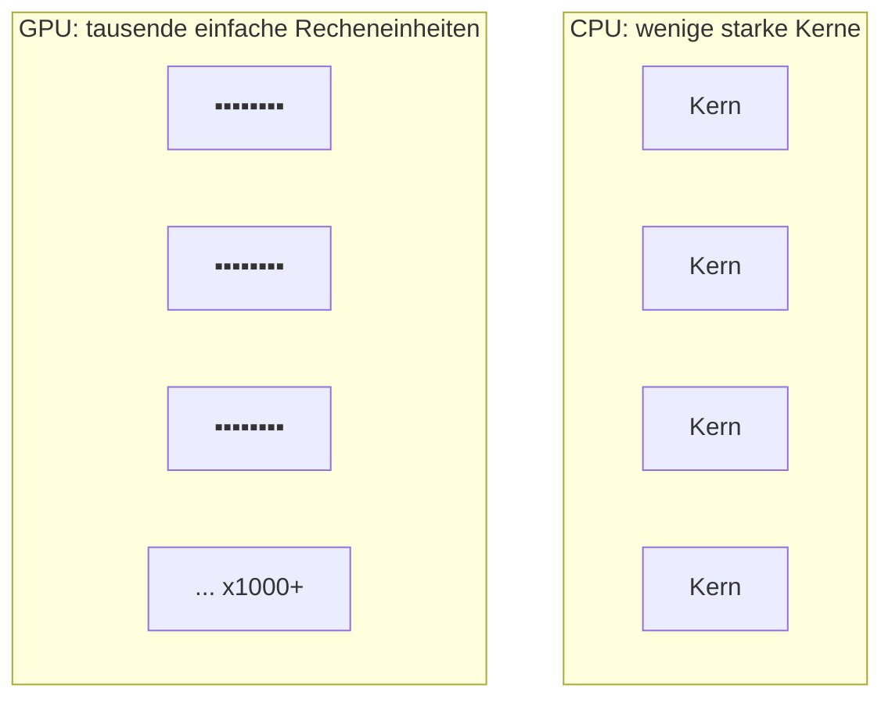

# LF2.2 – Herz & Hirn der Maschine

> **Zielgruppe:** Umschüler FIAE/FISI, 2. Lehrjahr
> **Prüfungsrelevanz:** AP1 (schriftlich) + Fachgespräch
> **Lernzeit:** Kerninhalt: 80–100 Min., mit Vertiefung (Nice-to-know, Marktüberblick): 110–130 Min.
> **Status:** Final
> **Stand:** 2026-08-27 – Marktangaben (Hersteller, Produktserien) veralten erfahrungsgemäß schnell und sollten vor Verwendung im Unterricht kurz gegengeprüft werden.

**Legende:** 🔴 Prüfungsstoff (hohe Relevanz) · 🟡 Kontextwissen (mittlere Relevanz) · 🟢 Nice to know

---

## IHK-Kernfragen

| # | Frage | Abschnitt |
|---|---|---|
| 1 | Warum ist die GHz-Zahl allein kein verlässliches Leistungsmaß mehr? | [1](#1-central-processing-unit-cpu) |
| 2 | Warum kann ein 32-Bit-Adressraum höchstens 2^32 Byte-Adressen darstellen, und warum steht einem 32-Bit-Prozess oft weniger als 4 GiB zur Verfügung? Was unterscheidet CISC von RISC? | [2](#2-die-sprache-der-cpu-isa) |
| 3 | Was ist eine NPU, und was bedeutet die Einheit TOPS? | [3](#3-der-markt-der-rechenkünstler) |
| 4 | Worin unterscheiden sich CPU und GPU architektonisch, und was ist GPGPU? | [4](#4-die-spezialisten-gpu-gpgpu--soc) |
| 5 | Welche Komponenten kann ein SoC integrieren, und wo liegt der Speicher dabei tatsächlich? | [4.2](#42-soc-system-on-chip) |

---

## 1. Central Processing Unit (CPU)

> **Grundprinzip:** Die Taktfrequenz (GHz) ist längst nicht mehr das einzige Maß für CPU-Leistung – moderne Prozessoren sind komplexe "Fabriken" aus Rechenwerk, Speicherhierarchie und Vorhersagelogik.

### 1.1 Innerer Aufbau

| Komponente | Aufgabe |
|---|---|
| ALU (Arithmetic Logic Unit) | Der "Taschenrechner" – führt die eigentlichen Rechen- und Logikoperationen aus |
| Register | Winzige, extrem schnelle Speicherzellen direkt in der CPU für akut benötigte Operanden |
| Steuerwerk (Control Unit) | Entschlüsselt Befehle und steuert den Ablauf (siehe [LF2.1](#), Befehlszyklus) |

### 1.2 Cache-Hierarchie


*Vereinfachtes Modell: Bei einem Cache-Miss wird jeweils die nächste Ebene geprüft – moderne CPUs greifen nicht immer streng linear zu, und L3 wird meist von mehreren Kernen gemeinsam genutzt.*

| Speicherart | Geschwindigkeit | Größenordnung |
|---|---|---|
| L1-Cache | Sehr schnell | Typischerweise einige 10 KB bis über 100 KB pro Kern, meist getrennt in Instruktions- und Daten-Cache |
| L2-Cache | Schnell | Meist einige hundert KB bis wenige MB pro Kern |
| L3-Cache | Mittel | Meist einige bis mehrere Dutzend MB, geteilt über mehrere Kerne; spezielle Designs mit zusätzlichem 3D-Cache können deutlich darüber liegen |
| RAM (Hauptspeicher) | Deutlich langsamer als jeder Cache (Größenordnung: um ein Vielfaches langsamer als L3) | GB-Bereich |

> **IHK-Typfrage:** *Warum ist eine CPU mit großem L3-Cache in manchen Anwendungen (z. B. Spielen) schneller als eine CPU mit höherer Taktfrequenz, aber kleinerem Cache?*
> **Musterantwort:** Ein großer L3-Cache erhöht die Wahrscheinlichkeit, dass benötigte Daten bereits im schnellen Cache liegen (Cache-Treffer), statt aus dem deutlich langsameren RAM geholt werden zu müssen (Cache-Miss). Gerade bei Anwendungen mit häufig wiederverwendeten Datenmengen (z. B. Spiel-Engines) kann ein größerer Cache RAM-Zugriffe so stark reduzieren, dass dieser Effekt eine niedrigere Taktfrequenz mehr als ausgleicht – Taktfrequenz und Cache-Größe wirken also zusammen, nicht isoliert, auf die reale Leistung.

🔴 **Stolperstein:** "Mehr Kerne bedeuten immer mehr Leistung." Das gilt nur, wenn die Software die zusätzlichen Kerne auch tatsächlich parallel nutzen kann – bei stark sequentieller (single-threaded) Software bringt ein achter oder sechzehnter Kern oft keinen spürbaren Vorteil.

🟡 **Kontextwissen – Pipelining und Branch Prediction:** Wie eine Pizzeria, in der eine Bestellung schon belegt wird, während die vorherige noch bäckt, arbeitet eine CPU mehrere Befehle zeitlich überlappend ab (Pipelining, siehe [LF2.1](#)). Bei bedingten Sprüngen (`IF`-Abzweigungen) "rät" die CPU vorab, welcher Zweig als Nächstes gebraucht wird (**Branch Prediction**), um die Pipeline gefüllt zu halten. Liegt die Vorhersage falsch (vergleichbar mit einer verbrannten Pizza, die neu gemacht werden muss), müssen die bereits begonnenen Schritte verworfen werden – das kostet Zeit, ist aber im Schnitt schneller, als immer zu warten.

🟢 **Nice to know:** Bei **SMT/Hyper-Threading** gaukelt ein einzelner physischer Kern dem Betriebssystem zwei logische Kerne vor, indem er bestimmte interne Ressourcen (z. B. ungenutzte Ausführungseinheiten) für zwei Befehlsströme gleichzeitig nutzt – das ist aber kein vollwertiger zweiter Kern und bringt je nach Arbeitslast einen unterschiedlich großen Zusatznutzen. Moderne CPUs unterscheiden zudem oft zwischen **P-Cores** (Performance, ausgelegt auf hohe Einzelthread-Leistung) und **E-Cores** (Efficiency, ausgelegt auf hohe Energieeffizienz und gute Parallelleistung pro Fläche) – das Betriebssystem verteilt Aufgaben dynamisch zwischen beiden Kerntypen, E-Cores sind also nicht auf reine Hintergrundaufgaben beschränkt. Ergänzend gilt: Wegen der Wärmeentwicklung können nicht alle Transistoren einer modernen CPU dauerhaft gleichzeitig mit voller Leistung laufen (**Dark Silicon**) – das erklärt, warum Hersteller nicht einfach beliebig viele Kerne ergänzen: Die Thermal Design Power (TDP), eine primär thermische Auslegungsgröße für die Kühlung, ist hier eine strategische Design-Entscheidung zwischen mehr Kernen mit niedrigerem Takt und weniger Kernen mit höherem Takt.

---

## 2. Die Sprache der CPU (ISA)

> **Grundprinzip:** Eine CPU versteht nur Befehle, die in ihrer ISA (Instruction Set Architecture) definiert sind – x86 und ARM sind die zwei dominierenden, aber grundverschiedenen "Sprachfamilien".

### 2.1 x86 vs. ARM

| Architektur | Haupteinsatz | Konzept |
|---|---|---|
| x86 / x86-64 (AMD64) | PC- und Server-Markt (Intel, AMD) | Traditionell CISC (Complex Instruction Set Computer) – umfangreicherer, mächtigerer Befehlssatz; x86-64 ist die 64-Bit-Erweiterung der ursprünglich 32-Bit-Architektur x86 |
| ARM | Smartphones, Apple M-Serie, Snapdragon | Historisch als RISC-orientierte ISA (Reduced Instruction Set Computer) entwickelt – kleinerer, gleichförmigerer Befehlssatz |

🟡 **Kontextwissen:** RISC-Designs gelten traditionell als energieeffizienter, CISC-Designs traditionell als leistungsfähiger bei komplexen Einzelbefehlen. Diese Grenze ist in modernen CPUs aber verschwommen: x86-Prozessoren zerlegen ihre CISC-Befehle intern häufig in einfachere RISC-ähnliche Mikrooperationen, und moderne ARM-Chips (z. B. Apple M-Serie) erreichen inzwischen auch sehr hohe Rechenleistungen. Aus der Einordnung CISC/RISC allein lässt sich daher kein zuverlässiger Rückschluss auf Energieverbrauch oder Leistung einer konkreten CPU ziehen.

### 2.2 Bitness (Adressraumbreite)

| Breite | Adressierbare Bytes | Praxisbezug |
|---|---|---|
| 32-Bit | 2^32 = 4.294.967.296 Byte ≈ 4 GiB | Reicht für heutige Anforderungen meist nicht mehr aus |
| 64-Bit | 2^64 Byte ≈ 16 Exbibyte (EiB) bzw. ca. 18,4 Exabyte (EB) | Praktisch nicht ausschöpfbare Obergrenze für heutige Systeme |

> **IHK-Typfrage:** *Beweise rechnerisch, warum ein 32-Bit-Prozess maximal ca. 4 GiB virtuellen Adressraum nutzen kann – und warum in der Praxis oft deutlich weniger zur Verfügung steht.*
> **Musterantwort:** Ein 32 Bit breiter Adressraum kann 2^32 = 4.294.967.296 unterschiedliche Adressen darstellen. Bei byteweiser Adressierung entspricht das 4.294.967.296 Byte, umgerechnet in Gibibyte (÷ 2^30 = ÷ 1.073.741.824) ergibt das genau 4 GiB. Ein 32-Bit-Prozess besitzt damit grundsätzlich einen virtuellen Adressraum von höchstens 4 GiB – unter vielen 32-Bit-Windows-Versionen ist dieser standardmäßig in ca. 2 GiB für den Prozess und 2 GiB für das Betriebssystem aufgeteilt, kann sich je nach Konfiguration aber verschieben. Die Technik PAE kann bestimmten 32-Bit-Betriebssystemen (insbesondere geeigneten Serverversionen) helfen, mehr als 4 GiB **physischen** RAM zu verwalten – sie vergrößert aber nicht den virtuellen Adressraum eines einzelnen 32-Bit-Prozesses. Zu unterscheiden sind also: der 32-Bit-Adressraum selbst (2^32 Adressen), der virtuelle Adressraum eines Prozesses (max. 4 GiB, praktisch oft weniger) und der physisch verwaltbare RAM (mit PAE über 4 GiB möglich).

🔴 **Stolperstein:** "Ein 64-Bit-Windows läuft auf jeder CPU." Ein 64-Bit-Betriebssystem benötigt zwingend eine 64-Bit-fähige CPU – umgekehrt läuft ein 32-Bit-Betriebssystem zwar meist auch auf einer 64-Bit-CPU, kann deren Fähigkeiten (z. B. den vollen Adressraum) dann aber nicht ausnutzen.

🟡 **Praxis-Tipp:** x86-/x86-64-kompiliertes "normales" Windows kann auf ARM-Systemen (z. B. Apple-M-Serie-Rechnern) nicht nativ mit seinem x86-Befehlssatz ausgeführt werden, da CPU und Software unterschiedliche Befehlssätze sprechen. Möglich sind stattdessen Windows on ARM (eine für ARM kompilierte Windows-Variante) sowie Emulation bzw. Virtualisierungslösungen – Leistung und Kompatibilität hängen dabei von der konkreten Lösung ab.

🟢 **Nice to know:** Über den Grundbefehlssatz hinaus bieten CPUs **Erweiterungen** für Spezialaufgaben, z. B. AVX/AVX-512 für Vektor-/Gleitkommaberechnungen (relevant u. a. beim Rendering) oder AES-NI für beschleunigte Verschlüsselung. Fehlt eine vom Betriebssystem vorausgesetzte Erweiterung (z. B. bestimmte SSE-Versionen), kann das aktuelle System schlicht nicht installiert werden – ein Klassiker bei sehr alter Hardware.

---

## 3. Der Markt der Rechenkünstler

> **Grundprinzip:** Der Markt verändert sich schnell – wichtiger als sich einzelne Modellnamen zu merken, ist zu verstehen, nach welchen Kriterien Hersteller, Architekturen und Produktkategorien sich unterscheiden.

### 3.1 Marktübersicht (Stand Anfang 2026 – vor Verwendung prüfen)

| Hersteller/Plattform | Typischer Schwerpunkt | Architektur |
|---|---|---|
| Intel | PCs, Notebooks, Server (z. B. Core-Ultra- und Xeon-Reihen) | x86-64 |
| AMD | PCs, Notebooks, Workstations, Server (z. B. Ryzen- und EPYC-Reihen) | x86-64 |
| Qualcomm | ARM-basierte Windows-Notebooks (z. B. Snapdragon-X-Reihe, "Copilot+ PCs") | ARM64 |
| Apple | ARM-basierte Macs/iPads (Apple-Silicon-M-Serie) | ARM64 |

> ⚠️ Produktnamen, Generationsbezeichnungen und TOPS-/Leistungsangaben ändern sich regelmäßig und sollten vor dem Unterrichtseinsatz anhand aktueller Herstellerseiten geprüft werden – hier lernst du die Marktstruktur, nicht auswendig gelernte Modellnamen.

### 3.2 NPU und TOPS

> **Merksatz:** CPU rechnet vielseitig, GPU rechnet parallel, NPU rechnet speziell für KI-nahe Operationen – und meist auch am stromsparendsten dafür.

Die **NPU (Neural Processing Unit)** ist ein spezialisierter Rechenkern, der vor allem neuronale Netze beschleunigt – darunter Matrix- und Vektoroperationen, aber auch weitere Tensor- und Signalverarbeitungsoperationen. Ihre Leistung wird häufig in **TOPS** (Tera Operations Per Second, 10^12 Operationen/Sekunde) angegeben – dabei handelt es sich meist um einen theoretischen Spitzenwert, dessen Aussagekraft stark vom verwendeten Datentyp (z. B. INT8 vs. FP16), der Messmethode und der tatsächlichen Software-Auslastung abhängt. Eine hohe TOPS-Zahl garantiert daher nicht automatisch eine entsprechend höhere Leistung in jeder KI-Anwendung, und TOPS-Angaben verschiedener Hersteller sind nur eingeschränkt direkt vergleichbar.

> **IHK-Typfrage:** *Warum ist die TOPS-Zahl für KI-Anwendungen aussagekräftiger als die Taktfrequenz in GHz – und wo liegen ihre Grenzen?*
> **Musterantwort:** Die Taktfrequenz beschreibt, wie oft pro Sekunde die CPU allgemein "tickt" – sie sagt nichts darüber aus, wie viele der für KI-Berechnungen typischen Matrixoperationen gleichzeitig ausgeführt werden können. TOPS misst gezielter die Anzahl solcher Operationen pro Sekunde und ist damit näher an der tatsächlichen KI-Rechenleistung als eine reine GHz-Zahl – ähnlich wie IPC ein zielgerichteteres Leistungsmaß als die Taktfrequenz allein ist (vgl. LF2.1). TOPS ist aber selbst nur ein theoretischer Spitzenwert unter bestimmten Messbedingungen und kein vollständiger Praxis-Benchmark – die reale KI-Leistung hängt zusätzlich von Speicherbandbreite, Software-Unterstützung und dem verwendeten Datentyp ab.

🟡 **Praxis-Tipp:** "AI PC" ist häufig zunächst ein Marketing-Label. Ob die NPU-Leistung im Alltag tatsächlich etwas bringt, hängt entscheidend davon ab, ob die eingesetzte Software die NPU auch gezielt anspricht – eine hohe TOPS-Zahl allein garantiert keinen Nutzen ohne passende Software-Unterstützung.

### 3.3 Consumer vs. Server/Workstation

| Aspekt | Consumer-CPU (z. B. Ryzen, Core) | Server-CPU (z. B. EPYC, Xeon) |
|---|---|---|
| Kernanzahl | Wenige bis mittel (typisch einstellig bis niedrige zweistellige Zahl) | Sehr hoch (bis weit über 100 möglich) |
| Speicherkanäle | Meist 2 | Deutlich mehr (mehrkanalig) |
| RAM-Typ | Standard-RAM | Oft mit ECC-Unterstützung (Fehlerkorrektur) |
| Einsatzzweck | Einzelplatzsysteme, Gaming, Office | Dauerbetrieb, Virtualisierung, hohe Zuverlässigkeit |

> **IHK-Typfrage:** *Ein Office-Arbeitsplatz soll neu beschafft werden – braucht der Sachbearbeiter wirklich eine leistungsstarke NPU?*
> **Musterantwort:** Für klassische Office-Aufgaben (Textverarbeitung, Tabellenkalkulation, E-Mail) ist der tatsächliche Nutzen einer starken NPU aktuell meist gering, da diese Anwendungen kaum NPU-beschleunigte KI-Funktionen nutzen. Eine Kosten-Nutzen-Abwägung sollte deshalb prüfen, ob konkret geplante Software (z. B. KI-gestützte Diktierfunktionen, lokale Zusammenfassungstools) die NPU tatsächlich nutzt – reine Zukunftssicherheit "auf Vorrat" rechtfertigt einen Aufpreis nur, wenn ein konkreter Bedarf absehbar ist.

---

## 4. Die Spezialisten (GPU, GPGPU & SoC)

### 4.1 CPU vs. GPU



| Aspekt | CPU | GPU |
|---|---|---|
| Recheneinheiten | Wenige, komplexe Kerne (typisch 4–64) | Viele, stärker auf Parallelverarbeitung ausgelegte Recheneinheiten (je nach Hersteller CUDA Cores, Stream Processors, Xe-Cores genannt) |
| Einzelkern-Komplexität | Sehr hoch, vielseitig | Gering, spezialisiert |
| Ideales Aufgabengebiet | Sequentielle, verzweigungsreiche Logik (Betriebssystem, Programmablauf) | Massiv parallele, gleichartige Berechnungen (Pixel, Matrizen) |
| Vergleichbarkeit der Kernzahl | CPU-Kernzahlen untereinander bedingt vergleichbar | GPU-"Kern"-Zahlen verschiedener Hersteller sind architektonisch uneinheitlich definiert und daher kaum direkt vergleichbar – auch nicht mit CPU-Kernen |

🔴 **Stolperstein:** "Eine GPU mit sehr vielen Recheneinheiten ist immer schneller als eine CPU." Falsch – entscheidend sind Aufgabenstruktur, Parallelisierbarkeit, Speicherzugriff und Softwareunterstützung. Wenn die Aufgabe (z. B. viele Excel-Formeln mit Abhängigkeiten zueinander) überwiegend sequentiell ist und sich nicht gut parallelisieren lässt, bleibt die CPU oft klar im Vorteil. Ebenso falsch: "Ich habe eine Grafikkarte, also ist alles schneller" – das gilt nur, wenn die konkrete Software GPGPU tatsächlich unterstützt und nutzt. Auch die Anzahl der "Kerne" selbst ist zwischen CPU und GPU nicht direkt vergleichbar, da z. B. ein CUDA Core architektonisch etwas anderes ist als ein CPU-Kern.

> **GPGPU (General Purpose Computation on GPU):** Die GPU wird nicht für Bildausgabe, sondern für allgemeine massiv-parallele Berechnungen genutzt – etwa KI-Training, Kryptografie/Mining oder Physik-Simulationen. Zugriff erfolgt über Schnittstellen wie **CUDA** (proprietäre Plattform von NVIDIA, im KI-Bereich stark verbreitet), **OpenCL** (offener, herstellerübergreifender Standard) oder **Metal** (Apples Grafik- und Compute-API). Video-Encoding läuft dagegen je nach Software entweder über solche GPGPU-Recheneinheiten oder über dedizierte Hardware-Encoder/-Decoder, die weder normale CPU-Kerne noch klassische GPU-Shader sind.

### 4.2 SoC (System on Chip)

Ein SoC (System on Chip) integriert CPU, GPU, NPU, Speichercontroller und weitere Funktionen auf einem Chip oder in einem gemeinsamen Chip-Package, teils zusätzlich Modem oder Medien-Encoder/-Decoder. Der eigentliche Arbeitsspeicher kann dabei außerhalb des SoC, im selben Package oder – je nach Plattform – sehr eng angebunden integriert sein. Entscheidend für **Unified Memory** ist dabei nicht zwingend der physische Ort, sondern dass CPU, GPU und NPU denselben Systemspeicher verwenden, statt wie klassisch je eigenen RAM (CPU) und VRAM (GPU) zu nutzen.

| Vorteil | Nachteil |
|---|---|
| Extrem kurze interne Wege → geringe Latenz | Nicht nachträglich aufrüstbar |
| Hohe Energieeffizienz | Bei Defekt eines Teils (z. B. Speicher) muss oft der gesamte Chip/das Package getauscht werden |
| Kompakter Bauraum (Smartphones, dünne Laptops) | Reparierbarkeit umstritten |

> **IHK-Typfrage:** *Erkläre das Konzept "Unified Memory" bei SoCs und seinen Vorteil gegenüber getrenntem CPU-RAM und GPU-VRAM.*
> **Musterantwort:** Bei klassischen PC-Aufbauten haben CPU (RAM) und GPU (VRAM) getrennte Speicherbereiche – Daten müssen bei Bedarf explizit zwischen beiden kopiert werden, was Zeit kostet. Bei Unified Memory greifen CPU, GPU und NPU dagegen auf denselben physischen Speicherbereich zu, wodurch ein explizites Kopieren zwischen getrenntem CPU-RAM und GPU-VRAM häufig entfallen kann – das kann Kopieraufwand, Latenz und Energieverbrauch reduzieren, besonders bei Aufgaben, die CPU und GPU abwechselnd bearbeiten (z. B. KI-gestützte Bildbearbeitung). Synchronisation und eine geeignete Datenorganisation sind aber weiterhin nötig; Unified Memory eliminiert also nicht jeden Koordinationsaufwand zwischen den Recheneinheiten.

🟢 **Nice to know – Chiplets:** Statt eines einzelnen großen ("monolithischen") Chips setzen Hersteller wie AMD und Intel zunehmend auf mehrere kleinere, einzeln gefertigte Chip-Bausteine, die erst nachträglich zu einem Gesamtpaket zusammengefügt werden. Das verbessert u. a. die Fertigungsausbeute (kleinere Chips haben statistisch weniger Fertigungsfehler), macht das Gesamtdesign aber komplexer in der internen Anbindung.

---

## Selbsttest

| # | Frage | Kurzantwort |
|---|---|---|
| 1 | Warum reicht die GHz-Zahl allein nicht als Leistungsmaß? | Cache-Größe, Kernanzahl, IPC und Software-Nutzung beeinflussen die reale Leistung mit |
| 2 | Wie viele Byte kann ein 32-Bit-Adressbus maximal adressieren? | 2^32 = 4.294.967.296 Byte ≈ 4 GiB |
| 3 | Ist x86 traditionell eher CISC oder RISC? | CISC |
| 4 | Was misst die Einheit TOPS? | Operationen pro Sekunde (10^12), typisch für NPU-Leistung |
| 5 | Nenne einen Vorteil und einen Nachteil eines SoC. | Vorteil: geringe Latenz/hohe Effizienz; Nachteil: nicht nachrüstbar |
| 6 | Warum ist eine GPU nicht automatisch schneller als eine CPU? | Bei sequentiellen, schlecht parallelisierbaren Aufgaben bleibt die CPU im Vorteil |
| 7 | Was ist der Unterschied zwischen P-Cores und E-Cores? | P-Cores sind auf hohe Einzelthread-Leistung ausgelegt; E-Cores auf hohe Energieeffizienz und gute Parallelleistung – das Betriebssystem verteilt Aufgaben dynamisch auf beide, E-Cores sind nicht auf reine Hintergrundaufgaben beschränkt |
| 8 | Was unterscheidet den virtuellen Adressraum eines Prozesses vom physisch verwaltbaren RAM? | Der virtuelle Adressraum gehört einem Prozess (bei 32 Bit max. 4 GiB); der physische Adressraum beschreibt tatsächlich adressierbare RAM-Bereiche und kann z. B. mit PAE größer sein |

---

## IHK-Cheatsheet

| Begriff | Kurzdefinition |
|---|---|
| ALU | Rechenwerk der CPU für arithmetische/logische Operationen |
| L1/L2/L3-Cache | Schneller Pufferspeicher zwischen CPU und RAM, abnehmende Geschwindigkeit, zunehmende Größe |
| Branch Prediction | CPU "rät" den wahrscheinlichen Sprungpfad, um die Pipeline gefüllt zu halten |
| Dark Silicon | Nicht alle Transistoren können wegen der Wärmeentwicklung gleichzeitig aktiv sein |
| ISA | Instruction Set Architecture – der von der CPU verstandene Befehlssatz |
| CISC / RISC | Traditionell komplexer/umfangreicher (x86) vs. reduziert/gleichförmig (ARM) – Grenzen heute verschwommen |
| PAE | Kann geeigneten 32-Bit-Betriebssystemen helfen, mehr als 4 GiB physischen RAM zu verwalten – ändert aber nicht den virtuellen 32-Bit-Adressraum eines einzelnen Prozesses |
| NPU / TOPS | Spezialkern für KI-Matrixoperationen / Maßeinheit für dessen Rechenleistung |
| GPGPU | Nutzung der GPU für allgemeine parallele Berechnungen statt nur Grafik |
| SoC | System on Chip – viele Systemfunktionen (CPU, GPU, NPU, I/O) auf einem Chip/Package; Unified Memory ist keine Frage des physischen Orts, sondern gemeinsamer Speichernutzung |
| ECC-RAM | Error-Correcting Code Memory – kann einzelne Bit-Fehler erkennen und korrigieren, wichtig für hohe Systemstabilität im Server-Dauerbetrieb |
| Unified Memory | CPU/GPU/NPU nutzen denselben physischen Speicherbereich – reduziert Kopieraufwand, ersetzt aber nicht jede Synchronisation |

---

## Prüfungstaktik

| Aufgabentyp | Typische Formulierung | Beispiel aus AP1 | Was die IHK hören will |
|---|---|---|---|
| Ursache-Wirkung | "Warum ist X trotz niedrigerer GHz-Zahl schneller?" | "Warum ist eine CPU mit 3D-V-Cache in Spielen oft schneller als eine höher getaktete CPU ohne diesen Cache?" | Cache-Treffer/-Miss-Argumentation, nicht nur "mehr Cache ist besser" |
| Rechenaufgabe | "Berechne/beweise rechnerisch, warum X gilt" | "Beweise, warum ein 32-Bit-System maximal ca. 4 GiB RAM adressieren kann." | Vollständiger Rechenweg (2^32, Umrechnung in GiB) |
| Architekturvergleich | "Vergleiche X und Y hinsichtlich Z" | "Vergleiche CPU und GPU hinsichtlich Kernanzahl und idealem Aufgabengebiet." | Klare Gegenüberstellung + Begründung, wann welche Architektur im Vorteil ist |
| Kosten-Nutzen-Bewertung | "Lohnt sich X für Anwendungsfall Y?" | "Lohnt sich eine NPU für einen reinen Office-Arbeitsplatz?" | Konkreten Softwarebedarf prüfen statt pauschal ja/nein zu antworten |

---

## Merk-Sätze fürs Fachgespräch

> GHz allein sagt wenig über Leistung aus – Cache-Größe, Kernanzahl, IPC und Software-Parallelisierbarkeit zählen mindestens genauso.

> CISC und RISC sind historische Design-Philosophien, keine verlässlichen Leistungs- oder Effizienzgarantien mehr – moderne CPUs vermischen beide Ansätze.

> TOPS ist für KI-Workloads ein zielgerichteteres Maß als die Taktfrequenz, aber selbst nur ein theoretischer Spitzenwert – kein vollständiger Praxis-Benchmark.

> CPU und GPU sind kein Konkurrenzverhältnis, sondern eine Arbeitsteilung – wenige starke Kerne für Logik, tausende einfache Kerne für parallele Massenberechnung.

> Ein SoC tauscht Aufrüstbarkeit gegen Geschwindigkeit und Energieeffizienz – ein bewusster Kompromiss, kein Kompromiss aus Versehen.

---

```yaml
lernfeld: LF2.2
titel: Herz & Hirn der Maschine
status: final
stand: 2026-08-27
quellen:
  - "LF2.2 – Herz & Hirn der Maschine"
  - "LF2.2.1 – Central Processing Unit (CPU)"
  - "LF2.2.2 – Die Sprache der CPU (ISA)"
  - "LF2.2.3 – Der Markt der Rechenkünstler"
  - "LF2.2.4 – Die Spezialisten (GPU, GPGPU & SoC)"
```