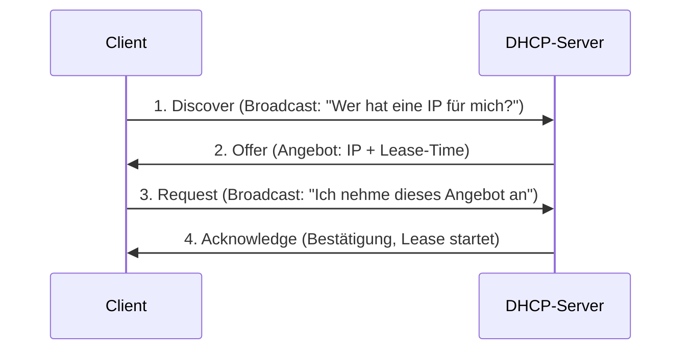
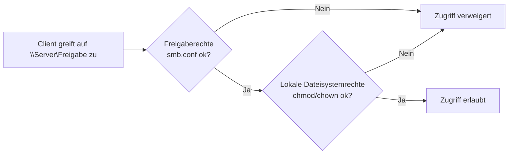

# LF3.1 – Der erste Kontakt (Das Fundament des Netzwerks)

> **Zielgruppe:** Umschüler FIAE/FISI, 2. Lehrjahr
> **Prüfungsrelevanz:** AP1 (schriftlich) + Fachgespräch
> **Lernzeit:** Kerninhalt: 90–110 Min., mit Vertiefung (Subnetting-Rechenbeispiele, DSGVO): 130–150 Min.
> **Status:** Final
> **Stand:** 2026-09-02

**Legende:** 🔴 Prüfungsstoff (hohe Relevanz) · 🟡 Kontextwissen (mittlere Relevanz) · 🟢 Nice to know

---

## IHK-Kernfragen

| # | Frage | Abschnitt |
|---|---|---|
| 1 | Woran erkennst du, dass zwischen zwei Ports grundsätzlich eine physische Verbindung besteht – und was beweist das noch nicht? | [1.2](#12-link-status-und-verbindungstest) |
| 2 | Welche zwei Adressen eines klassischen IPv4-Subnetzes dürfen normalerweise nicht an einen Host vergeben werden, und warum? | [2.2](#22-subnetzmaske-netz-id-und-broadcast) |
| 3 | Was passiert in den vier Phasen des DORA-Prinzips? | [3.1](#31-das-dora-prinzip) |
| 4 | `ping 8.8.8.8` funktioniert, `ping google.de` nicht – welche Ursachen kommen infrage und wie prüfst du sie? | [3.3](#33-dns-namensauflösung-und-troubleshooting) |
| 5 | Wie wirken Freigabeberechtigungen und lokale Dateisystemrechte bei einer SMB-Freigabe zusammen? | [4.2](#42-die-doppel-schlüssel-regel-freigabe--dateisystemrechte) |

---

## 1. Physische Grundlage & Verbindungstest

> **Grundprinzip:** Bevor Daten sinnvoll übertragen werden können, muss zunächst die physische Verbindung stehen. Danach werden Layer 2, IP-Konfiguration und ggf. Routing geprüft: Geräte im selben Subnetz kommunizieren direkt, Geräte in unterschiedlichen Netzen benötigen ein Gateway. Fehlersuche im Netzwerk beginnt deshalb unten (Layer 1/2) und arbeitet sich erst danach nach oben.

### 1.1 Netzplan-Symbole & Komponenten

| Aspekt | Beschreibung | IHK-Relevanz |
|---|---|---|
| Standard-Symbole | Etablierte Symbolstandards für Netzpläne (z. B. Cisco-Symbolik): Switch = Quadrat mit Pfeilen, Router = Kreis mit Pfeilen/Kreuz. Es gibt keine einzige weltweit verbindliche Norm, aber die Cisco-Symbolik ist in der Praxis am weitesten verbreitet | 🟡 |
| Switch | Verbindet mehrere Endgeräte in einem LAN auf Layer 2 und lernt automatisch, welche MAC-Adresse an welchem Port hängt (MAC-Address-Table) | 🔴 |
| MAC-Adresse | Hardware-/Schnittstellenadresse für die Kommunikation auf Layer 2 (z. B. `00:1A:2B:3C:4D:5E`). Hersteller vergeben meist global eindeutige Präfixe, die Adresse kann jedoch softwareseitig geändert oder (v. a. bei WLAN) zufällig erzeugt werden | 🔴 |

🟡 **Praxis-Tipp:** Netzpläne mit Standard-Symbolen zu zeichnen ist keine Fleißaufgabe – im Fachgespräch und beim Troubleshooting ist eine korrekt gelesene Skizze oft schneller als jedes Kommandozeilen-Tool.

### 1.2 Link-Status und Verbindungstest

| Aspekt | Beschreibung | IHK-Relevanz |
|---|---|---|
| Link-Status (LED) | Zeigt Hardware-seitig an, ob eine physische Verbindung besteht (meist grün leuchtend/blinkend am Port) | 🔴 |
| `ping` | Sendet ICMP-Echo-Requests an eine IP-Adresse, um Erreichbarkeit auf Layer 3 zu prüfen | 🔴 |

> **IHK-Typfrage:** *Der Link zwischen zwei Rechnern leuchtet grün, die IP-Adressen sind korrekt konfiguriert, aber `ping` schlägt mit "Zeitüberschreitung der Anforderung" fehl. Wie gehst du vor?*
> **Musterantwort:** Eine aktive Link-LED zeigt an, dass die Netzwerkschnittstelle eine Verbindung erkannt und die physikalische Verbindung ausgehandelt hat – sie belegt damit Layer 1, sagt aber noch nichts darüber aus, ob VLAN, Layer 2/3 oder Firewall-Regeln tatsächlich funktionieren. Systematische Prüfreihenfolge: zunächst IP-Adresse und Subnetzmaske beider Geräte vergleichen, dann Gateway/Routing prüfen, erst danach die Firewall. Eine häufige Ursache ist eine Firewall, die eingehende ICMP-Echo-Anfragen (Typ 8) blockiert – ping nutzt Echo-Request (Typ 8) und Echo-Reply (Typ 0); eine Firewall kann gezielt nur diese Typen sperren, während andere ICMP-Typen wie "Destination Unreachable" weiterhin erlaubt bleiben. Prüfschritte: Firewall-Regel für ICMPv4-Echo-Anfrage aktivieren und erneut pingen.

🔴 **Stolperstein – Die Firewall-Falle:** Ein grüner Link und korrekte IPs beweisen nur eine physische Verbindung, nicht die Erreichbarkeit auf Protokollebene. Eine häufige, aber nicht die einzige Ursache für einen fehlgeschlagenen Ping trotz korrekter Hardware ist eine lokale Firewall, die ICMP blockiert – ein fehlgeschlagener Ping ist zudem kein Beweis, dass gar keine Kommunikation möglich ist: ICMP kann gezielt blockiert sein, während z. B. SMB oder HTTP trotzdem funktionieren.

🔴 **Stolperstein – Ungleiche Subnetzmasken:** Hat PC A die IP `192.168.1.10/24` und PC B die IP `192.168.2.10/8`, beurteilen beide Geräte dieselbe Verbindung unterschiedlich: PC A hält PC B für ein fremdes Netz und nutzt sein Gateway, PC B betrachtet PC A wegen `/8` dagegen als direkt erreichbar. Dadurch kann die Kommunikation je nach Gateway- und Routing-Konfiguration teilweise oder vollständig scheitern, oder Anfrage und Antwort nehmen unterschiedliche Wege. Wichtig zur Abgrenzung: Haben zwei Geräte dieselbe IP-Adresse, ist das kein Subnetzmasken-, sondern ein IP-Adresskonflikt.

🟡 **Praxis-Tipp:** Unter Ubuntu wird eine per Netplan (`.yaml`) gespeicherte Konfiguration erst mit `sudo netplan apply` aktiv. Netplan reagiert empfindlich auf Syntax: falsche Einrückung, Tabs statt Leerzeichen oder fehlende Doppelpunkte führen dazu, dass die Konfiguration nicht akzeptiert wird. Für Änderungen per SSH ist `sudo netplan try` oft sicherer als ein direktes `apply`, da bei fehlender Bestätigung automatisch zurückgerollt wird.

---

## 2. IP-Adressierung und Subnetting

> **Grundprinzip:** Eine Subnetzmaske trennt jede IP-Adresse in einen Netzwerk-Teil ("Straße") und einen Host-Teil ("Hausnummer"). Geräte, die anhand IP-Adresse und Subnetzmaske dasselbe Subnetz erkennen, versuchen eine direkte Layer-2-Kommunikation über ARP – Geräte in unterschiedlichen Netzen benötigen dagegen ein Gateway (Router). Ob die direkte Kommunikation im selben Subnetz tatsächlich klappt, hängt zusätzlich von Faktoren wie VLANs, Switch-Konfiguration oder lokalen Firewalls ab; "gleiches Subnetz" ist also die Grundregel, keine absolute Garantie.

### 2.1 Öffentliche vs. private IP-Adressen

| Aspekt | Beschreibung | IHK-Relevanz |
|---|---|---|
| Öffentliche IP | Weltweit einmalig und grundsätzlich global routbar, sofern Routing, Firewall und der jeweilige Dienst das zulassen (z. B. `8.8.8.8`) | 🔴 |
| Private IP | Wird in privaten Netzen verwendet und normalerweise nicht im öffentlichen Internet geroutet; mehrere getrennte Netze dürfen dieselben privaten Adressen nutzen. Am Router meist per NAT ins Internet übersetzt | 🔴 |
| Private Adressräume (RFC 1918) | `10.0.0.0/8`, `172.16.0.0/12`, `192.168.0.0/16` | 🔴 |

> **IHK-Typfrage:** *Ordne die Adressen `10.5.0.1`, `8.8.4.4`, `192.168.178.20` und `172.16.0.5` in "privat" oder "öffentlich" ein.*
> **Musterantwort:** `10.5.0.1` → privat (liegt im Bereich `10.0.0.0/8`). `8.8.4.4` → öffentlich (kein reservierter privater Bereich). `192.168.178.20` → privat (Bereich `192.168.0.0/16`, typische Heimrouter-Voreinstellung). `172.16.0.5` → privat (liegt im Bereich `172.16.0.0/12`, der `172.16.0.0` bis `172.31.255.255` umfasst).

### 2.2 Subnetzmaske, Netz-ID und Broadcast

| Aspekt | Beschreibung | IHK-Relevanz |
|---|---|---|
| Subnetzmaske | Trennt IP in Netzwerk- und Host-Teil, z. B. `255.255.255.0` bzw. `/24` | 🔴 |
| Netz-ID | Erste Adresse eines Subnetzes – Name des Netzes, nicht an Hosts vergebbar | 🔴 |
| Broadcast | Letzte Adresse eines Subnetzes – Rundruf an alle Hosts, nicht an Hosts vergebbar | 🔴 |

🟡 **Bitweise Erklärung:** Eine Subnetzmaske ist eine 32-Bit-Zahl. `/24` bedeutet, dass die ersten 24 Bit auf `1` gesetzt sind: `11111111.11111111.11111111.00000000` → dezimal `255.255.255.0`. Die verbleibenden Nullen (hier 8 Bit) bestimmen die Anzahl der Host-Adressen: `2⁸ = 256`, davon 2 reserviert (Netz-ID, Broadcast) → 254 nutzbare Adressen.

> **IHK-Typfrage:** *Für das Netz `192.168.10.0/24` sollen Netz-ID, Broadcast-Adresse und ein gültiger Host-Bereich bestimmt werden.*
> **Musterantwort:** Bei `/24` (Maske `255.255.255.0`) sind die letzten 8 Bit Host-Anteil, das ergibt 256 Adressen (`.0`–`.255`). Netz-ID: `192.168.10.0` (erste Adresse). Broadcast: `192.168.10.255` (letzte Adresse). Gültiger Host-Bereich: `192.168.10.1` bis `192.168.10.254` (254 nutzbare Adressen). Das Standard-Gateway wird üblicherweise als erste oder letzte Host-Adresse vergeben, z. B. `192.168.10.1`.

🔴 **Stolperstein:** Wird einem Host versehentlich die Netz-ID (z. B. `192.168.1.0/24`) oder der Broadcast (`192.168.1.255/24`) zugewiesen, ist das im normalen IPv4-Subnetz-Design unzulässig – Betriebssysteme oder Netzwerkgeräte können solche Konfigurationen ablehnen oder unterschiedlich behandeln, als reguläre Hostadresse funktioniert die Adresse aber nicht. Das gilt für klassische Subnetze; Sonderfälle wie `/31` (Punkt-zu-Punkt-Verbindungen), `/32` (Hostroute) und IPv6 (kein Broadcast, stattdessen Multicast) folgen eigenen Regeln.

🟡 **Praxis-Tipp – Subnetting in vier Teile:** Wird `192.168.50.0` mit `255.255.255.192` (`/26`, Blockgröße 64) in vier gleich große Teilnetze zerlegt, ergeben sich: Teilnetz 1 `192.168.50.0`–`.63` (Netz-ID `.0`, Broadcast `.63`), Teilnetz 2 `.64`–`.127` (Netz-ID `.64`, Broadcast `.127`), Teilnetz 3 `.128`–`.191` (Netz-ID `.128`, Broadcast `.191`), Teilnetz 4 `.192`–`.255` (Netz-ID `.192`, Broadcast `.255`). Merkregel: Bei `/26` beginnt jedes neue Teilnetz an einem Vielfachen von 64.

> **IHK-Typfrage:** *Bestimme für die Hostadresse `192.168.50.137/26` das zugehörige Teilnetz, die Netz-ID, die Broadcast-Adresse und den gültigen Host-Bereich.*
> **Musterantwort:** Bei `/26` beträgt die Blockgröße 64, die Teilnetze beginnen also bei `.0`, `.64`, `.128` und `.192`. Die Adresse `.137` liegt zwischen `.128` und `.191`, gehört also zum dritten Teilnetz. Netz-ID: `192.168.50.128`. Broadcast: `192.168.50.191`. Gültiger Host-Bereich: `192.168.50.129` bis `192.168.50.190`. Diese Aufgabe prüft (anders als beim direkten Rechnen mit einer bereits bekannten Netz-ID), ob das richtige Teilnetz zu einer beliebigen Hostadresse überhaupt erkannt wird.

### 2.3 IPv4 vs. IPv6 & SLAAC

| Aspekt | Beschreibung | IHK-Relevanz |
|---|---|---|
| IPv4 | 32 Bit lang, dezimale Schreibweise (z. B. `192.168.1.1`) | 🔴 |
| IPv6 | 128 Bit lang, hexadezimale Schreibweise, eingeführt wegen IPv4-Adressknappheit | 🔴 |
| Aufbau IPv6 | Typischerweise 64-Bit-Netzpräfix (vom Router) + 64-Bit-Interface-ID (Gerätekennung) in vielen LANs; die tatsächliche Präfixlänge kann abweichen | 🟡 |
| SLAAC | Stateless Address Autoconfiguration – das Gerät erhält per Router Advertisement ein IPv6-Präfix und bildet daraus selbstständig eine Adresse. Ein DHCPv6-Server ist dafür nicht zwingend nötig, kann aber zusätzlich für weitere Parameter genutzt werden | 🟡 |

🟢 **Nice to know – Privacy Extensions:** Beim klassischen EUI-64-Verfahren wird die Interface-ID aus der MAC-Adresse abgeleitet, wodurch das Gerät wiedererkennbar wäre. Moderne Betriebssysteme verwenden heute aber meist zufällige oder temporäre Interface-IDs (Privacy Extensions), sodass die direkte MAC-Ableitung nicht mehr der Regelfall ist.

---

## 3. Automatisierung mit DHCP und DNS

> **Grundprinzip:** In Unternehmensnetzwerken wird keine IP-Adresse manuell an hunderte Clients vergeben – das übernehmen automatisierte Hintergrunddienste (DHCP für Adressen, DNS für Namen), damit Administration skaliert und fehlerarm bleibt.

### 3.1 Das DORA-Prinzip

| Aspekt | Beschreibung | IHK-Relevanz |
|---|---|---|
| DHCP | Vergibt Endgeräten automatisch IP-Adresse, Subnetzmaske, Gateway und DNS-Server | 🔴 |
| Lease-Time | Zeitspanne, für die eine per DHCP bezogene IP-Adresse gültig ist, bevor sie verlängert werden muss | 🔴 |
| DORA | Die vier Phasen der DHCP-Aushandlung: Discover, Offer, Request, Acknowledge | 🔴 |



> **IHK-Typfrage:** *Erkläre die vier Phasen des DORA-Prinzips in eigenen Worten.*
> **Musterantwort:** Discover: Der Client sendet beim Start einen Broadcast ins Netz, da er noch keine eigene IP besitzt, und sucht nach einem DHCP-Server. Offer: Ein oder mehrere DHCP-Server antworten mit einem Angebot (freie IP, Lease-Time, weitere Parameter). Request: Der Client bestätigt per Broadcast, welches Angebot er annimmt – das informiert gleichzeitig alle anderen anbietenden Server, dass ihr Angebot nicht gewählt wurde. Acknowledge: Der gewählte Server bestätigt final, die Lease-Time beginnt zu laufen.

🟡 **Praxis-Tipp – Broadcast gilt nicht immer:** Discover und Request laufen beim initialen DHCP-Ablauf typischerweise als Broadcast. Liegt der DHCP-Server in einem anderen Subnetz, werden die Anfragen meist über einen DHCP-Relay-Agent weitergeleitet. Bei einer späteren Lease-Verlängerung (Renewal) nutzt der Client oft Unicast direkt zum bereits bekannten Server, sofern die Lease noch gültig ist – DHCP läuft also nicht grundsätzlich immer über Broadcast.

🔴 **Stolperstein – Rogue DHCP:** Verteilen durch Fehlkonfiguration (z. B. ein privater Router in der Netzwerkdose) zwei Server im selben Netz IP-Adressen, erhält der Client mehrere Angebote und wählt eines nach den Auswahlregeln seiner DHCP-Implementierung – welches Angebot gewinnt, hängt vom Client/Betriebssystem ab und sollte nicht pauschal mit "das erste gewinnt" erklärt werden. Entscheidend ist: Ein Rogue-DHCP-Server kann so falsche Gateway-/DNS-/Netzmasken-Angaben verteilen; Clients verlieren dann teils die Internetverbindung, obwohl das LAN intakt bleibt.

🟡 **Praxis-Tipp:** Windows hält alte DHCP-Daten oft hartnäckig im Cache. Nach Änderungen an der DHCP-Konfiguration hilft `ipconfig /release` gefolgt von `ipconfig /renew`, um eine frische Lease zu erzwingen.

### 3.2 Namensauflösung: DNS

| Aspekt | Beschreibung | IHK-Relevanz |
|---|---|---|
| DNS | Übersetzt für Menschen lesbare Namen (`google.de`) in Maschinen-IP-Adressen | 🔴 |
| A-Record | Ordnet einem Namen eine IPv4-Adresse zu | 🔴 |
| AAAA-Record | Ordnet einem Namen eine IPv6-Adresse zu | 🔴 |
| Hosts-Datei | Lokale Textdatei zur Namensauflösung (`/etc/hosts` bzw. `C:\Windows\System32\drivers\etc\hosts`). In typischen Standardkonfigurationen wird sie vor einer DNS-Abfrage berücksichtigt; die genaue Reihenfolge hängt vom Betriebssystem ab | 🟡 |

### 3.3 DNS-Namensauflösung und Troubleshooting

> **IHK-Typfrage:** *`ping 8.8.8.8` funktioniert einwandfrei, `ping google.de` schlägt jedoch fehl. Welche Ursachen kommen infrage?*
> **Musterantwort:** Da der Client `8.8.8.8` erreicht, ist zumindest ein Teil der IPv4-Konnektivität über den vorhandenen Pfad funktionsfähig. Schlägt der Ping zum Namen fehl, ist ein DNS- bzw. Namensauflösungsproblem am wahrscheinlichsten – zuerst mit `nslookup google.de` prüfen, ob überhaupt eine IP geliefert wird. Wird der Name aufgelöst, kommen ergänzend auch eine bevorzugte IPv6-Auflösung, ein falscher Eintrag in der lokalen Hosts-Datei oder eine gezielte ICMP-Blockierung am Ziel als Ursache infrage.

🟡 **Praxis-Tipp:** Mit `nslookup <Name>` lässt sich gezielt prüfen, welche IP für einen Namen aufgelöst wird und welcher DNS-Server geantwortet hat – ein zentrales Werkzeug für DNS-Troubleshooting.

| Befehl | Zweck | IHK-Relevanz |
|---|---|---|
| `nslookup google.de` | Zeigt die aufgelöste IP und den antwortenden DNS-Server | 🔴 |
| `dig google.de` | Ausführlichere DNS-Abfrage mit allen Record-Typen (v. a. Linux) | 🟡 |
| `ipconfig /displaydns` (Win) | Zeigt den lokalen DNS-Cache unter Windows | 🟢 |
| `resolvectl status` / `resolvectl query google.de` (Linux, systemd-resolved) | Zeigt DNS-Server/Resolver-Konfiguration bzw. führt eine Auflösung über den konfigurierten Resolver durch – `resolvectl statistics` zeigt dagegen nur Zähler, keine Cache-Einträge | 🟢 |

---

## 4. Dateifreigaben (SMB) und Netzwerksicherheit

> **Grundprinzip:** Bei einer Netzwerkfreigabe greifen zwei Sicherheitsebenen ineinander: die Freigabeberechtigung ("Tür des Hauses") und die lokalen Dateisystemrechte ("Tresor im Zimmer"). Für die Grundprüfung gilt vereinfacht: Zugriff bekommt nur, wer durch beide Ebenen gleichzeitig passt – die jeweils restriktivere Ebene begrenzt das Ergebnis, eine Freigabe kann lokale Linux-Rechte nicht erweitern. In komplexeren Samba-Konfigurationen können zusätzlich POSIX-/Samba-ACLs, Gastzugriff oder Optionen wie `force user` eine Rolle spielen.

### 4.1 SMB-Grundlagen

| Aspekt | Beschreibung | IHK-Relevanz |
|---|---|---|
| SMB | Standard-Netzwerkprotokoll für plattformübergreifende Dateifreigaben (Windows ↔ Linux), kommuniziert heute hauptsächlich über TCP/445; ältere Versionen nutzten zusätzlich NetBIOS über TCP/139 (Session Service) sowie UDP/137 (Name Service) und UDP/138 (Datagram Service) | 🔴 |
| Samba | Linux-Softwarepaket, das SMB-Freigaben bereitstellt | 🔴 |
| `smb.conf` | Zentrale Konfigurationsdatei des Samba-Dienstes | 🔴 |
| `smbpasswd` | Bei klassischer Samba-Benutzerauthentifizierung ist ein Linux-Systembenutzer nicht automatisch als Samba-Benutzer aktiviert – er muss zusätzlich mit `smbpasswd -a <Name>` eingerichtet werden | 🔴 |

### 4.2 Die Doppel-Schlüssel-Regel: Freigabe- & Dateisystemrechte



| Aspekt | Beschreibung | IHK-Relevanz |
|---|---|---|
| `chmod` | Ändert lokale Linux-Zugriffsrechte (lesen/schreiben/ausführen) – wirkt unabhängig von der Freigabe | 🔴 |
| `chown` | Ändert Eigentümer und Gruppenzugehörigkeit einer Datei/eines Verzeichnisses | 🔴 |
| Kombinationsregel | Freigaberechte und lokale Dateisystemrechte müssen beide zusammenpassen – die jeweils restriktivere Ebene begrenzt den effektiven Zugriff | 🔴 |

> **IHK-Typfrage:** *Windows meldet "Zugriff verweigert", obwohl die `smb.conf` vollen Zugriff erlaubt. Woran kann das liegen?*
> **Musterantwort:** Der effektive Zugriff ergibt sich aus dem Zusammenspiel von Freigabeberechtigung (SMB) und lokalem Dateisystemrecht – die restriktivere Ebene begrenzt das Ergebnis, die Rechte summieren sich nicht einfach auf. Erlaubt `smb.conf` zwar den Zugriff, gehört das freigegebene Verzeichnis (z. B. `/srv/austausch`) auf Linux-Ebene aber `root` und ist per `chmod` für "Andere" gesperrt, blockiert die lokale Dateisystemebene den Zugriff trotzdem. Lösung: Besitzer bzw. Rechte des Verzeichnisses mit `chown`/`chmod` passend zum gewünschten Samba-Benutzer setzen.

🟡 **Praxis-Tipp:** Ein unter Ubuntu per `adduser` angelegter Systembenutzer existiert für Samba noch nicht automatisch – er muss zusätzlich per `sudo smbpasswd -a <Name>` in die eigene Samba-Benutzerdatenbank eingetragen werden. Das gilt für klassische Samba-Konfigurationen mit eigener Passwortdatenbank; bei Anbindung an eine Windows-Domäne bzw. ein Active Directory läuft die Authentifizierung stattdessen darüber, `smbpasswd` entfällt dann.

### 4.3 DSGVO & Compliance bei Dateifreigaben

| Aspekt | Beschreibung | IHK-Relevanz |
|---|---|---|
| Offene Freigabe ("Jeder darf alles") | Technisches Risiko (Ransomware-Verbreitung) und rechtliches Risiko zugleich | 🔴 |
| DSGVO-Bezug | Werden personenbezogene Daten (z. B. Personalakten, Patientendaten) durch eine fehlerhafte Berechtigung Unbefugten zugänglich, kann dies eine Datenschutzverletzung darstellen und ist nach internen Datenschutz-/Meldeprozessen zu bewerten | 🔴 |
| Weitere Risiken | Offene Freigaben können zusätzlich gegen interne Sicherheitsrichtlinien, Lizenzbedingungen oder urheberrechtliche Vorgaben verstoßen | 🟡 |

🔴 **Stolperstein:** "Technisch funktioniert die Freigabe" ist in der Praxis nicht gleichbedeutend mit "die Freigabe ist zulässig konfiguriert" – die Berechtigungsvergabe muss immer auch unter Datenschutz-Gesichtspunkten (Wer darf was sehen? Need-to-know-Prinzip) bewertet werden, nicht nur funktional. Die konkrete rechtliche Bewertung eines Einzelfalls hängt dabei von Art der Daten, Zweck der Verarbeitung und getroffenen Schutzmaßnahmen ab – im Ernstfall ist unverzüglich die zuständige Datenschutz- bzw. IT-Sicherheitsstelle im Unternehmen einzubeziehen.

---

## Selbsttest

| # | Frage | Kurzantwort |
|---|---|---|
| 1 | Woran erkennst du zwischen zwei Ports grundsätzlich eine physische Verbindung – und was beweist das noch nicht? | An der aktiven Link-LED; sie bestätigt nur Layer 1, nicht VLAN-, IP-, Routing- oder Firewall-Konfiguration |
| 2 | Welche drei privaten Adressbereiche definiert RFC 1918? | `10.0.0.0/8`, `172.16.0.0/12`, `192.168.0.0/16` |
| 3 | Wie lautet die Broadcast-Adresse von `192.168.10.0/24`? | `192.168.10.255` |
| 4 | Was bedeutet das "R" im DORA-Prinzip? | Request – der Client bestätigt per Broadcast das gewählte DHCP-Angebot |
| 5 | Was übersetzt ein A-Record? | Einen Namen in eine IPv4-Adresse |
| 6 | `ping <IP>` klappt, `ping <Name>` klappt nicht – was ist die wahrscheinlichste Ursache? | Ein Problem mit dem DNS-Server bzw. der Namensauflösung |
| 7 | Was ist ein Rogue DHCP Server? | Ein unautorisierter zweiter DHCP-Server im Netz, der mit dem echten um Clients konkurriert |
| 8 | Welche Linux-Befehle regeln lokale Dateisystemrechte? | `chmod` und `chown` |
| 9 | Warum reicht ein Linux-Systembenutzer für Samba-Zugriff nicht aus? | Bei klassischer Samba-Authentifizierung muss er zusätzlich per `smbpasswd -a` als Samba-Benutzer eingerichtet werden |

---

## IHK-Cheatsheet

| Begriff | Kurzdefinition |
|---|---|
| Link-Status | LED-Anzeige für eine bestehende physische Verbindung am Port |
| Netz-ID / Broadcast | Erste/letzte Adresse eines Subnetzes – beide nicht an Hosts vergebbar |
| CIDR (`/24` etc.) | Kompakte Schreibweise der Subnetzmaske über die Anzahl gesetzter Bits |
| RFC 1918 | Definiert die drei privaten IPv4-Adressbereiche |
| SLAAC | IPv6-Adresskonfiguration über Router Advertisements, Gerät bildet die Adresse selbstständig; DHCPv6 ist dafür nicht zwingend nötig |
| DORA | Discover – Offer – Request – Acknowledge (DHCP-Ablauf) |
| Lease-Time | Gültigkeitsdauer einer per DHCP vergebenen IP-Adresse |
| Rogue DHCP | Unautorisierter, konkurrierender DHCP-Server im selben Netz |
| A- / AAAA-Record | DNS-Eintrag für IPv4- bzw. IPv6-Adresse eines Namens |
| Doppel-Schlüssel-Regel (SMB) | Freigabe- und lokale Dateisystemrechte müssen beide passen – die restriktivere Ebene begrenzt den Zugriff |

---

## Prüfungstaktik

| Aufgabentyp | Typische Formulierung | Beispiel aus AP1 | Was die IHK hören will |
|---|---|---|---|
| Netz berechnen | "Bestimme Netz-ID, Broadcast und Host-Bereich für X/Y" | "Berechne für `192.168.20.0/26` alle vier Teilnetze." | Nachvollziehbarer Rechenweg über die Blockgröße, nicht nur das Endergebnis |
| Fehlerursache eingrenzen | "Ping zu IP klappt, Ping zu Name nicht – warum?" | "Ein Client erreicht `8.8.8.8`, aber nicht `www.ihk.de`." | Sofortige Eingrenzung auf DNS statt allgemeines "Netzwerkproblem" |
| Ablauf erklären | "Beschreibe die Phasen von X" | "Erkläre das DORA-Prinzip bei der IP-Vergabe." | Alle vier Phasen einzeln, mit Broadcast-Charakter von Discover/Request |
| Rechte-Konflikt auflösen | "Zugriff wird trotz korrekter Freigabe verweigert – warum?" | "Die smb.conf erlaubt alles, Windows zeigt dennoch 'Zugriff verweigert'." | Beide Rechte-Ebenen (Freigabe + lokales Dateisystem) nennen und erklären, dass die restriktivere Ebene den effektiven Zugriff begrenzt |

---

## Merk-Sätze fürs Fachgespräch

> Eine Link-LED beweist nur eine physische Verbindung auf Layer 1 – nicht, dass VLAN, IP-Konfiguration oder Firewall-Regeln stimmen. Fehlersuche geht immer von unten (Layer 1) nach oben.

> In einem klassischen IPv4-Subnetz kennzeichnen Netz-ID und Broadcast-Adresse das Subnetz selbst und werden deshalb normalerweise nicht an Hosts vergeben.

> DORA ist im Kern ein Verhandlungsprotokoll per Broadcast: Der Client hat anfangs keine eigene Adresse und muss sich deshalb zunächst an "alle" wenden.

> Funktioniert der Ping zur IP, aber nicht zum Namen, ist die IPv4-Konnektivität grundsätzlich da – gesucht wird der Fehler zuerst bei der Namensauflösung (DNS), erst danach bei IPv6 oder gezielten ICMP-Blockaden.

> Bei Netzwerkfreigaben entscheidet nie eine Ebene allein: Freigaberecht und lokales Dateisystemrecht wirken zusammen, für die Grundprüfung gilt die restriktivere Ebene als begrenzend – in komplexeren Samba-Setups können zusätzlich ACLs eine Rolle spielen.

---

```yaml
lernfeld: LF3.1
titel: Der erste Kontakt (Das Fundament des Netzwerks)
status: final
stand: 2026-09-02
review: fachliche Praezisierungen in drei Runden eingearbeitet (Link-LED, Firewall-Ursache/ICMP-Typen, MAC, IPv4/IPv6, Netz-ID/Broadcast-Sonderfaelle, DORA/Rogue-DHCP/Unicast-Renewal, DNS-Cache-Befehle, SMB-Rechte als vereinfachtes Modell/NetBIOS-Ports/AD-Hinweis, DSGVO-Einzelfallhinweis, zweites Subnetting-Beispiel mit Hostadresse)
quellen:
  - LF3.1- Der erste Kontakt
  - LF3.1.1- Link Up
  - LF3.1.2- IP-Adressierung & Subnetze
  - LF3.1.3- Automatisierung mit DHCP und DNS
  - LF3.1.4- Dateifreigaben (SMB) und Netzwerksicherheit
```