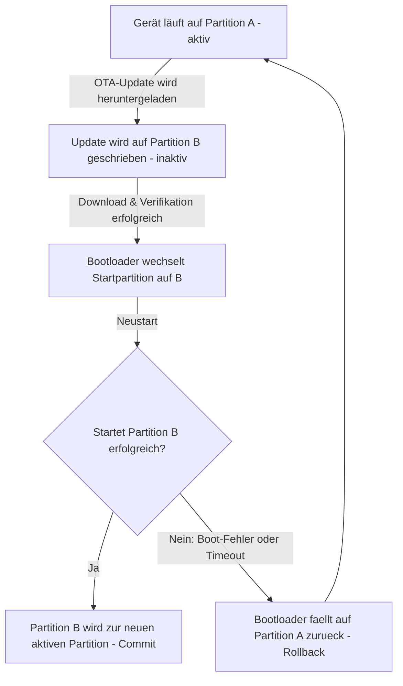
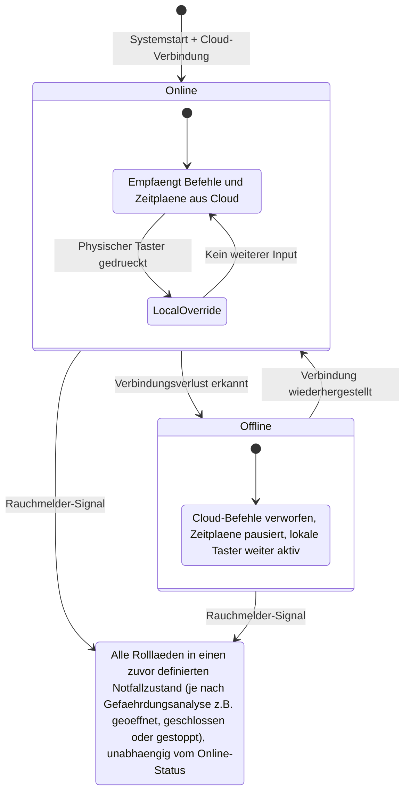
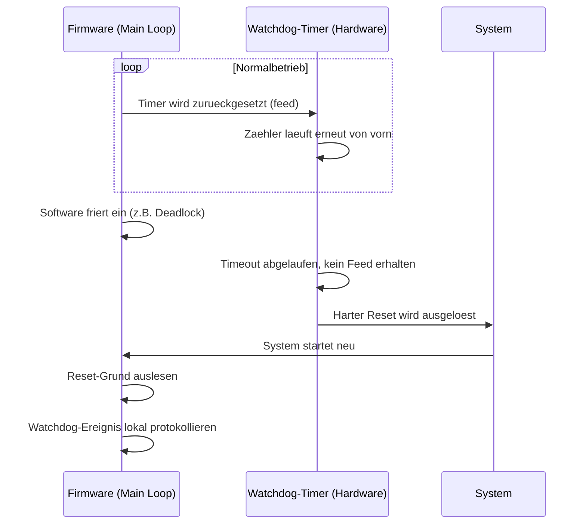

# Infomaterial (Typ C): Robustheit, Wartung & Wirtschaftlichkeit im IoT-Flottenbetrieb

> **Hinweis:** Dies ist reines Infomaterial ohne direkten IHK-Prüfungsbezug – ein Abstecher zu praxisrelevanten Betriebs- und Wirtschaftlichkeitsfragen rund um LF7 (IoT), die für die Umsetzung eines echten IoT-Projekts nützlich sind, aber nicht als AP1/AP2-Prüfungsstoff eingestuft werden. Kein Selbsttest, kein Cheatsheet, keine Prüfungsfallen – nur Orientierung.
>
> **Bezug:** Ergänzt LF7.3 (Betriebssicherheit & OTA-Updates), das die technischen Grundlagen (Watchdog, A/B-Partitioning, Fail-Safe) bereits prüfungsrelevant abdeckt. Dieses Dokument vertieft dieselben Themen aus einer betrieblich-wirtschaftlichen statt einer prüfungsbezogenen Perspektive.
>
> **Stand:** 2026-09-14

---

## Inhaltsverzeichnis

1. [Gesetzlicher Rahmen: EU Cyber Resilience Act](#1-gesetzlicher-rahmen-eu-cyber-resilience-act)
2. [OTA vs. Non-OTA: Der wirtschaftliche Direktvergleich](#2-ota-vs-non-ota-der-wirtschaftliche-direktvergleich)
3. [OTA-Architektur: A/B-Partitionsschema](#3-ota-architektur-ab-partitionsschema)
4. [Ausfallsicherheit: Lokale Fail-Safe-Logik](#4-ausfallsicherheit-lokale-fail-safe-logik)
5. [Der Hardware-Watchdog: Segen und Fehlertarnung](#5-der-hardware-watchdog-segen-und-fehlertarnung)
6. [Entscheidungshilfe: OTA-Strategie wählen](#6-entscheidungshilfe-ota-strategie-wählen)
7. [Checkliste: Robuste IoT-Firmware & Betrieb](#7-checkliste-robuste-iot-firmware--betrieb)
8. [Weiterführende Ressourcen](#8-weiterführende-ressourcen)

---

## 1. Gesetzlicher Rahmen: EU Cyber Resilience Act

Der **EU Cyber Resilience Act (CRA, Verordnung (EU) 2024/2847)** trat am 10. Dezember 2024 in Kraft (20 Tage nach Veröffentlichung im Amtsblatt) und ist die erste EU-weite Verordnung mit verbindlichen Mindestanforderungen an die Cybersicherheit für "Produkte mit digitalen Elementen" – also eine sehr große Zahl vernetzter Hardware- und Softwareprodukte, mit Abgrenzungen und Ausnahmen im Detail (z. B. bei Produkten, die bereits durch andere EU-Rechtsakte geregelt sind). Er gilt mit gestaffelten Übergangsfristen:

| Datum | Was passiert |
| --- | --- |
| 20.11.2024 | Veröffentlichung im Amtsblatt der EU |
| 10.12.2024 | CRA tritt in Kraft (20 Tage nach Veröffentlichung) |
| 11.06.2026 | Regelungen zur Notifizierung von Konformitätsbewertungsstellen werden anwendbar |
| **11.09.2026** | **Meldepflicht in Kraft:** aktiv ausgenutzte Schwachstellen **und schwere Sicherheitsvorfälle** müssen innerhalb von 24h gemeldet werden (Frühwarnung), nach 72h Detailmeldung; Abschlussbericht bei Schwachstellen spätestens 14 Tage nach Verfügbarkeit einer Abhilfemaßnahme (bei schweren Vorfällen: grundsätzlich innerhalb eines Monats nach der 72h-Meldung) |
| 11.12.2027 | Vollständige CRA-Konformität für alle betroffenen neuen Produkte verpflichtend |

> Zum Zeitpunkt dieses Dokuments (September 2026) ist die 24-Stunden-Meldepflicht also bereits **aktiv geltendes Recht** – nicht mehr nur eine kommende Frist. Hersteller müssen während eines festgelegten Unterstützungszeitraums Schwachstellen wirksam behandeln und erforderliche Sicherheitsupdates bereitstellen. Dieser Zeitraum orientiert sich an der erwarteten Nutzungsdauer und beträgt grundsätzlich **mindestens 5 Jahre**; bei einer erwarteten Nutzungsdauer von weniger als 5 Jahren entspricht er dieser kürzeren Dauer, bei absehbar längerer Nutzung kann ein längerer Zeitraum erforderlich sein. Der CRA schreibt dafür **keine bestimmte technische Update-Methode** wie OTA vor – entscheidend ist die wirksame Behandlung von Schwachstellen, nicht ein bestimmter Übertragungsweg. Bei bestimmten Verstößen sieht der CRA Bußgelder von bis zu 15 Mio. € oder bis zu 2,5 % des weltweiten Jahresumsatzes vor (je nachdem, welcher Betrag höher ist) – die konkrete Sanktion hängt vom Verstoß und der Umsetzung durch die zuständigen nationalen Behörden ab.

In der Praxis variiert die tatsächlich sinnvolle Support-Dauer stark nach Einsatzzweck – der CRA setzt nur die gesetzliche Untergrenze:

| Segment | Typische Support-Dauer | Treiber |
| --- | --- | --- |
| Consumer IoT (z. B. Smart-Home-Lampen) | 2–5 Jahre (CRA-Mindestmaß greift) | Bisher oft freiwillig, durch CRA jetzt reguliert |
| Enterprise / Logistik | 5–7 Jahre | Orientiert an betrieblichen Abschreibungszyklen |
| Industrial IoT / Gebäudeautomatisierung | 10–15 Jahre | Hohe Wechselkosten, lange Planungshorizonte |

**Praktische Konsequenz für die Projektplanung:** Der Support-Zeitraum sollte **vor** der Komponentenauswahl feststehen. Der CRA verlangt, dass Schwachstellen während dieses Zeitraums wirksam behandelt werden können – **nicht zwingend über OTA**, aber ein Microcontroller ohne absehbaren Langzeit-Support und ohne praktikablen Update-Weg (ob OTA oder ein anderer definierter Mechanismus) kann ein Projekt nachträglich in Erklärungsnot bringen, diese Anforderung zu erfüllen.

---

## 2. OTA vs. Non-OTA: Der wirtschaftliche Direktvergleich

Eine Beispielrechnung für 100 Sensoren, 5 Jahre Laufzeit, ca. 3,5 kritische Updates über diesen Zeitraum:

| Kriterium | System mit OTA | System ohne OTA |
| --- | --- | --- |
| Update-Methode | Zentral über Update-Server (automatisiert) | Physisch vor Ort: USB/seriell |
| Fehlertoleranz beim Update | Hoch, sofern A/B-Partitionsschema vorhanden | Gering – fehlgeschlagener Flash-Vorgang kann das Gerät defekt machen |
| Sicherheitsrisiko zwischen Updates | Gering (Patch kann zeitnah ausgerollt werden) | Hoch (System bleibt oft wochenlang ungepatcht) |
| Administrativer Aufwand über 5 Jahre | Beispielannahme (eher optimistisch, ohne Serverbetrieb/Zertifikatsverwaltung/Incident Handling): Größenordnung 10–15 Stunden reines Rollout-Monitoring | Größenordnung 100+ Stunden (Anfahrt, Demontage, Flash, Test, Montage je Gerät) |
| Initiale Infrastrukturkosten | Einmalig: Update-Server, Signierzertifikate, Rollout-Management | Keine direkten Infrastrukturkosten, dafür laufende Personalkosten |

> Die genauen Stunden- und Kostenwerte hängen stark vom konkreten Projekt ab (Gerätezugänglichkeit, Lohnkosten, Update-Häufigkeit) – die Rechnung oben ist eine grobe Faustformel, kein Normwert. In der OTA-Spalte fehlen zudem typischerweise weitere Kostenpunkte wie Entwicklung/Integration, Zertifikats- und Schlüsselmanagement, laufender Serverbetrieb, Monitoring, Rollout-Tests und Incident Handling – die 10–15 Stunden sind also bewusst knapp gerechnet. Der grundsätzliche Trend bleibt aber robust: Bei einer größeren Zahl schwer zugänglicher Geräte kehrt sich das Verhältnis meist zugunsten von OTA um. Bei sehr kleinen Flotten mit seltenen, unkritischen Updates (siehe Abschnitt 6) kann der OTA-Infrastrukturaufbau umgekehrt zunächst mehr Aufwand bedeuten als ein manuelles Update.

**Anschauliches Negativbeispiel:** 100 Unterputz-Sensoren ohne OTA verbaut. Pro Update: Hinfahren, Verkleidung abschrauben, Kabel anstecken, flashen, testen, zuschrauben. Bei angenommenen 25 Minuten pro Gerät und 3,5 Updates über die Laufzeit ergeben sich rund 145 Stunden reiner Handarbeit – bei einem Gerätewert der gesamten Flotte von wenigen Tausend Euro können allein die Personalkosten für Updates den ursprünglichen Hardwarewert übersteigen.

**Delta-OTA als Alternative bei knappem Datenvolumen:** Beim klassischen Full-Image-OTA (siehe Abschnitt 3) wird immer die komplette Firmware übertragen – einfach und robust, aber bandbreitenintensiv. **Delta-OTA** überträgt nur die tatsächlich geänderten Bytes (z. B. über einen Algorithmus wie `bsdiff`), was vor allem bei teurem oder langsamem Mobilfunk-Datentarif (NB-IoT, LTE-M) entscheidend sein kann. Delta-OTA spart aber **nicht automatisch Flash-Speicher** auf dem Gerät: Für die Patch-Anwendung werden meist zusätzlich die alte Firmware, der Patch selbst und ein temporärer Arbeitsbereich benötigt – das finale Image muss am Ende weiterhin vollständig vorliegen. Nachteil: Delta-Patches sind typischerweise an eine bestimmte Ausgangsversion gebunden, was die Komplexität im Update-Management erhöht (lässt sich durch geeignete Patch-Ketten oder ausgewählte Basisversionen organisatorisch abfedern).

---

## 3. OTA-Architektur: A/B-Partitionsschema

Das A/B-Schema hält zwei vollständige Firmware-Partitionen vor – eine aktive, eine für das Update.



| Phase | Beschreibung |
| --- | --- |
| Download | Neue Firmware wird auf die inaktive Partition geschrieben – laufender Betrieb bleibt ungestört |
| Verifikation | Integrität per Hash/Prüfsumme, Authentizität zusätzlich per kryptografischer Signatur geprüft (ein Hash allein beweist nicht, dass die Firmware tatsächlich vom Hersteller stammt) – idealerweise auf dem Gerät bzw. im Bootloader selbst, nicht nur serverseitig |
| Boot-Test | Gerät startet von der neuen Partition; bei Fehler oder ausbleibendem Bestätigungssignal automatischer Rollback |
| Commit | Erst nach erfolgreichem Start und expliziter Selbstbestätigung wird die alte Partition als veraltet markiert |

**Häufiger Umsetzungsfehler:** Das Commit-Signal (die explizite Bestätigung "Update erfolgreich, dauerhaft übernehmen") wird in der Implementierung vergessen. Je nach konkreter Bootloader-Implementierung kann das dazu führen, dass das Gerät die neue Firmware bei jedem Neustart erneut als nicht bestätigt behandelt und wiederholt zurückrollt, in eine Boot-Schleife gerät, oder die alte Version dauerhaft bevorzugt – oft ohne für Außenstehende sichtbare Fehlermeldung.

---

## 4. Ausfallsicherheit: Lokale Fail-Safe-Logik

Ein robustes IoT-Gerät sollte bei Verbindungsverlust nicht unkontrolliert in einem undefinierten Zustand verharren, sondern autonom in einen bewusst festgelegten Zustand übergehen. Am Beispiel einer IoT-Rollladensteuerung:



**Verhalten nach Wiederverbindung:** Eine mögliche Reihenfolge beim Reconnect: zuerst die alte Befehlswarteschlange bewerten (nicht zwingend pauschal löschen – je nach Anwendung können Befehle nach Alter, Priorität oder Gültigkeit differenziert behandelt werden), dann Zeit synchronisieren (z. B. per NTP), Ist-Zustand an die Cloud melden, erst danach neue Befehle entgegennehmen. Ein Grund für das Verwerfen veralteter Befehle: Ein während der Offline-Phase gequeuter Befehl (z. B. "Rollladen schließen") könnte inzwischen durch veränderte Umstände (z. B. einen zwischenzeitlich ausgelösten Alarm) unpassend geworden sein – pauschales Löschen ist dabei eine mögliche, aber nicht die einzige sinnvolle Sicherheitsstrategie; ein zeitkritischer Alarmbefehl sollte anders behandelt werden als ein veralteter Komfortbefehl.

Ein **Beispiel** für ein Prioritätenmodell konkurrierender Steuerungsquellen (konkrete Anzahl und Reihenfolge der Stufen hängt von der jeweiligen Anlage ab):

| Priorität | Auslöser | Verhalten |
| --- | --- | --- |
| 1 – Sicherheitsfunktion | z. B. Rauchmelder-Signal | Übersteuert alles Weitere, im Idealfall hardwareseitig/unabhängig von Cloud und normaler Kommunikation abgesichert |
| 2 – Wartung/Sperrzustand | z. B. Servicebetrieb, Verriegelung | Blockiert normale Automatik und lokale Bedienung |
| 3 – Lokal | Physischer Taster/Interrupt | Überschreibt Cloud-Befehle, aber nicht Sicherheitsfunktion/Wartungssperre |
| 4 – Cloud | MQTT-Befehl/Zeitplan | Normalbetrieb, niedrigste Priorität |

---

## 5. Der Hardware-Watchdog: Segen und Fehlertarnung

Der Watchdog selbst ist bereits in LF7.3 (Abschnitt 2.1) als prüfungsrelevantes Grundkonzept behandelt. Hier eine praxisnähere Vertiefung, wie Watchdog-Resets im Betrieb sinnvoll ausgewertet werden können:



**Die Schattenseite:** Ein Watchdog bekämpft die Blockade (das Symptom), nicht den zugrunde liegenden Bug (die Ursache). Typische Fälle:

| Fehlertyp | Ablauf ohne Gegenmaßnahme | Folge |
| --- | --- | --- |
| Memory Leak | Speicher füllt sich schrittweise, System friert irgendwann ein, Watchdog löst Reset aus | Bug "verschwindet" gefühlt nach jedem Neustart – Ursache bleibt unbehandelt |
| Netzwerk-Ressourcenleck | Netzwerk-Stack erschöpft sich allmählich, Kommunikation bricht zusammen | Reset wirkt kurzfristig hilfreich, Problem kehrt zyklisch wieder |
| Watchdog-Dauerschleife | Ein unbehandelter Sonderfall lässt die Hauptschleife wiederholt abstürzen | Gerät startet ständig neu – ohne Monitoring bleibt das unbemerkt |

**Sinnvolle Gegenmaßnahmen:**

| Maßnahme | Umsetzung | Zweck |
| --- | --- | --- |
| Reset-Ursache auslesen | Beim Booten die vom jeweiligen Mikrocontroller bereitgestellte Reset-Ursache auslesen (Speicherort variiert je Plattform: Reset-Register, RTC-/Retention-Speicher o. ä. – z. B. `esp_reset_reason()` als plattformspezifisches Beispiel bei ESP32) | Unterscheidet normalen Power-On von Watchdog-Reset |
| Lokales Crash-Logging | Watchdog-Ereignis mit Zeitstempel und letztem bekannten Zustand im Flash speichern | Beweissicherung auch ohne Netzwerkverbindung |
| Meldung an Cloud | Crash-Log nach jedem Neustart übertragen | Macht wiederkehrende Watchdog-Resets im Dashboard sichtbar |
| Schwellenwert-Überwachung | Alarmierung ab definierter Reset-Häufigkeit (z. B. mehr als 3 pro Stunde) | Frühwarnung vor eskalierender Instabilität |

---

## 6. Entscheidungshilfe: OTA-Strategie wählen

Eine grobe Orientierung, keine feste Regel:

- **Physischer Zugang im Betrieb schwierig** (Unterputz, Außenbereich, schwer erreichbar) → OTA in der Praxis kaum verzichtbar.
- **Physischer Zugang einfach, aber große Flotte (grob ab zweistelliger Gerätezahl)** → OTA meist wirtschaftlich sinnvoll, selbst wenn Einzelzugriff möglich wäre.
- **Physischer Zugang einfach, kleine Flotte, seltene/unkritische Updates** → Manuelles Update kann vertretbar sein, OTA aber weiterhin zeitsparend.
- **Eingeschränkter Speicher/teures Datenvolumen** → Delta-OTA statt Full-Image-OTA erwägen (siehe Abschnitt 2).

**Beispiele zur Einordnung:**
- 5 Laborsensoren im Schulungsraum, jährliches Update → manuelles Update wirtschaftlich vertretbar; OTA lohnt sich eher, sobald häufigere Updates, größere Entfernungen oder wachsende Gerätezahlen absehbar sind.
- 80 Sensoren in einer Produktionshalle, monatliche Firmware-Iterationen → OTA mit A/B-Schema, gestaffelter Rollout in Batches.
- Thermostate in 200 Hotelzimmern, 10 Jahre Laufzeit → OTA ist hier wirtschaftlich praktisch unverzichtbar und dürfte die naheliegendste Lösung sein, um die CRA-Anforderung wirksamer Schwachstellenbehandlung über die lange Laufzeit praktikabel zu erfüllen – der CRA selbst schreibt OTA als Technologie aber nicht ausdrücklich vor.

---

## 7. Checkliste: Robuste IoT-Firmware & Betrieb

**OTA**
- [ ] OTA-Fähigkeit von Projektbeginn an eingeplant, nicht nachträglich aufgesetzt
- [ ] A/B-Partitionsschema (oder gleichwertiger Rollback-Mechanismus) implementiert
- [ ] Commit-Signal nach erfolgreichem Update vorhanden
- [ ] Automatischer Rollback bei Boot-Fehler getestet, nicht nur angenommen
- [ ] Signaturprüfung erfolgt auf dem Gerät bzw. im Bootloader selbst (ein kompromittierter Update-Server darf kein unsigniertes oder fremd signiertes Image durchsetzen können)

**Fail-Safe**
- [ ] Offline-Verhalten definiert und dokumentiert
- [ ] Priorität lokaler Bedienung, Wartungssperre und Sicherheitsfunktionen zueinander ist explizit definiert (z. B. Sicherheitsfunktion > Wartung > Lokal > Cloud)
- [ ] Verhalten der Befehlswarteschlange bei Reconnect festgelegt
- [ ] Notfall-Override ist möglichst hardwareseitig/unabhängig von Software-Logik abgesichert

**Watchdog**
- [ ] Hardware-Watchdog aktiviert (nicht nur Software-seitige Prüfung)
- [ ] Reset-Ursache wird beim Booten ausgelesen
- [ ] Crash-Informationen werden lokal gespeichert und nach Neustart übermittelt
- [ ] Watchdog-Häufigkeit wird überwacht, nicht nur der Einzelfall

**Wirtschaftlichkeit & Recht**
- [ ] Support-Zeitraum (CRA-Mindestmaß plus betriebliche Anforderungen) vor Komponentenauswahl festgelegt
- [ ] OTA-Infrastrukturkosten realistisch im Projektbudget eingeplant
- [ ] OTA-Gesamtkosten grob gegen manuelle Wartungskosten kalkuliert
- [ ] CRA-Meldeprozesse (24h/72h/Abschlussbericht) organisatorisch geklärt, nicht nur technisch

---

## 8. Weiterführende Ressourcen

| Ressource | Beschreibung |
| --- | --- |
| [EUR-Lex – Verordnung (EU) 2024/2847](https://eur-lex.europa.eu/legal-content/DE/TXT/?uri=CELEX:32024R2847) | Volltext des Cyber Resilience Act (deutsch) |
| [BSI – Cyber Resilience Act](https://www.bsi.bund.de/DE/Themen/Unternehmen-und-Organisationen/Informationen-und-Empfehlungen/Cyber_Resilience_Act/cyber_resilience_act.html) | Deutschsprachige Einordnung und Fristenübersicht |
| [ENISA – IoT Security](https://www.enisa.europa.eu/topics/iot-and-smart-infrastructures) | Offizielle EU-Empfehlungen für sichere IoT-Infrastrukturen |
| [Espressif – ESP-IDF OTA Guide](https://docs.espressif.com/projects/esp-idf/en/latest/esp32/api-reference/system/ota.html) | Praxisanleitung für A/B-OTA auf dem ESP32 |
| [Mender.io](https://mender.io/) | Open-Source-OTA-Plattform mit A/B-Support |
| [SWUpdate](https://sbabic.github.io/swupdate/) | Leichtgewichtige OTA-Lösung für Embedded Linux |

---

```yaml
dokument: LF7-typ-c-infomaterial
lernfeld: "LF7 (Ergänzung zu LF7.3)"
titel: "Robustheit, Wartung & Wirtschaftlichkeit im IoT-Flottenbetrieb"
typ: "Typ C - Infomaterial ohne Prüfungsbezug"
status: final
stand: 2026-09-14
quellen_intern:
  - "Übernommen und aktualisiert aus dem Rohmaterial-Ordner 'Iot_2026 Lernfeld_7' (9.1.Zusatz_Robustheit_Wartung_Wirtschaftlichkeit_IoT_Flottenbetrieb.md), das nach Fertigstellung der finalen LF7.1-7.3-Artikel im GitHub-Repo verblieben war"
  - "Ergänzt LF7.3 Abschnitt 2 (Betriebssicherheit & OTA-Updates) um eine betrieblich-wirtschaftliche statt prüfungsbezogene Perspektive"
quellen_fachlich:
  - titel: "EU Cyber Resilience Act, Verordnung (EU) 2024/2847"
    herausgeber: "Europäische Union (EUR-Lex), BSI, ENISA"
    status: "in Runde 2 erneut web-verifiziert und korrigiert: Inkrafttreten ist der 10.12.2024 (nicht 20.11.2024, das war nur die Amtsblatt-Veröffentlichung), 20 Tage danach. Meldepflicht-Frist 11.09.2026 weiterhin bestätigt aktiv; 14-Tage-Abschlussfrist bezieht sich auf Verfügbarkeit einer Abhilfemaßnahme, nicht pauschal auf 'Fix'; Meldepflicht umfasst auch schwere Sicherheitsvorfälle, nicht nur Schwachstellen; OTA ist keine ausdrückliche CRA-Vorgabe, nur häufig die praktikabelste Umsetzung der Vulnerability-Handling-Pflicht"
  - titel: "A/B-Partitioning, Watchdog-Praxis, Fail-Safe-Architektur"
    herausgeber: "Rohmaterial + etabliertes Embedded-Systems-Standardwissen"
    status: "stabile Konzepte, keine weitere Verifikation nötig"
review_historie:
  - runde: 1
    datum: 2026-09-14
    ergebnis: "Erstellt auf explizite Anfrage des Auftraggebers als Typ-C-Infomaterial (reines Infomaterial ohne Prüfungsbezug, nur bei wörtlicher Anforderung erstellt). Rohmaterial aus dem GitHub-Repo-Ordner 'Iot_2026 Lernfeld_7' übernommen und leicht bereinigt (IHK-Relevanz-Framing entfernt, da Typ C explizit ohne Prüfungsbezug ist). CRA-Zeitplan eigenständig web-verifiziert und aktualisiert: Meldepflicht-Frist (11.09.2026) ist zum Stand dieses Dokuments bereits aktiv, nicht mehr nur angekündigt - Rohmaterial hatte das noch als reine Zukunftsangabe formuliert. Zahlenbeispiele (Personalstunden, Kosten) als grobe Faustformeln statt exakter Werte gekennzeichnet, um keine falsche Präzision zu suggerieren."
  - runde: 2
    datum: 2026-09-14
    ergebnis: "3 Reviews eingearbeitet. Wichtigster Fund (eigene Web-Recherche + 1 Review): Inkrafttretedatum war falsch (20.11.2024 statt korrekt 10.12.2024 - Verwechslung mit dem Amtsblatt-Veröffentlichungsdatum). Zweitwichtigster Fund (2 von 3 Reviews, gut mit EUR-Lex begründet): 'OTA als CRA-Pflicht' entkoppelt - der CRA verlangt wirksame Schwachstellenbehandlung über den Supportzeitraum, schreibt aber keine bestimmte Update-Technologie vor; OTA ist meist die praktikabelste, nicht die rechtlich vorgeschriebene Lösung. Weitere Korrekturen: Support-Zeitraum-Formel juristisch präzisiert (orientiert an Nutzungsdauer, nicht starr 'kürzerer von 5 Jahren/Lebensdauer'); Bußgeld als 'höherer der beiden Beträge' präzisiert; Geltungsbereich von 'praktisch jede' auf 'sehr große Zahl' abgeschwächt; 11.06.2026-Zeile präzisiert (Notifizierungsregelungen statt 'dürfen offiziell bewerten'); Meldepflicht um schwere Sicherheitsvorfälle ergänzt, 14-Tage-Frist an Verfügbarkeit einer Abhilfemaßnahme geknüpft statt pauschal 'nach Fix'; Delta-OTA-Aussage korrigiert (spart Übertragungsvolumen, nicht automatisch Flash-Speicher); Fail-Safe-Rollladen-Beispiel nicht mehr pauschal 'geöffnet'; Prioritätentabelle um Wartungssperre erweitert und als Beispielarchitektur gekennzeichnet; Reconnect-Queue-Löschung als eine mögliche statt zwingende Strategie dargestellt; A/B-Commit-Fehlerbild weniger absolut (mehrere mögliche Ausprägungen je Implementierung); Hash vs. Signatur unterschieden (Integrität vs. Authentizität); NV-Register-Aussage plattformneutraler gefasst; Wirtschaftlichkeitstabelle als bewusst knapp gerechnetes Beispiel gekennzeichnet, fehlende Kostenpunkte benannt; 'OTA spart ab erstem Patch' als Pauschalaussage entschärft. Eine Review behauptete Claude-Links im Inhaltsverzeichnis - beim Abgleich mit der Datei nicht bestätigt."
freigabe: "Erstellt auf ausdrücklichen Wunsch des Auftraggebers. Nach Runde 2 (3 externe Reviews, gewichtet nach Quellenbezug) final gesetzt - Typ C erfordert keine mehrrundige externe Prüfung wie Typ A/B, wurde hier aber dennoch durchgeführt, da fachliche/rechtliche Korrekturen substanziell waren."
```