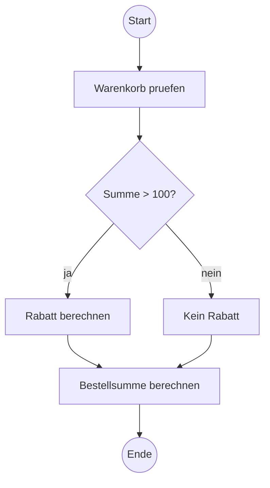

# Pseudocode & Algorithmenstrukturen

> **Zielgruppe:** Umschüler FIAE, 2./3. Lehrjahr
> **Prüfungsrelevanz:** AP2, Prüfungsbereich "Entwicklung und Umsetzung von Algorithmen" (§14 FIAusbV, schriftlich, 90 Minuten) – eigener AP2-Prüfungsbereich, unabhängig von "Planen eines Softwareproduktes"; Gewichtung in der Fachrichtung Anwendungsentwicklung: 10% gemäß §16 FIAusbV
> **Lernzeit:** Kerninhalt: 90–110 Min., mit Vertiefung (Sortierverfahren im Detail, Rekursionsbeispiele): 130–160 Min.
> **Status:** Final
> **Stand:** 2026-09-15
>
> **Wichtiger Hinweis zum Prüfungsstand:** Der überarbeitete AP2-Prüfungskatalog (gültig ab AP2 Sommer 2025) hat die Darstellung von Kontrollstrukturen von "Struktogramm, PAP oder Pseudocode" auf "Aktivitätsdiagramm oder Pseudocode" geändert. Für diese Katalogposition sind damit **Pseudocode und UML-Aktivitätsdiagramm** die genannten Darstellungen. Ältere Lernmaterialien zu Struktogramm/PAP sind dadurch nicht falsch, aber nicht mehr die für diese Katalogposition vorgesehene Notation.

**Legende:** 🔴 Prüfungsstoff (hohe Relevanz) · 🟡 Kontextwissen (mittlere Relevanz) · 🟢 Nice to know

---

## IHK-Kernfragen

| # | Frage | Abschnitt |
|---|---|---|
| 1 | Was ist ein Algorithmus, und welche drei klassischen Kontrollstrukturen bilden seinen Kern in Pseudocode? | [1](#1-die-drei-grundbausteine) |
| 2 | Wie wird ein Algorithmus als UML-Aktivitätsdiagramm dargestellt, und wodurch unterscheidet es sich vom (nicht mehr geprüften) Programmablaufplan? | [2](#2-uml-aktivitätsdiagramm) |
| 3 | Wie funktionieren Bubble Sort, Selection Sort und Insertion Sort, und was unterscheidet sie im Ablauf? | [3](#3-elementare-sortierverfahren) |
| 4 | Was ist der Basisfall einer Rekursion, und was passiert bei seinem Fehlen? | [4](#4-rekursion-kontextwissen) |
| 5 | Was ist ein Schreibtischtest, und wie führt man ihn systematisch durch? | [5](#5-der-schreibtischtest) |

---

## 1. Die drei Grundbausteine

Ein **Algorithmus** ist eine eindeutige und ausführbare Handlungsvorschrift zur Lösung eines Problems. Für viele Algorithmen gilt außerdem, dass sie nach endlich vielen Schritten terminieren (Endlichkeit) und für eine ganze Klasse von Eingaben einsetzbar sind, nicht nur für einen Einzelfall. Je nach Fachbuch werden zusätzlich weitere Eigenschaften genannt, etwa **Determiniertheit** (bei gleicher Eingabe entsteht dasselbe Ergebnis) – diese Feinheiten sind für diesen Artikel nicht der Schwerpunkt.

> **Grundprinzip:** Ein Kochrezept beschreibt einen Ablauf unabhängig davon, in welcher Küche und mit welchem Herd er nachgekocht wird. Pseudocode funktioniert genauso: Er beschreibt die **Logik** eines Algorithmus unabhängig von einer konkreten Programmiersprache – kein Compiler versteht ihn, aber jeder Mensch mit Programmiervorkenntnissen kann ihn in nahezu jede Sprache übersetzen.

Die klassischen Kontrollstrukturen eines strukturierten Algorithmus sind Sequenz, Selektion und Iteration:

| Baustein | Bedeutung | Typische Pseudocode-Schlüsselwörter |
|---|---|---|
| **Sequenz** | Anweisungen werden nacheinander abgearbeitet | (keine besonderen Schlüsselwörter – einfache Zeilenfolge) |
| **Verzweigung (Selektion)** | Abhängig von einer Bedingung wird einer von mehreren Zweigen ausgeführt | `WENN ... DANN ... SONST ...` |
| **Wiederholung (Iteration)** | Eine Anweisungsfolge wird wiederholt ausgeführt, solange/bis eine Bedingung gilt | `SOLANGE ... TUE ...` / `WIEDERHOLE ... BIS ...` / `FÜR JEDES ... IN ...` |

> **Wichtig für die Prüfung:** Es gibt **keine einzige verbindliche Pseudocode-Norm** – anders als bei UML oder SQL existiert kein DIN-Standard. Da Pseudocode keine einheitliche Syntax besitzt, sollte die eigene Schreibweise vor allem **eindeutig, konsistent und logisch nachvollziehbar** sein. Wichtiger als exakte Schlüsselwörter ist eine lückenlose Notation innerhalb der eigenen Lösung.

```text
WENN Warenkorb.Summe > 100
    DANN Rabatt = Warenkorb.Summe * 0,1
    SONST Rabatt = 0
Bestellsumme = Warenkorb.Summe - Rabatt
```

### 1.1 Verschachtelung

Kontrollstrukturen können ineinander verschachtelt werden – eine Schleife kann eine Verzweigung enthalten, die wiederum eine weitere Schleife enthält. Die **Einrückung** macht die Verschachtelungstiefe sichtbar und ist keine Formsache, sondern Teil der korrekten Notation.

```text
FÜR JEDES Produkt IN Warenkorb
    WENN Produkt.Lagerbestand < Produkt.Bestellmenge
        DANN melde "Nicht ausreichend Lagerbestand: " + Produkt.Name
        SONST Produkt.Lagerbestand = Produkt.Lagerbestand - Produkt.Bestellmenge
```

> **IHK-Typfrage:** *"Formulieren Sie in Pseudocode: Für eine Liste von Prüfungsergebnissen soll ermittelt werden, wie viele Teilnehmende bestanden haben (Note besser oder gleich 4,0). Am Ende soll die Anzahl ausgegeben werden."*
> **Musterantwort:**
> ```text
> Bestanden = 0
> FÜR JEDES Ergebnis IN Prüfungsergebnisse
>     WENN Ergebnis.Note <= 4,0
>         DANN Bestanden = Bestanden + 1
> melde "Bestanden: " + Bestanden
> ```
> Die Lösung verwendet eine Zählvariable (Sequenz), die bei jedem Durchlauf der Schleife (Wiederholung) abhängig von einer Bedingung (Verzweigung) erhöht wird – alle drei Grundbausteine kombiniert. Wichtig ist die korrekte Initialisierung von `Bestanden = 0` **vor** der Schleife, ein häufiger Fehler ist das Vergessen dieser Initialisierung.

🔴 **Stolperstein:** Eine Zählvariable, die nicht vor der Schleife initialisiert wird, hat einen undefinierten Startwert – ein klassischer Fehler, der in Prüfungsaufgaben gezielt gesucht wird, wenn nach der Bewertung eines gegebenen Pseudocodes gefragt ist.

---

## 2. UML-Aktivitätsdiagramm

> **Grundprinzip:** Wo Pseudocode die Logik in Textform beschreibt, macht das Aktivitätsdiagramm denselben Ablauf als Flussbild sichtbar – wie ein U-Bahn-Plan, der Linien, Verzweigungen und Umsteigepunkte auf einen Blick zeigt, statt sie in Worten zu beschreiben.

Das UML-Aktivitätsdiagramm ist die grafische Notation, die im aktuellen AP2-Prüfungskatalog anstelle von Struktogramm und PAP für diese Katalogposition vorgesehen ist. Wichtigste Symbole:

| Symbol | Bedeutung |
|---|---|
| ⚫ (gefüllter Kreis) | Startknoten |
| Abgerundetes Rechteck | Aktivität/Aktion |
| ◇ (Raute) | Entscheidung (Decision) bzw. Zusammenführung (Merge) |
| ▬ (Balken) | Gabelung (Fork, paralleler Start) bzw. Zusammenführung (Join, Synchronisation) |
| ⚫ mit Ring (Bullseye) | Endknoten |

> **Hinweis zur Darstellung:** Das folgende Diagramm ist eine **schematische Annäherung** mit dem Werkzeug Mermaid (Flowchart-Syntax) – es zeigt denselben Kontrollfluss wie ein Aktivitätsdiagramm, ist aber **kein formal korrektes UML-Aktivitätsdiagramm**. In echter UML-Notation werden Entscheidungszweige mit Guards in eckigen Klammern beschriftet, z. B. `[Summe > 100]` und `[Summe <= 100]` oder – bei eindeutigem Kontext – auch `[ja]` und `[nein]`; Start-/Endknoten folgen zudem der UML-eigenen Symbolik. Für die Prüfung zählt der korrekt dargestellte Kontrollfluss, nicht die Mermaid-Syntax.



> **Wichtig für die Prüfung:** Ein UML-Aktivitätsdiagramm besitzt mit Fork und Join standardisierte UML-Elemente für parallele Abläufe. Diese Semantik ist bei einem klassischen PAP nicht in gleicher Weise standardisiert – das ist ein wesentlicher konzeptioneller Unterschied, auch wenn sich einfache sequenzielle Verzweigungen in beiden Notationen ähnlich darstellen lassen. In strikter UML-Notation folgt zudem nach einer Verzweigung (Decision) üblicherweise ein **Merge-Knoten**, der die Zweige wieder zu einem einzigen Kontrollfluss zusammenführt, bevor der Ablauf weitergeht – im vereinfachten Mermaid-Beispiel oben ist das nicht als eigenes Symbol dargestellt.

🟢 **Nice to know:** Umlaute werden in Mermaid-Diagrammen aus Kompatibilitätsgründen teils umschrieben (z. B. "pruefen" statt "prüfen") – das ist ein reiner Darstellungs-Workaround des Werkzeugs, keine inhaltliche Vorgabe für die Prüfung.

🟡 **Kontextwissen:** In der Prüfung kann verlangt werden, denselben Algorithmus **sowohl** in Pseudocode **als auch** als Aktivitätsdiagramm darzustellen, oder von einer Notation in die andere zu übersetzen. Beide sollten dieselbe Logik enthalten – eine korrekte Übersetzung erkennt man daran, dass jeder Pseudocode-Zweig ein Gegenstück im Diagramm hat und umgekehrt.

---

## 3. Elementare Sortierverfahren

> **Grundprinzip:** Eine Hand Spielkarten sortieren kann man auf verschiedene Weisen – immer die kleinste Karte suchen und nach vorne legen, oder jede neue Karte an der richtigen Stelle in die bereits sortierten einordnen. Beide Strategien führen zum selben Ergebnis, aber über unterschiedliche Wege – genau das unterscheidet die drei im Katalog genannten Verfahren.

Der AP2-Prüfungskatalog konkretisiert "elementares Sortieren" beispielhaft mit: **Bubble Sort, Selection Sort, Insertion Sort**.

> **Vorab – Index:** Bei einer Liste bezeichnet der Index die Position eines Elements. Die Zählung beginnt bei `0` – bei einer Liste mit 4 Elementen liegen die gültigen Indizes also bei `0` bis `3`. Beispiel: Bei `Liste = [5, 2, 8, 1]` hat `Liste[0]` den Wert 5 und `Liste[3]` den Wert 1; `Liste[4]` existiert nicht. `Liste[j+1]` bezeichnet damit das Element direkt nach der Position `j`.

### 3.1 Bubble Sort ("Blasensortierung")

Benachbarte Elemente werden paarweise verglichen und bei Bedarf vertauscht – große Werte "steigen wie Blasen" schrittweise ans Ende der Liste.

```text
FÜR i VON 0 BIS Länge(Liste) - 2
    FÜR j VON 0 BIS Länge(Liste) - 2 - i
        WENN Liste[j] > Liste[j+1]
            DANN vertausche Liste[j] und Liste[j+1]
```

**Innerer Durchlauf 1 (i=0)** mit Startliste [5, 2, 8, 1]:

| Schritt | Liste (vor Vergleich) | Vergleich | Aktion |
|---|---|---|---|
| 1 | [5, 2, 8, 1] | 5 > 2? | tauschen → [2, 5, 8, 1] |
| 2 | [2, 5, 8, 1] | 5 > 8? | keine Aktion |
| 3 | [2, 5, 8, 1] | 8 > 1? | tauschen → [2, 5, 1, 8] |

Nach diesem ersten äußeren Durchlauf (i=0) steht das größte Element (8) bereits an seiner endgültigen Position am Ende. Die **weiteren äußeren Durchläufe** sortieren schrittweise den verbleibenden Bereich:

| Nach Durchlauf | Liste |
|---|---|
| i=0 | [2, 5, 1, 8] |
| i=1 | [2, 1, 5, 8] |
| i=2 | [1, 2, 5, 8] (fertig sortiert) |

🔴 **Stolperstein:** Bei nullbasierten Indizes reicht die letzte gültige Position bis `Länge(Liste) - 1`. Beim Vergleich `Liste[j]` mit `Liste[j+1]` darf `j` deshalb höchstens `Länge(Liste) - 2` erreichen – sonst entsteht ein ungültiger Indexzugriff auf ein nicht existierendes Element.

### 3.2 Selection Sort ("Auswahlsortierung")

In jedem Durchlauf wird das kleinste (noch nicht einsortierte) Element gesucht und an die richtige Position getauscht.

```text
FÜR i VON 0 BIS Länge(Liste) - 2
    Minimum_Index = i
    FÜR j VON i+1 BIS Länge(Liste) - 1
        WENN Liste[j] < Liste[Minimum_Index]
            DANN Minimum_Index = j
    WENN Minimum_Index != i
        DANN vertausche Liste[i] und Liste[Minimum_Index]
```

🟡 **Kontextwissen:** Der zusätzliche Vergleich verhindert einen unnötigen Tausch, wenn das aktuelle Element bereits das Minimum ist.

### 3.3 Insertion Sort ("Einfügesortierung")

Ähnlich wie beim Sortieren einer Spielkartenhand: Jedes Element wird an der richtigen Stelle in den bereits sortierten Teil der Liste eingefügt.

```text
FÜR i VON 1 BIS Länge(Liste) - 1
    aktuelles_Element = Liste[i]
    j = i - 1
    SOLANGE j >= 0 UND Liste[j] > aktuelles_Element
        Liste[j+1] = Liste[j]
        j = j - 1
    Liste[j+1] = aktuelles_Element
```

🟡 **Kontextwissen:** Die Bedingung `j >= 0 UND Liste[j] > aktuelles_Element` funktioniert nur korrekt, wenn `j >= 0` **zuerst** geprüft wird und die Auswertung bei "falsch" sofort abbricht (Kurzschlussauswertung) – sonst würde bei `j = -1` ein ungültiger Zugriff auf `Liste[-1]` versucht. Diese Reihenfolge ist in vielen Programmiersprachen so vorgegeben, ist aber keine allgemeine Pseudocode-Regel. Praxisempfehlung: Bei zusammengesetzten Bedingungen zuerst prüfen, ob der Index überhaupt gültig ist – so wird ein Zugriff auf ein nicht vorhandenes Element von vornherein vermieden.

> **IHK-Typfrage:** *"Erklären Sie den grundlegenden Unterschied zwischen Selection Sort und Insertion Sort."*
> **Musterantwort:** Selection Sort **sucht** in jedem Durchlauf aktiv das kleinste Element im unsortierten Teil der Liste und **tauscht** es an die richtige Position – der bereits sortierte Teil wird dabei nicht mehr verändert. Insertion Sort dagegen **nimmt** das nächste Element aus dem unsortierten Teil und **fügt** es an der passenden Stelle in den bereits sortierten Teil ein, wobei größere Elemente im sortierten Teil dafür nach hinten verschoben werden. Beide Verfahren bauen den sortierten Bereich schrittweise auf, unterscheiden sich aber darin, ob aktiv gesucht (Selection) oder eingefügt (Insertion) wird.

> **Wichtig für die Prüfung:** Eine formale Behandlung von Landau-Notation, Big-O-Beweisen und detaillierten Laufzeitanalysen steht in diesem Artikel bewusst **nicht im Mittelpunkt** – aus einem fehlenden expliziten Katalognachweis folgt nicht automatisch, dass so etwas in keiner Aufgabe vorkommen kann, aber der Schwerpunkt der AP2-Vorbereitung liegt klar auf Ablauf, Umsetzung und Nachvollziehbarkeit der Verfahren. Für die Prüfung zählt vor allem das Verständnis des **Ablaufs** und die Fähigkeit, ihn in Pseudocode korrekt zu formulieren oder einen gegebenen Sortiercode nachzuvollziehen (Schreibtischtest, siehe Abschnitt 5).

### 3.4 Die drei Verfahren im Vergleich

| Kriterium | Bubble Sort | Selection Sort | Insertion Sort |
|---|---|---|---|
| Prinzip | Benachbarte Elemente paarweise vergleichen und tauschen | Minimum im unsortierten Teil suchen, dann tauschen | Element an richtiger Stelle im sortierten Teil einfügen |
| Was verändert sich pro Durchlauf | Das jeweils größte verbleibende Element erreicht seine endgültige Position | Ein Element wird an seine endgültige Position gebracht | Der sortierte Bereich wächst um ein Element |
| Bei der hier gezeigten Implementierung "in-place" (ohne zweite Liste)? | Ja | Ja | Ja |
| Stabil? (gleiche Werte behalten ihre Reihenfolge) | Ja | Nein (durch den Tausch über größere Distanzen) | Ja |

🟡 **Kontextwissen:** Alle drei Verfahren sind "elementar" – sie sind einfach zu verstehen und zu programmieren, aber bei sehr großen Datenmengen ineffizienter als fortgeschrittenere Verfahren (Quicksort, Mergesort). Diese fortgeschrittenen Verfahren gehören nach aktuellem Kenntnisstand nicht zum ausdrücklich benannten AP2-Katalogstoff.

🟢 **Bewusste Abgrenzung – Suchalgorithmen:** Lineare und binäre Suche sind nach aktuellem Kenntnisstand nicht mit derselben Explizitheit im AP2-Katalog benannt wie die drei hier behandelten Sortierverfahren und werden in diesem Artikel deshalb bewusst nicht vertieft. Sie gehören zum allgemeinen Algorithmenverständnis und können bei Bedarf in einem eigenen Vertiefungsartikel ergänzt werden.

---

## 4. Rekursion (Kontextwissen)

> **Grundprinzip:** Eine Matroschka-Puppe enthält eine kleinere Version ihrer selbst – bis zur kleinsten, nicht mehr teilbaren Puppe. Eine rekursive Funktion funktioniert genauso: Sie ruft sich selbst mit einem kleineren/einfacheren Problem auf, bis ein **Abbruchfall (Basisfall)** erreicht ist.

```text
FUNKTION Fakultät(n)
    WENN n <= 1
        DANN GIB ZURÜCK 1
        SONST GIB ZURÜCK n * Fakultät(n - 1)
```

🟡 **Kontextwissen:** Anders als die drei Sortierverfahren ist Rekursion im aktuellen AP2-Prüfungskatalog nicht mit derselben Explizitheit als eigener Stichpunkt belegt wie Bubble/Selection/Insertion Sort. Sie ist aber ein wichtiges allgemeines Programmierkonzept und für diesen Artikel bewusst nur als Kontextwissen eingestuft – insbesondere beim Nachvollziehen oder Bewerten von gegebenem Code (§14 FIAusbV: "Programmcode interpretieren") kann sie relevant werden.

🔴 **Stolperstein** (der Abschnitt insgesamt ist 🟡 Kontextwissen, dieser einzelne Punkt aber 🔴, weil er auch bei einer als Kontextwissen eingestuften Aufgabe zu einem gravierenden Fehler führt): Fehlt der Basisfall oder wird er nie erreicht (z. B. weil sich das Argument nicht verkleinert), läuft die Rekursion unbegrenzt weiter, bis der verfügbare Speicher (Aufrufstapel) erschöpft ist – ein "Stack Overflow".

---

## 5. Der Schreibtischtest

> **Grundprinzip:** Ein Schreibtischtest ist wie das manuelle Nachrechnen einer Rechenaufgabe – man verfolgt jeden Schritt des Algorithmus von Hand, notiert den aktuellen Stand aller Variablen und stellt so fest, ob die Logik tatsächlich zum erwarteten Ergebnis führt.

Ein systematischer Schreibtischtest verwendet eine Tabelle: eine Spalte pro Variable, eine Zeile pro Durchlauf/Schritt.

**Beispiel** für den Code aus Abschnitt 1.1 mit `Prüfungsergebnisse = [3,5; 4,0; 4,3]`:

| Durchlauf | Ergebnis.Note | Bedingung erfüllt? | Bestanden |
|---|---|---|---|
| Start | – | – | 0 |
| 1 | 3,5 | ja (≤ 4,0) | 1 |
| 2 | 4,0 | ja (≤ 4,0) | 2 |
| 3 | 4,3 | nein | 2 |

> **IHK-Typfrage:** *"Führen Sie einen Schreibtischtest für den Selection-Sort-Algorithmus (Abschnitt 3.2) mit der Liste [4, 1, 3] durch."*
> **Musterantwort:**
> | i | Minimum_Index (Start) | j-Durchlauf | Liste nach Tausch |
> |---|---|---|---|
> | 0 | 0 (Wert 4) | j=1: 1<4 → Min_Index=1; j=2: 3<1? nein | [1, 4, 3] |
> | 1 | 1 (Wert 4) | j=2: 3<4 → Min_Index=2 | [1, 3, 4] |
>
> Nach dem Durchlauf mit i=0 wird das Minimum (1) an Index 0 getauscht, danach mit i=1 das nächste Minimum (3) an Index 1 – die Liste ist nach zwei äußeren Durchläufen vollständig sortiert: [1, 3, 4].

> **Wichtig für die Prüfung:** Ein Schreibtischtest ist eine sehr hilfreiche Methode, um in der Prüfung ohne Compiler zu erkennen, ob eine eigene Pseudocode-Lösung tatsächlich korrekt ist – gerade bei Verschachtelungen (Abschnitt 1.1) passieren sonst leicht unbemerkte Logikfehler. Der Schreibtischtest ist zugleich die direkte praktische Umsetzung der §14-FIAusbV-Kompetenz "Programmcode interpretieren": Dabei werden nicht nur einzelne Variablenwerte verfolgt, sondern auch Schleifenbedingungen (wird die Schleife noch einmal durchlaufen?), Verzweigungsergebnisse (welcher Zweig wird genommen?) und der jeweils aktuelle Zustand von Listen/Arrays.

---

## 6. Zusammenspiel mit anderen Lernfeldern

Boolesche Bedingungen (`WENN`, `SOLANGE`) in diesem Artikel bauen auf den Logikgattern und der Booleschen Algebra aus **LF2.1 – Die Logik der Maschinen** auf (dort: AND/OR/NOT auf Hardware-Ebene; hier: dieselbe Logik als Bedingung in Kontrollstrukturen). Wer die Wahrheitstabellen aus LF2.1 verstanden hat, erkennt in einer verschachtelten `WENN`-Bedingung dieselbe Struktur wieder.

---

## Quellen

- **§14, §16 FIAusbV** (Primärquelle) – Prüfungsbereich "Entwicklung und Umsetzung von Algorithmen": Inhalt, Prüfungszeit und Gewichtung
- **Neuer Prüfungskatalog für die AP2 als Fachinformatiker Anwendungsentwicklung ab 2025 – IT-Berufe-Podcast #191** (Sekundärquelle, Stefan Macke, aktiver IHK-Prüfer) – dokumentierter Alt/Neu-Vergleich, insbesondere Streichung von Struktogramm/PAP zugunsten von Aktivitätsdiagramm/Pseudocode sowie explizite Nennung von Bubble/Selection/Insertion Sort als Beispiele für elementares Sortieren
- **OMG UML-Spezifikation** – Grundlage für Aktivitätsdiagramm-Symbolik (Fork/Join/Decision/Merge)

> **Hinweis:** Die Katalogänderungen sind über die genannte Sekundärquelle dokumentiert, nicht über direkte Einsicht in den offiziellen, kostenpflichtigen Prüfungskatalog (IHK-AkA/ZPA Nord-West, U-Form-Verlag). Die Formulierungen in diesem Artikel sind entsprechend vorsichtig gehalten ("im aktuellen Katalog vorgesehen" statt "verbindlich vorgeschrieben").

---

## 7. Typische Prüfungsfallen

| # | Falle | Richtigstellung |
|---|---|---|
| 1 | Es gibt eine verbindliche Pseudocode-Norm, die genau eingehalten werden muss | Es gibt keine DIN-Norm für Pseudocode – wichtig ist konsistente, eindeutige Notation, nicht exakte Schlüsselwörter |
| 2 | Struktogramm oder PAP sind weiterhin die Standarddarstellung für die AP2 | Der aktuelle Katalog nennt für diese Position Pseudocode und UML-Aktivitätsdiagramm |
| 3 | Eine Zählvariable muss nicht explizit initialisiert werden | Eine nicht initialisierte Zählvariable hat einen undefinierten Ausgangswert – klassischer Prüfungsfehler |
| 4 | Selection Sort und Insertion Sort funktionieren im Kern gleich | Selection Sort sucht aktiv das Minimum und tauscht; Insertion Sort fügt Element für Element an der richtigen Stelle ein |
| 5 | Bei Rekursion reicht ein beliebiger Funktionsaufruf am Ende | Ohne erreichbaren Basisfall läuft die Rekursion unbegrenzt (Stack Overflow) |
| 6 | Ein Aktivitätsdiagramm kann keine parallelen Abläufe darstellen | Gabelung (Fork) und Zusammenführung (Join) sind genau dafür vorgesehen – ein Unterschied zum PAP |

---

## Selbsttest

| # | Frage | Kurzantwort |
|---|---|---|
| 1 | Nenne die drei klassischen Kontrollstrukturen eines strukturierten Algorithmus. | Sequenz, Verzweigung (Selektion), Wiederholung (Iteration) |
| 2 | Welche zwei Darstellungsformen werden im aktuellen AP2-Katalog für Kontrollstrukturen genannt? | Pseudocode und UML-Aktivitätsdiagramm |
| 3 | Was unterscheidet Bubble Sort im Grundprinzip von Selection Sort? | Bubble Sort vertauscht benachbarte Elemente paarweise; Selection Sort sucht aktiv das Minimum und tauscht es an die richtige Position |
| 4 | Was passiert bei fehlendem Basisfall in einer rekursiven Funktion? | Die Rekursion läuft unbegrenzt weiter, bis der Aufrufstapel erschöpft ist (Stack Overflow) |
| 5 | Wozu dient ein Schreibtischtest? | Manuelles, schrittweises Nachverfolgen eines Algorithmus zur Überprüfung der Korrektheit ohne Compiler |
| 6 | Welche zwei UML-Symbole stellen parallele Abläufe dar? | Gabelung (Fork) und Zusammenführung (Join), dargestellt als Balken |

**Anwendungsaufgabe:** Formuliere Pseudocode, der aus einer nicht leeren Liste von Zahlen die größte Zahl ermittelt und ausgibt.

> **Musterlösung:**
> ```text
> Maximum = Liste[0]
> FÜR JEDES Zahl IN Liste
>     WENN Zahl > Maximum
>         DANN Maximum = Zahl
> GIB Maximum AUS
> ```
> Diese kompakte Aufgabe prüft gleichzeitig Initialisierung, Schleife, Bedingung und Ergebnisausgabe.

---

## IHK-Cheatsheet

| Begriff | Kurzdefinition |
|---|---|
| Pseudocode | Sprachunabhängige, textuelle Beschreibung eines Algorithmus – keine DIN-Norm, aber konsistente Notation nötig |
| Sequenz | Anweisungen nacheinander |
| Verzweigung/Selektion | `WENN...DANN...SONST` – abhängig von Bedingung ein Zweig |
| Wiederholung/Iteration | `SOLANGE`/`FÜR JEDES` – Anweisungsfolge wiederholt |
| UML-Aktivitätsdiagramm | Grafische Notation für Abläufe – im aktuellen AP2-Katalog vorgesehen statt Struktogramm/PAP |
| Fork/Join | Gabelung/Zusammenführung für parallele Abläufe im Aktivitätsdiagramm |
| Bubble Sort | Paarweiser Vergleich benachbarter Elemente, große Werte "steigen" ans Ende |
| Selection Sort | Aktive Suche des Minimums je Durchlauf, dann Tausch an richtige Position |
| Insertion Sort | Einfügen jedes Elements an der richtigen Stelle im bereits sortierten Teil |
| Rekursion | Funktion ruft sich selbst mit kleinerem Problem auf, bis Basisfall erreicht ist |
| Schreibtischtest | Manuelles Durchspielen eines Algorithmus mit Tabelle für Variablenwerte |

---

## Prüfungstaktik

| Aufgabentyp | Typische Formulierung | Was die IHK hören will |
|---|---|---|
| Pseudocode formulieren | "Formulieren Sie in Pseudocode einen Algorithmus, der..." | Erst das Problem verstehen, dann Variablen korrekt initialisieren, anschließend Kontrollstruktur aufbauen |
| Gegebenen Code nachvollziehen | "Führen Sie einen Schreibtischtest für folgenden Code durch" | Vollständige Variablentabelle, nicht nur das Endergebnis |
| Sortierverfahren erklären | "Erklären Sie den Ablauf von X Sort anhand der Liste [...]" | Nach jedem Vergleich/Tausch den aktuellen Listenzustand notieren, nicht nur das Endergebnis |
| Diagramm übersetzen | "Stellen Sie folgenden Pseudocode als Aktivitätsdiagramm dar" | Kontrollfluss muss logisch identisch bleiben – jeder Pseudocode-Zweig braucht ein Gegenstück im Diagramm |
| Code bewerten/korrigieren | "Bewerten Sie folgenden Pseudocode auf Fehler" | Konkrete Zeile + Ursache + Auswirkung benennen, nicht nur "ist falsch" |

---

## Merk-Sätze fürs Fachgespräch

> Pseudocode hat keine Norm, aber jede eindeutige, konsistente Notation ist eine gültige Antwort.

> Für die aktuelle AP2-Katalogposition zählen Aktivitätsdiagramm und Pseudocode – Struktogramm und PAP gehören dort nicht mehr zur vorgesehenen Darstellung.

> Selection Sort sucht und tauscht, Insertion Sort nimmt und fügt ein – beide bauen den sortierten Teil schrittweise auf, aber auf unterschiedlichen Wegen.

> Eine rekursive Funktion ohne erreichbaren Basisfall ruft sich unbegrenzt weiter auf – typische Folge ist ein Überlaufen des Aufrufstapels, ein Stack Overflow.

> Der Schreibtischtest ist der Compiler auf Papier – wer ihn beherrscht, findet Logikfehler, bevor sie zu Punktabzug führen.

---

```yaml
dokument: Pseudocode-Algorithmenstrukturen-wiki-artikel
lernfeld: "Ergänzung zu AP2 §14 FIAusbV (kein bestehendes LF-Kürzel im Wiki, eigenständiger Artikel)"
titel: "Pseudocode & Algorithmenstrukturen"
typ: "Typ A – Kompakter Prüfungs-Wiki (FIAE-fokussiert)"
status: final
stand: 2026-09-15
quellen_intern:
  - "Identifizierte Lücke aus Prüfungsrelevanz-Recherche (2026-09-15): Priorität-1-Thema, da AP2-Prüfungsbereich 'Entwicklung und Umsetzung von Algorithmen' bislang nicht im Wiki vertreten war"
  - "Bewusster Verweis auf LF2.1 (Die Logik der Maschinen, bereits Final im Wiki) für Boolesche Grundlagen statt Wiederholung"
  - "Bewusste Abgrenzung zu einer formalen Komplexitätsanalyse (Landau-Notation/Big-O-Beweise), da diese nicht Schwerpunkt dieses Artikels ist - Effizienzbetrachtung der Sortierverfahren absichtlich nicht formal behandelt"
quellen_fachlich:
  - titel: "Fachinformatiker-Ausbildungsverordnung (FIAusbV), §14 und §16"
    herausgeber: "Bundesministerium der Justiz (gesetze-im-internet.de)"
    status: "Primärquelle für Prüfungsbereich 'Entwicklung und Umsetzung von Algorithmen' (§14: Inhalt, 90 Min.), Gewichtung 10% für Fachrichtung Anwendungsentwicklung (§16) - web-verifiziert in dieser Session"
  - titel: "Neuer Prüfungskatalog für die AP2 als Fachinformatiker Anwendungsentwicklung ab 2025 – IT-Berufe-Podcast #191"
    herausgeber: "IT-Berufe-Podcast / Stefan Macke, aktiver IHK-Prüfer für FIAE (https://it-berufe-podcast.de/neuer-pruefungskatalog-fuer-die-ap2-als-fachinformatiker-anwendungsentwicklung-ab-2025-it-berufe-podcast-191/)"
    status: "Sekundärquelle für dokumentierte Katalogänderungen: 'Struktogramm, PAP oder Pseudocode' → 'Aktivitätsdiagramm oder Pseudocode', sowie 'Bubble Sort, Selection Sort, Insertion Sort' als Beispiele für elementares Sortieren. Primäre, kostenpflichtige Katalogquelle (IHK-AkA/ZPA Nord-West, U-Form-Verlag) nicht direkt eingesehen - Formulierungen im Artikel entsprechend vorsichtig gehalten. Rekursion nicht mit gleicher Explizitheit belegt wie die drei Sortierverfahren - deshalb als Kontextwissen (🟡) statt Kernstoff (🔴) eingestuft"
  - titel: "UML-Aktivitätsdiagramm-Notation (Fork/Join/Decision/Merge)"
    herausgeber: "OMG UML-Spezifikation, etabliertes Standardwissen"
    status: "stabile Notation, keine gesonderte Web-Verifikation nötig"
review_historie:
  - runde: 1
    datum: 2026-09-15
    ergebnis: "Erstdraft erstellt basierend auf der in dieser und vorherigen Sessions durchgeführten Prüfungsrelevanz-Recherche. Kein Rohmaterial vom Auftraggeber vorhanden - Artikel aus eigenem Wissen unter Beachtung der recherchierten 2025-Katalogänderungen erstellt. Bewusst gehedgte Formulierung bei Rekursion (Kontextwissen statt Kernstoff, da weniger explizit belegt als die drei benannten Sortierverfahren) und bei Effizienzbetrachtung (Big-O explizit als Nicht-Prüfungsstoff markiert, um keine Verwechslung mit Priorität-3-Themen zu erzeugen)."
  - runde: 2
    datum: 2026-09-15
    ergebnis: "3 Reviews eingearbeitet. Wichtigster Fund (2 Reviews): Mermaid-Flowchart wurde unkritisch als 'UML-Aktivitätsdiagramm' bezeichnet - technisch nicht korrekt (keine formalen Guards in eckigen Klammern, keine UML-eigene Symbolik). Klarer Hinweis ergänzt, dass es sich um eine schematische Annäherung handelt, kein formal korrektes UML-Diagramm. 'Seit 2025 Standard statt...' und Big-O 'kein Prüfungsstoff' (alle 3 Reviews) zu absolut - beide auf 'im aktuellen Katalog vorgesehen' bzw. 'nicht im Mittelpunkt dieses Artikels' abgeschwächt, da aus fehlendem Katalognachweis nicht automatisch 'kommt nicht vor' folgt. Rekursions-Merksatz präzisiert (Stack Overflow ist mögliche Folge, nicht Definition). Bubble-Sort-Tabelle vervollständigt (zeigte nur ersten Durchlauf, wirkte wie Endergebnis) plus Index-Grenzen-Stolperstein ergänzt. Array/Index-Konzept kurz erklärt (alle drei Sortierverfahren nutzen Indexzugriffe, war vorausgesetzt statt erklärt). Selection Sort um Vermeidung unnötigen Tauschs ergänzt, Insertion Sort um Kurzschlussauswertungs-Hinweis. Vergleichstabelle der drei Sortierverfahren ergänzt (bewusst ohne Komplexitätsklassen/Big-O). Kurze Algorithmus-Definition mit klassischen Eigenschaften vorangestellt. Schreibtischtest expliziter mit §14-Kompetenz 'Programmcode interpretieren' verknüpft. IHK-Kernfragen um Rekursion erweitert. YAML-Quellenstatus um konkrete URL präzisiert statt vagem Sammelverweis. 🟢-Markierung erstmals tatsächlich genutzt (vorher nur in Legende angekündigt)."
  - runde: 3
    datum: 2026-09-15
    ergebnis: "3 weitere Reviews eingearbeitet. Wichtigster juristischer Fund (1 Review, web-verifiziert): Kopfzeile vermischte §14 (Prüfungsbereich/90 Min.) und §16 (Gewichtung/10%) FIAusbV - eigenständig geprüft, §16 regelt tatsächlich die Gewichtung der Prüfungsbereiche, nicht §14. Kopfzeile entsprechend getrennt. Verbleibende Absolutheiten ('nur noch', 'seit 2025 Standard') an drei weiteren Stellen (Kopf-Hinweisbox, Selbsttest, Merksatz) konsistent nachgezogen, die in Runde 2 nur teilweise behoben waren. Relevanz-Marker-Inkonsistenz in Abschnitt 4 (Rekursion 🟡, aber 🔴-Stolperstein) - über zwei Runden von mehreren Reviews bemängelt, jetzt per empfohlener 'Option C' gelöst (Nuance explizit im Text erklärt statt Marker zu ändern). Algorithmuseigenschaften-Liste vereinfacht (fünf Fachbegriffe wirkten zu lehrbuchhaft für den Artikelfokus). Guard-Beispiel korrigiert ([ja]/[nein] ist ebenfalls gültige UML-Notation, nicht nur die vollständige Bedingung). Merge-Knoten-Hinweis ergänzt. Kurzschlussauswertung nicht mehr als 'in Pseudocode üblich' dargestellt (Pseudocode legt keine Auswertungsreihenfolge fest), sondern als Praxisempfehlung. Vergleichstabelle um 'Stabil?'-Zeile erweitert, 'in-place' auf die gezeigte Implementierung bezogen statt als generelle Verfahrenseigenschaft dargestellt. Suchalgorithmen explizit als bewusste (nicht vergessene) Auslassung benannt. Echte Pseudocode-Anwendungsaufgabe im Selbsttest ergänzt (vorher nur Wissensfragen, keine Transferaufgabe) - dabei einen eigenen Formatierungsfehler korrigiert (Codeblock war fälschlich in eine Tabellenzelle gesetzt worden, rendert so nicht). Sichtbarer Quellenblock im Artikeltext selbst ergänzt (vorher nur im YAML, für Leser nicht sichtbar). YAML-Quellen sauber in Primär-/Sekundärquelle getrennt. Ein Vorschlag (Prüfungstaktik-Spaltenüberschrift 'Was die IHK hören will' umbenennen) geprüft, aber verworfen - projektweite Konvention über alle anderen Wiki-Artikel hinweg, Änderung nur hier hätte Inkonsistenz geschaffen."
  - runde: 4
    datum: 2026-09-15
    ergebnis: "Eigene Abschlussprüfung: Zwei weitere Reste derselben in Runde 3 bereits mehrfach korrigierten Absolutheit gefunden und behoben - Prüfungsfallen-Tabelle (Zeile 2: 'seit 2025 nur noch') und Cheatsheet-Eintrag (UML-Aktivitätsdiagramm: 'seit 2025 Standard') trugen noch die alte Formulierung, obwohl Kopf, Merksatz und Selbsttest bereits abgeschwächt waren. Beide an 'im aktuellen Katalog vorgesehen' angeglichen. Keine weiteren Fachfehler gefunden."
freigabe: "Final gesetzt nach 4 Runden (3 externe Prüfrunden + 1 eigene Abschlussprüfung, 2026-09-15) – Freigabe durch Autor:in bestätigt."
```