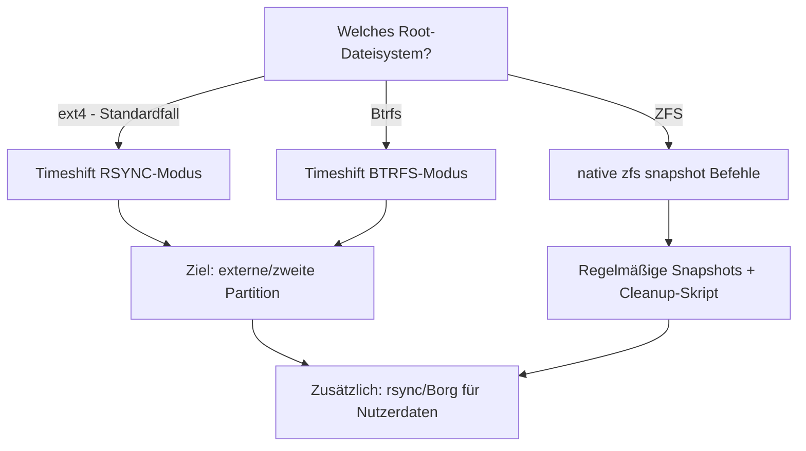

# Backup & System-Snapshots unter Ubuntu 24.04 LTS

> **Zielgruppe:** Umschüler FIAE/FISI, 2. Lehrjahr
> **Prüfungsrelevanz:** AP1 (schriftlich) + Fachgespräch
> **Lernzeit:** Ca. 30–40 Minuten
> **Status:** Final
> **Stand:** 2026

---

## IHK-Kernfragen

| # | Frage | Abschnitt |
|---|---|---|
| 1 | Was ist der Unterschied zwischen Paket-Snapshot (APT) und System-Snapshot (Timeshift)? | [1. Native Möglichkeiten](#1-native-möglichkeiten-ohne-zusatzsoftware) |
| 2 | Welche Snapshot-Modi bietet Timeshift, und wann nimmt man welchen? | [2. Timeshift-Modi](#2-timeshift-rsync-vs-btrfs) |
| 3 | Was sichert Timeshift standardmäßig NICHT, und warum ist das Absicht? | [3. Was Timeshift nicht sichert](#3-was-timeshift-bewusst-nicht-sichert) |
| 4 | Wie läuft ein Notfall-Restore ab, wenn das System nicht mehr bootet? | [5. Notfall-Restore](#5-notfall-restore-über-live-system) |
| 5 | Welche Backup-Strategie kombiniert man sinnvoll mit Timeshift? | [6. Ergänzende Strategie](#6-ergänzende-backup-strategie) |

---

## 1. Native Möglichkeiten (ohne Zusatzsoftware)

> **Grundprinzip:** Ubuntu 24.04 bringt native Bausteine für *Paket*-Snapshots und (bei ZFS/Btrfs) *Dateisystem*-Snapshots mit – aber keinen vollwertigen grafischen Backup-Manager. Für praktikable System-Snapshots braucht es Timeshift.

### 1.1 APT-Snapshot-Service (Paketebene)

Der APT-Snapshot-Service friert den Zustand der offiziellen Ubuntu-Repositories zu einem Zeitpunkt ein. Ab Ubuntu 24.04 erkennt `apt` automatisch, ob ein Repository Snapshots unterstützt (`Snapshots:`-Direktive im Release-File) – bei offiziellen Ubuntu-Quellen ist das standardmäßig der Fall.

```bash
# Paketstand zu einem festen Zeitpunkt installieren
sudo apt install hello --update --snapshot 20240301T030400Z
```

Verfügbar sind Snapshots für jeden Zeitpunkt ab dem 1. März 2023.

| Aspekt | Beschreibung | IHK-Relevanz |
|---|---|---|
| Umfang | Nur Paketversionen, keine Nutzerdaten/Konfiguration | 🟡 |
| Nutzen | Reproduzierbare Deployments, gestaffelte Rollouts, Debug alter Versionen | 🔴 |
| Kein Ersatz für | Vollständiges Systembackup | 🔴 |

### 1.2 Dateisystem-native Snapshots (ZFS/Btrfs)

Nur relevant, wenn das Root-Dateisystem tatsächlich ZFS oder Btrfs ist (bei Standard-Ubuntu-Desktop-Installation: **nicht der Fall**, dort ist ext4 Standard).

```bash
# ZFS
sudo zfs snapshot tank@backup-$(date +%Y%m%d-%H%M%S)
zfs list -t snapshot

# Btrfs (analog, oft in Kombination mit Timeshift genutzt)
sudo btrfs subvolume snapshot /  /.snapshots/backup-$(date +%Y%m%d)
```

| Aspekt | Beschreibung | IHK-Relevanz |
|---|---|---|
| Voraussetzung | Root-FS muss ZFS/Btrfs sein | 🔴 |
| Vorteil | Copy-on-Write, extrem platzsparend, sekundenschnell | 🟡 |
| Nachteil | Bei ext4 (Standardfall) nicht nutzbar | 🟢 |

---

## 2. Timeshift: RSYNC vs. BTRFS

> **Grundprinzip:** Timeshift sichert den *Systemzustand* (Root-FS, `/etc`, installierte Pakete) – nicht die persönlichen Nutzerdaten. Der Modus richtet sich nach dem Root-Dateisystem.

| Modus | Voraussetzung | Funktionsweise | IHK-Relevanz |
|---|---|---|---|
| **RSYNC** | ext4 (Standardfall bei Ubuntu Desktop) | `rsync` + Hardlinks, ähnlich macOS Time Machine | 🔴 |
| **BTRFS** | Root-FS ist Btrfs | Native Btrfs-Snapshots, sehr schnell & platzsparend | 🟡 |

Da die meisten Ubuntu-24.04-Desktop-Installationen auf ext4 laufen, ist **RSYNC-Modus + separates Ziellaufwerk** der Praxis-Standardfall.

> **IHK-Typfrage:** *"Warum sollte man Timeshift-Snapshots nicht auf der Root-Partition selbst speichern?"*
> **Musterantwort:** Weil die Snapshots dann den Systemspeicher füllen, statt bei einem Systemausfall unabhängig zur Verfügung zu stehen. Ziel sollte eine externe oder zweite interne Partition sein.

---

## 3. Was Timeshift bewusst NICHT sichert

Timeshift sichert **standardmäßig keine normalen Nutzerdaten** (Dokumente, Bilder, Downloads) – nur optional versteckte Konfigurationsdateien (Dotfiles) im Home-Verzeichnis.

**Warum ist das Absicht?** Ein Restore soll den *Systemzustand* wiederherstellen können, ohne versehentlich neuere Nutzerdateien zu überschreiben. System-Snapshot und Datensicherung sind zwei getrennte Aufgaben.

| Wird gesichert | Wird NICHT gesichert |
|---|---|
| `/`, `/etc`, installierte Pakete | Home-Dokumente, Bilder, Projekte |
| Optional: Dotfiles im Home | `/dev`, `/tmp`, `/mnt`, `/media` (immer ausgeschlossen) |

---

## 4. Setup Schritt für Schritt

### 4.1 Installation

```bash
sudo apt update
sudo apt install timeshift
```

### 4.2 Ersteinrichtung (GUI)

1. Timeshift starten
2. Snapshot-Typ: **RSYNC** wählen (bei ext4, dem Standardfall)
3. Zielgerät: externe Platte oder zweite interne Partition (ext4)
4. Zeitplan: z. B. täglich, ggf. zusätzlich wöchentlich
5. Home-Verzeichnis: Option **"Nur versteckte Dateien"** aktivieren
6. Auf **„Create"** klicken → erster Snapshot

### 4.3 CLI-Bedienung

```bash
# Verfügbare Geräte anzeigen
sudo timeshift --list-devices

# Ersten Snapshot erstellen (RSYNC, Ziel z. B. /dev/sdb1)
sudo timeshift --rsync \
  --snapshot-device /dev/sdb1 \
  --create \
  --comments "Initial baseline" \
  --tags B

# Snapshots auflisten
sudo timeshift --list
```

**Tags** (Kennzeichnung des Snapshot-Anlasses): `O` (On-demand, Default), `B` (Boot), `H` (Hourly), `D` (Daily), `W` (Weekly), `M` (Monthly).

### 4.4 Automatisierung

```bash
#!/bin/sh
/usr/bin/timeshift --create --tags D --scripted >/dev/null 2>&1
```

Skript unter `/usr/local/bin/timeshift-daily.sh` ablegen, per `cron` oder systemd-Timer täglich ausführen lassen.

---

## 5. Notfall-Restore über Live-System

Wenn das System nicht mehr bootet:

1. Von Ubuntu Live-USB booten
2. Timeshift installieren: `sudo apt update && sudo apt install timeshift`
3. Partitionen identifizieren: `lsblk -f`
4. Restore ausführen:

   ```bash
   sudo timeshift --restore \
     --snapshot "2026-01-15_10-30-45" \
     --target-device /dev/sda2
   ```

5. `sudo reboot`

> **Praxishinweis:** `--target` ist ein gültiger Kurzalias für `--target-device`. Bei Bedarf lässt sich zusätzlich mit `--grub-device <device>` das Neuinstallieren von GRUB steuern oder mit `--skip-grub` überspringen.

---

## 6. Ergänzende Backup-Strategie

Timeshift ersetzt kein Datenbackup. Für persönliche Dateien:

```bash
# rsync für Nutzerdaten
rsync -aH --delete ~/Dokumente /media/backup/dokumente
```

Bei ZFS zusätzlich regelmäßige Snapshots der Daten-Datasets (z. B. `tank/home`) mit automatischer Löschung alter Stände nach X Tagen.

---

## Entscheidungs-Diagramm



---

## Selbsttest

| Frage | Kurzantwort |
|---|---|
| Sichert der APT-Snapshot-Service Nutzerdaten? | Nein, nur Paketstände der Repos |
| Welcher Timeshift-Modus für Standard-ext4-Systeme? | RSYNC |
| Werden normale Home-Dateien standardmäßig gesichert? | Nein, nur optional Dotfiles |
| Wohin sollten Timeshift-Snapshots NICHT gespeichert werden? | Nicht auf die Root-Partition selbst |
| Ab welchem Datum sind APT-Snapshots verfügbar? | Ab 1. März 2023 |

---

## IHK-Cheatsheet

| Begriff | Kurzdefinition |
|---|---|
| APT-Snapshot-Service | Zeitpunktgenauer Zugriff auf Ubuntu-Paketarchiv (ab 1.3.2023) |
| Timeshift | Tool für System-Snapshots (Root-FS + Konfiguration) |
| RSYNC-Modus | rsync + Hardlinks, für ext4-Systeme |
| BTRFS-Modus | Native Btrfs-Snapshots, für Btrfs-Root |
| Tags (Timeshift) | O, B, H, D, W, M – Kennzeichnung des Snapshot-Anlasses |
| `--snapshot-device` | Zielgerät für Snapshot-Speicherung festlegen |
| `--target-device` | Zielgerät beim Restore festlegen |
| Dotfiles | Versteckte Konfigurationsdateien im Home-Verzeichnis |
| ZFS-Snapshot | Copy-on-Write-Snapshot auf Dataset-Ebene |
| Cold-Backup vs. Hot-Backup | System-Snapshot (kalt, Konfiguration) vs. laufende Datensicherung (Nutzerdaten) |

---

## Prüfungstaktik

| Aufgabentyp | Formulierung | Was IHK hören will |
|---|---|---|
| Fachgespräch | "Wie sichern Sie ein Produktivsystem ab?" | Trennung System-Snapshot vs. Datenbackup benennen |
| Szenario-Frage | "System bootet nicht mehr – was tun?" | Live-USB → Timeshift installieren → Restore-Befehl |
| Konzeptfrage | "Warum kein Timeshift-Ziel auf Root-Partition?" | Speicherplatz-Argument + Ausfallsicherheit |

---

## Merk-Sätze

> System-Snapshot ist kein Datenbackup – beides getrennt denken.

> ext4 → RSYNC, Btrfs → BTRFS-Modus. Das Root-Dateisystem entscheidet den Timeshift-Modus.

> Snapshot-Ziel niemals auf der Root-Partition selbst.

> APT-Snapshots sichern Pakete, Timeshift sichert das System, rsync/Borg sichern Daten – drei Ebenen, drei Werkzeuge.

---

```yaml
titel: "Backup & System-Snapshots unter Ubuntu 24.04 LTS"
typ: "A"
themenbereich: "Systemadministration / Linux"
lernfeld: "LF-übergreifend"
stand: "2026"
status: "final"
quellen_geprueft: true
```